[toc]

# 设计模式

**设计模式的思想**：

- 单一职责原则：每个类只有单一的功能。
- 迪米特法则：一个对象应当对其他对象有尽可能少的了解。
- 开闭原则：要求软件对扩展开放，对修改关闭。

**参考资料**：

- [GURU](https://refactoringguru.cn/design-patterns)
- [博客](https://lailin.xyz/post/go-design-pattern.html)
- [常见的UML图](https://blog.csdn.net/qq_35423190/article/details/125069834)

## 1 创建型

### 1.1 简单工厂模式


#### 1.1.2 使用场景

实现简单，但是会有较多的if else分支，适用于改动的不频繁的方法。

### 1.2 工厂方法模式


#### 1.2.1 概念&作用

**工厂方法**是一种创建型设计模式，在父类中提供一个创建对象的方法， 允许子类决定实例化对象的类型。

当对象的创建逻辑比较复杂，不只是简单的new一下就可以，而是要组合其他类对象，做各种初始化操作的时候，我们推荐使用工厂方法模式，将复杂的创建逻辑拆分到多个工厂类中，让每个工厂类都不至于过于复杂。

#### 1.2.2 使用场景

- 当你在编写代码的过程中，如果无法预知对象确切类别及其依赖关系时，可使用工厂方法。
- 如果你希望用户能扩展你软件库或框架的内部组件，可使用工厂方法。
-  如果你希望复用现有对象来节省系统资源，而不是每次都重新创建对象，可使用工厂方法。

#### 1.2.3 比较不同

- **简单工厂/工厂方法/抽象工厂**

  - **简单工厂**描述了一个类，它拥有一个包含大量条件语句的构建方法，可根据方法的参数来选择对何种产品进行初始化并将其返回。

    ```java
    class UserFactory {
        public static function create($type) {
            switch ($type) {
                case 'user': return new User();
                case 'customer': return new Customer();
                case 'admin': return new Admin();
                default:
                    throw new Exception('传递的用户类型错误。');
            }
        }
    }
    ```

  - **工厂方法**在父类中提供一个创建对象的方法， 允许子类决定实例化对象的类型。

    ```java
    abstract class Department {
        public abstract function createEmployee($id);
    
        public function fire($id) {
            $employee = $this->createEmployee($id);
            $employee->paySalary();
            $employee->dismiss();
        }
    }
    
    class ITDepartment extends Department {
        public function createEmployee($id) {
            return new Programmer($id);
        }
    }
    
    class AccountingDepartment extends Department {
        public function createEmployee($id) {
            return new Accountant($id);
        }
    }
    ```

  - **抽象工厂**能创建一系列相关或相互依赖的对象， 而无需指定其具体类。

  >[工厂模式比较](https://refactoringguru.cn/design-patterns/factory-comparison)

- **工厂方法/模版方法**：工厂方法是模版方法模式的一种特殊形式。

#### 1.2.4 模式结构


### 1.3 抽象工厂模式

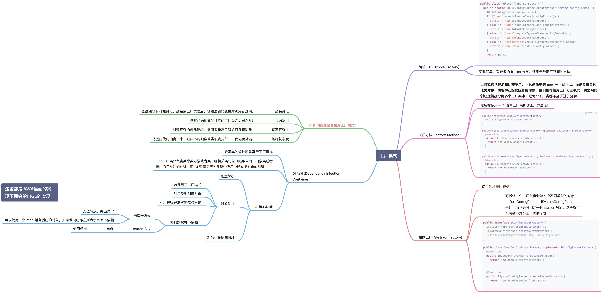

#### 1.3.1 概念&作用

**抽象工厂**是一种创建型设计模式， 它能创建一系列相关的对象， 而无需指定其具体类。

#### 1.3.2 使用场景

- 如果代码需要与多个不同系列的相关产品交互， 但是由于无法提前获取相关信息， 或者出于对未来扩展性的考虑， 你不希望代码基于产品的具体类进行构建， 在这种情况下， 你可以使用抽象工厂。
- 如果你有一个基于一组抽象方法的类， 且其主要功能因此变得不明确， 那么在这种情况下可以考虑使用抽象工厂模式。

#### 1.3.3 比较不同

- **简单工厂/工厂方法/抽象工厂**：详见1.2.3
- **建造者/抽象工厂**：**建造者**重点关注如何分步生成复杂对象；而**抽象工厂**专门用于生产一系列相关对象。
- **原型/抽象工厂**：**抽象工厂**通常基于一组工厂方法，但你也可以使用**原型模式**来生成这些类的方法。

#### 1.3.4 模式结构


### 1.4 建造者模式


#### 1.4.1 概念&作用

**建造者模式**是一种创建型设计模式， 使你能够分步骤创建复杂对象。 该模式允许你使用相同的创建代码生成不同类型和形式的对象。

#### 1.4.2 使用场景

- 类中的属性比较多。
- 类的属性之间有一定的依赖关系，或者是约束条件。
- 存在必选和非必选的属性。
- 希望创建不可变的对象。

#### 1.4.3 比较不同

- **建造者/工厂模式**：建造者模式用于创建参数复杂的对象，工厂模式用于创建类型相关的不同对象
- **建造者/组合模式**：可以在创建复杂组合模式树时使用建造者，因为这可使其构造步骤以递归的方式运行。
- **建造者/桥接模式**：可以结合使用建造者和桥接模式：主管类负责抽象工作， 各种不同的建造者负责实现工作。

#### 1.4.4 模式结构


### 1.5 原型模式

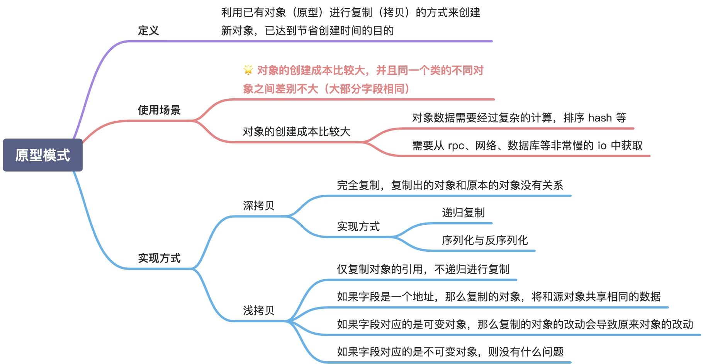

#### 1.5.1 概念&作用

**原型模式**是一种创建型设计模式， 使你能够复制对象， 甚至是复杂对象， 而又无需使代码依赖它们所属的类。

**复制的实现方式**：

- 深拷贝
- 浅拷贝

#### 1.5.2 使用场景

- 对象的创建成本比较大，并且同一个类的不同对象之间差别不大（大部分字段相同）
  - 对象的创建成本大的情况
    - 对象数据需要经过复杂的计算，排序hash等。
    - 需要从rpc、网络、数据库等非常慢的io中获取。

#### 1.5.3 比较不同

- **原型/命令模式**：原型可以用于保存命令模式的历史记录。
- **原型/组合/装饰模式**：大量使用组合模式和装饰模式的设计通常可从对于原型的使用中获益。你可以通过该模式来复制复杂结构，而非从零开始重新构造。
- **原型/备忘录模式**：有时候原型可以作为备忘录模式的一个简化版本， 其条件是你需要在历史记录中存储的对象的状态比较简单， 不需要链接其他外部资源， 或者链接可以方便地重建。
- **抽象工厂/建造者/原型模式**：抽象工厂、建造者和原型都可以用单例模式来实现。

#### 1.5.4 模式结构

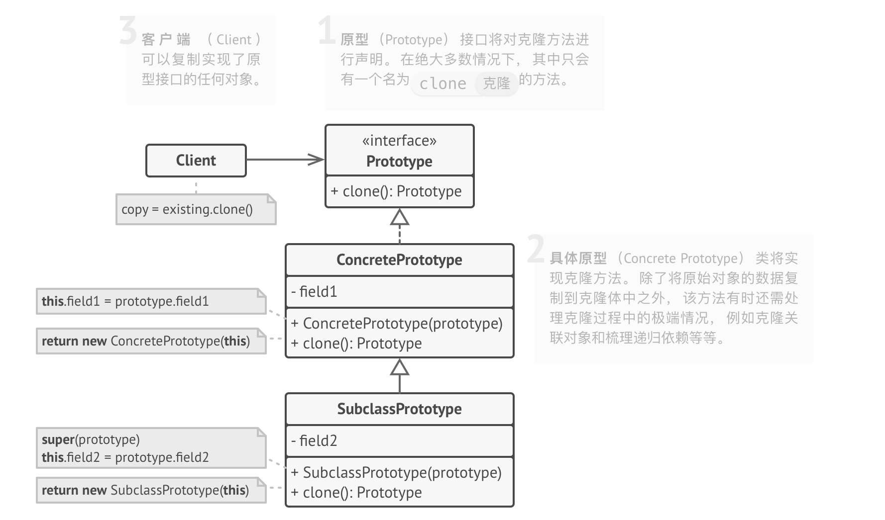

### 1.6 单例模式

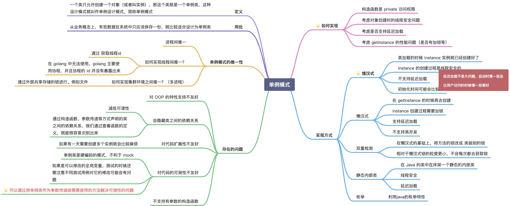

#### 1.6.1 概念&作用

**单例模式**是一种创建型设计模式， 让你能够保证一个类只有一个实例， 并提供一个访问该实例的全局节点。

#### 1.6.2 使用场景

- 如果程序中的某个类对于所有客户端只有一个可用的实例，可以使用单例模式。
- 如果你需要更加严格地控制全局变量，可以使用单例模式。

#### 1.6.3 比较不同

- **外观/单例模式**：外观模式类通常可以转换为单例模式类， 因为在大部分情况下一个外观对象就足够了。
- **享元/单例模式**：如果你能将对象的所有共享状态简化为一个享元对象， 那么享元模式就和单例类似了。 但这两个模式有两个根本性的不同。
  - 只会有一个单例实体， 但是享元类可以有多个实体， 各实体的内在状态也可以不同。
  - 单例对象可以是可变的。 享元对象是不可变的。
- **抽象工厂/建造者/原型/单例模式**：都可以用单例来实现

#### 1.6.4 模式结构

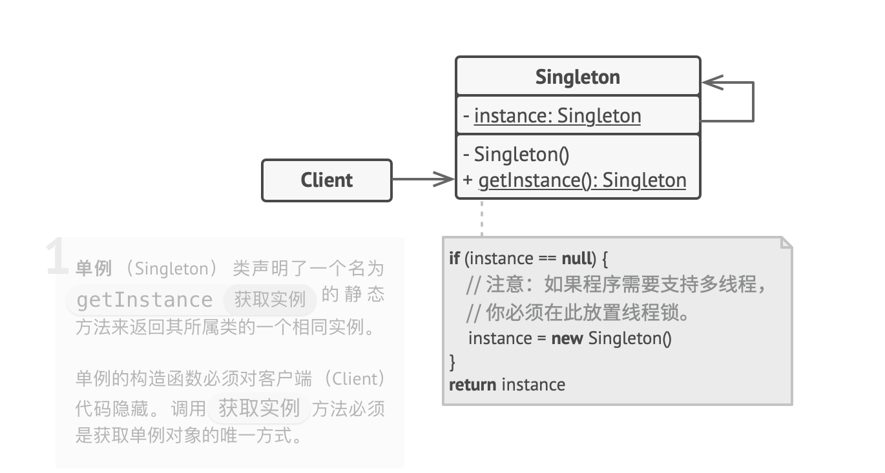

## 2 结构型

### 2.1 适配器模式

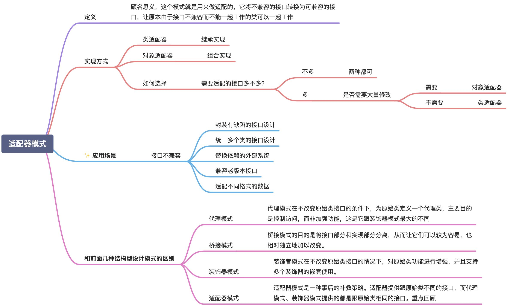

 #### 2.1.1 概念&作用

**适配器模式**是一种结构型设计模式， 它能使接口不兼容的对象能够相互合作。

#### 2.1.2 使用场景

- 当你希望使用某个类， 但是其接口与其他代码不兼容时， 可以使用适配器类。
- 如果您需要复用这样一些类， 他们处于同一个继承体系， 并且他们又有了额外的一些共同的方法， 但是这些共同的方法不是所有在这一继承体系中的子类所具有的共性。

#### 2.1.3 比较不同

- **桥接/适配器模式**：桥接模式通常会于开发前期进行设计， 使你能够将程序的各个部分独立开来以便开发。 另一方面， 适配器模式通常在已有程序中使用， 让相互不兼容的类能很好地合作。
- **装饰/适配器模式**：适配器可以对已有对象的接口进行修改， 装饰模式则能在不改变对象接口的前提下强化对象功能。 此外， 装饰还支持递归组合， 适配器则无法实现。
- **代理/适配器模式**：适配器能为被封装对象提供不同的接口， 代理模式能为对象提供相同的接口， 装饰则能为对象提供加强的接口。
- **外观/适配器模式**：外观模式为现有对象定义了一个新接口， 适配器则会试图运用已有的接口。 适配器通常只封装一个对象， 外观通常会作用于整个对象子系统上。

- **桥接/状态/策略/适配器模式**：桥接、 状态模式和策略模式 （在某种程度上包括适配器） 模式的接口非常相似。 实际上， 它们都基于组合模式——即将工作委派给其他对象， 不过也各自解决了不同的问题。 模式并不只是以特定方式组织代码的配方， 你还可以使用它们来和其他开发者讨论模式所解决的问题。

#### 2.1.4 模式结构

##### 2.1.4.1 对象适配器

实现时使用了构成原则： 适配器实现了其中一个对象的接口， 并对另一个对象进行封装。 所有流行的编程语言都可以实现适配器。

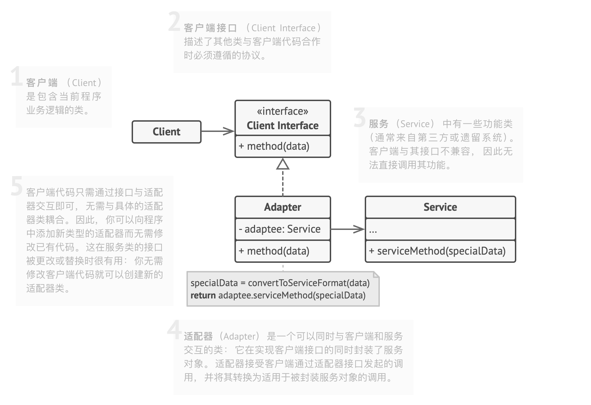

##### 2.1.4.2 类适配器

这一实现使用了继承机制： 适配器同时继承两个对象的接口。 请注意， 这种方式仅能在支持多重继承的编程语言中实现， 例如 C++。

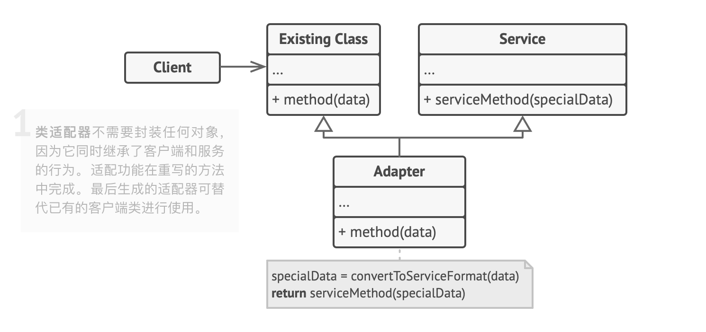

### 2.2 桥接模式

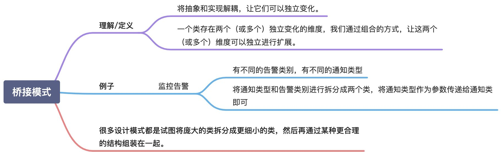

 #### 2.2.1 概念&作用

**桥接**是一种结构型设计模式， 可将业务逻辑或一个大类拆分为不同的层次结构， 从而能独立地进行开发。

#### 2.2.2 使用场景

- 如果你想要拆分或重组一个具有多重功能的庞杂类 （例如能与多个数据库服务器进行交互的类）， 可以使用桥接模式。
- 如果你希望在几个独立维度上扩展一个类， 可使用该模式。
- 如果你需要在运行时切换不同实现方法， 可使用桥接模式。

#### 2.2.3 比较不同

- **桥接/适配器模式**：桥接模式通常会于开发前期进行设计， 使你能够将程序的各个部分独立开来以便开发。 另一方面， 适配器模式通常在已有程序中使用， 让相互不兼容的类能很好地合作。
- **桥接/状态/策略模式**：桥接、 状态模式和策略模式 （在某种程度上包括适配器） 模式的接口非常相似。 实际上， 它们都基于组合模式——即将工作委派给其他对象， 不过也各自解决了不同的问题。 模式并不只是以特定方式组织代码的配方， 你还可以使用它们来和其他开发者讨论模式所解决的问题。
- **抽象工厂/桥接模式**：你可以将抽象工厂模式和桥接搭配使用。 如果由桥接定义的抽象只能与特定实现合作， 这一模式搭配就非常有用。 在这种情况下， 抽象工厂可以对这些关系进行封装， 并且对客户端代码隐藏其复杂性。
- **建造者/桥接模式**：可以结合使用建造者模式和桥接模式： 主管类负责抽象工作， 各种不同的生成器负责实现工作。

#### 2.2.4 模式结构

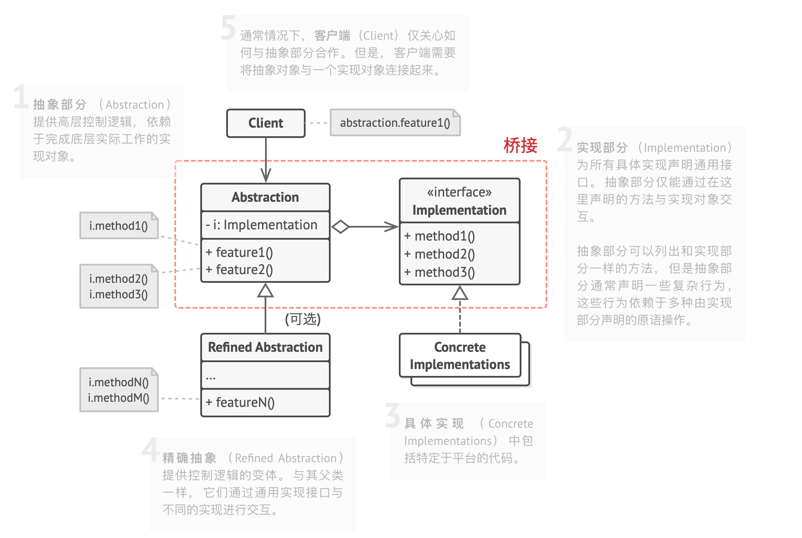

### 2.3 组合模式

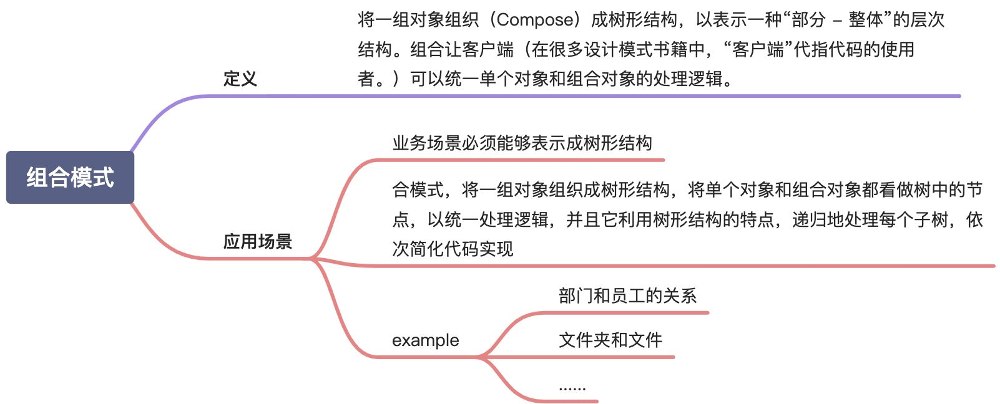

 #### 2.3.1 概念&作用

**组合模式**是一种结构型设计模式， 你可以使用它将对象组合成树状结构， 并且能像使用独立对象一样使用它们。

- 如果应用的核心模型能用树状结构表示， 在应用中使用组合模式才有价值。

#### 2.3.2 使用场景

- 如果你需要实现树状对象结构，可以使用组合模式。
- 如果你希望客户端代码以相同方式处理简单和复杂元素，可以使用该模式。

#### 2.3.3 比较不同

- **桥接/状态/策略/组合模式**：桥接模式、 状态模式和策略模式 （在某种程度上包括适配器模式） 模式的接口非常相似。 实际上， 它们都基于组合模式——即将工作委派给其他对象， 不过也各自解决了不同的问题。 模式并不只是以特定方式组织代码的配方， 你还可以使用它们来和其他开发者讨论模式所解决的问题。

- **建造者/组合模式**：你可以在创建复杂组合树时使用建造者模式， 因为这可使其构造步骤以递归的方式运行。
- **责任链/组合模式**：责任链模式通常和组合模式结合使用。 在这种情况下， 叶组件接收到请求后， 可以将请求沿包含全体父组件的链一直传递至对象树的底部。
- **迭代器/组合模式**：你可以使用迭代器模式来遍历组合树。
- **访问者/组合模式**：你可以使用访问者模式对整个组合树执行操作。
- **享元/组合模式**：你可以使用享元模式实现组合树的共享叶节点以节省内存。
- **装饰/组合模式**：组合和装饰模式的结构图很相似， 因为两者都依赖递归组合来组织无限数量的对象。
  - 装饰类似于组合， 但其只有一个子组件。 此外还有一个明显不同： 装饰为被封装对象添加了额外的职责， 组合仅对其子节点的结果进行了 “求和”。
- **装饰/组合/原型模式**：大量使用组合和装饰的设计通常可从对于原型模式的使用中获益。 你可以通过该模式来复制复杂结构， 而非从零开始重新构造。

#### 2.3.4 模式结构

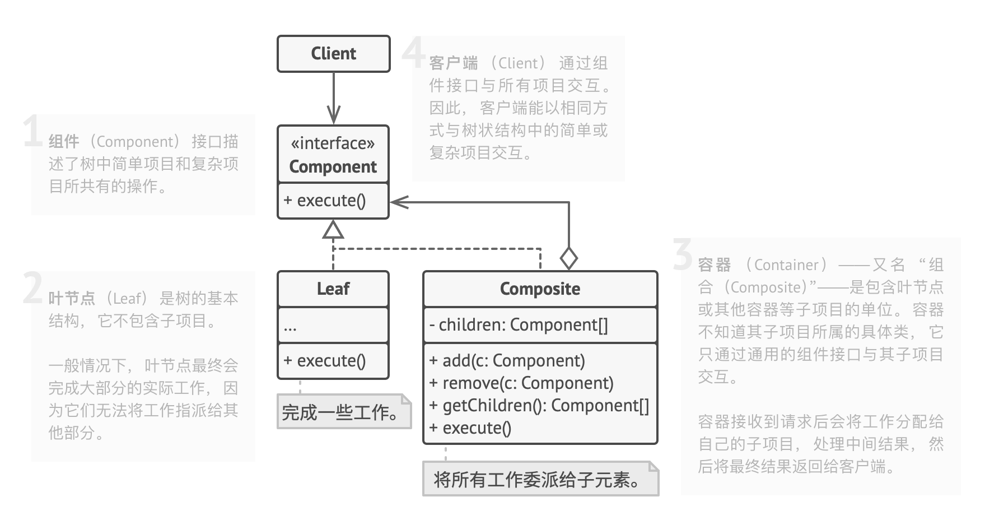

### 2.4 装饰模式

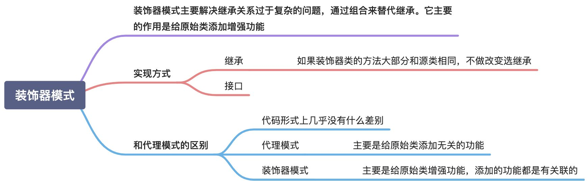

 #### 2.4.1 概念&作用

**装饰模式**是一种结构型设计模式， 允许你通过将对象放入包含行为的特殊封装对象中来为原对象绑定新的行为。

#### 2.4.2 使用场景

- 如果你希望在无需修改代码的情况下即可使用对象， 且希望在运行时为对象新增额外的行为， 可以使用装饰模式。
- 如果用继承来扩展对象行为的方案难以实现或者根本不可行， 你可以使用该模式。

#### 2.4.3 比较不同

- **代理/装饰模式**：装饰和代理有着相似的结构， 但是其意图却非常不同。 这两个模式的构建都基于组合原则， 也就是说一个对象应该将部分工作委派给另一个对象。 两者之间的不同之处在于代理通常自行管理其服务对象的生命周期， 而装饰的生成则总是由客户端进行控制。
- **组合/装饰模式**：组合模式和装饰的结构图很相似， 因为两者都依赖递归组合来组织无限数量的对象。
  - 装饰类似于组合， 但其只有一个子组件。 此外还有一个明显不同： 装饰为被封装对象添加了额外的职责， 组合仅对其子节点的结果进行了 “求和”。
  - 但是， 模式也可以相互合作： 你可以使用装饰来扩展组合树中特定对象的行为。
- **策略/装饰模式**：装饰可让你更改对象的外表， 策略模式则让你能够改变其本质。
- **责任链/装饰模式**：责任链模式和装饰模式的类结构非常相似。 两者都依赖递归组合将需要执行的操作传递给一系列对象。 但是， 两者有几点重要的不同之处。
  - 责任链的管理者可以相互独立地执行一切操作， 还可以随时停止传递请求。 另一方面， 各种装饰可以在遵循基本接口的情况下扩展对象的行为。 此外， 装饰无法中断请求的传递。
- **适配器/装饰模式**：适配器模式可以对已有对象的接口进行修改， 装饰模式则能在不改变对象接口的前提下强化对象功能。 此外， 装饰还支持递归组合， 适配器则无法实现。
  - 适配器能为被封装对象提供不同的接口， 代理模式能为对象提供相同的接口， 装饰则能为对象提供加强的接口。

#### 2.4.4 模式结构

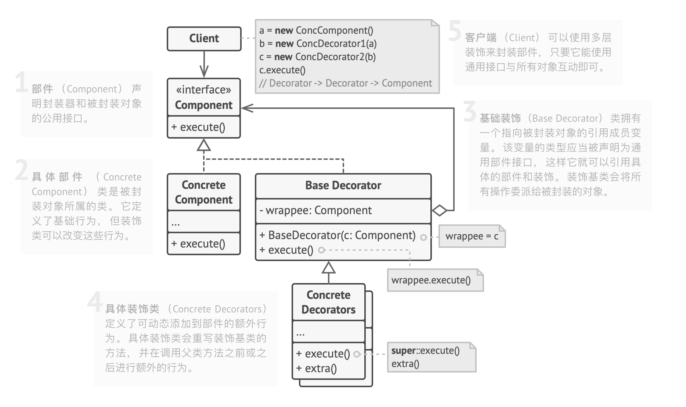

### 2.5 外观模式

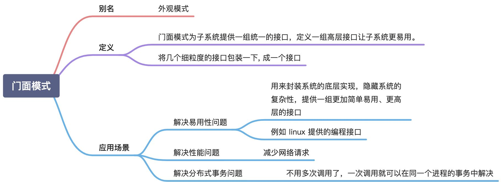

 #### 2.5.1 概念&作用

**外观**是一种结构型设计模式， 能为复杂系统、 程序库或框架提供一个简单 （但有限） 的接口。

#### 2.5.2 使用场景

- 如果你需要一个指向复杂子系统的直接接口， 且该接口的功能有限， 则可以使用外观模式。
- 如果需要将子系统组织为多层结构， 可以使用外观。

#### 2.5.3 比较不同

- **适配器/外观模式**：外观模式为现有对象定义了一个新接口， 适配器模式则会试图运用已有的接口。 适配器通常只封装一个对象， 外观通常会作用于整个对象子系统上。
- **享元/外观模式**：享元模式展示了如何生成大量的小型对象， 外观则展示了如何用一个对象来代表整个子系统。
- **抽象工厂/外观模式**：当只需对客户端代码隐藏子系统创建对象的方式时， 你可以使用抽象工厂模式来代替外观。
- **中介者/外观模式**：它们都尝试在大量紧密耦合的类中组织起合作。
  - 外观为子系统中的所有对象定义了一个简单接口， 但是它不提供任何新功能。 子系统本身不会意识到外观的存在。 子系统中的对象可以直接进行交流。
  - 中介者将系统中组件的沟通行为中心化。 各组件只知道中介者对象， 无法直接相互交流。

- **单例/外观模式**：外观类通常可以转换为单例模式类， 因为在大部分情况下一个外观对象就足够了。
- **代理/外观模式**：外观与代理模式的相似之处在于它们都缓存了一个复杂实体并自行对其进行初始化。 代理与其服务对象遵循同一接口， 使得自己和服务对象可以互换， 在这一点上它与外观不同。

#### 2.5.4 模式结构

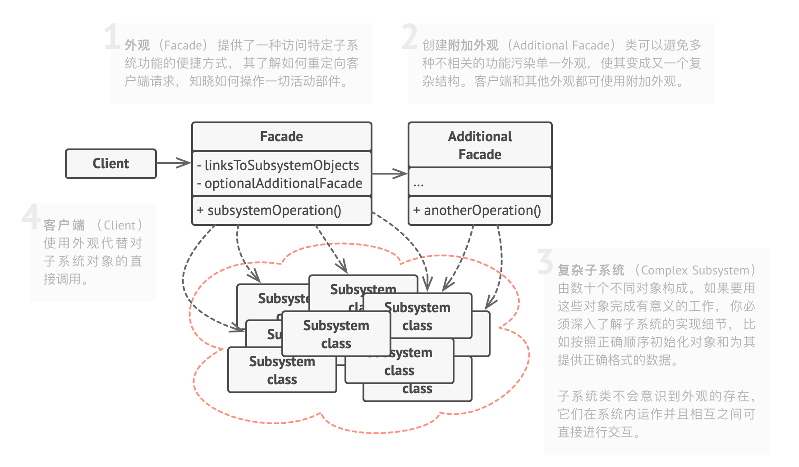

### 2.6 享元模式

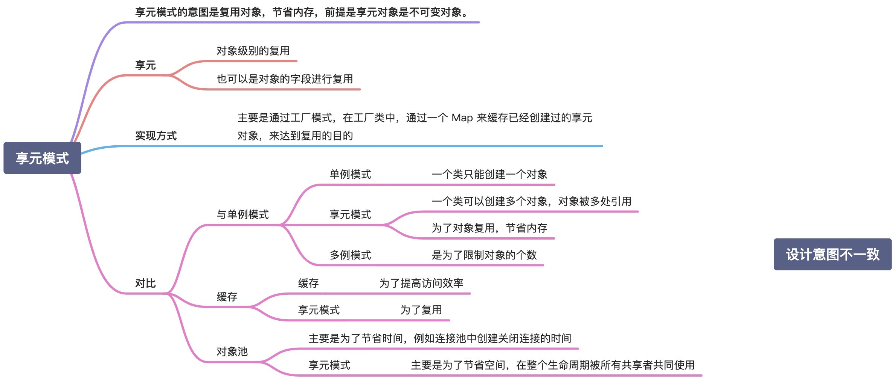


 #### 2.6.1 概念&作用

**享元**是一种结构型设计模式， 它允许你在消耗少量内存的情况下支持大量对象。

#### 2.6.2 使用场景

- 仅在程序必须支持大量对象且没有足够的内存容量时使用享元模式。

#### 2.6.3 比较不同

- **外观/享元模式**：享元展示了如何生成大量的小型对象， 外观模式则展示了如何用一个对象来代表整个子系统。
- **组合/享元模式**：你可以使用享元模式实现组合模式树的共享叶节点以节省内存。
- 单例/享元模式：如果你能将对象的所有共享状态简化为一个享元对象， 那么享元就和单例模式类似了。 但这两个模式有两个根本性的不同。
  - 只会有一个单例实体， 但是享元类可以有多个实体， 各实体的内在状态也可以不同。
  - 单例对象可以是可变的。 享元对象是不可变的。

#### 2.6.4 模式结构

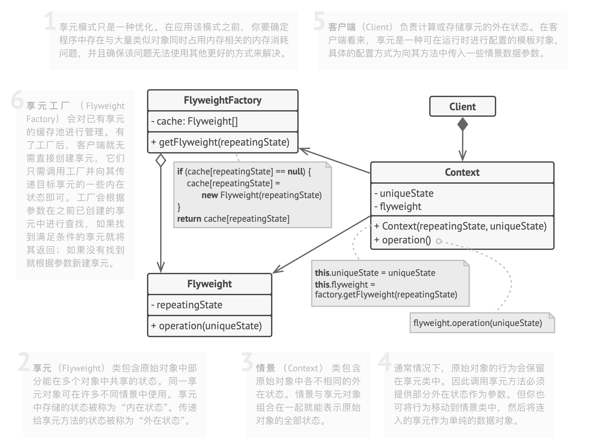

### 2.7 代理模式

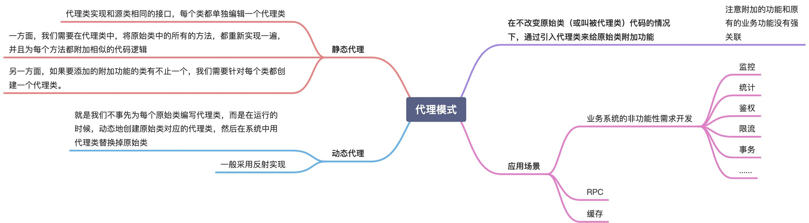

 #### 2.7.1 概念&作用

**代理**是一种结构型设计模式， 让你能提供真实服务对象的替代品给客户端使用。 代理接收客户端的请求并进行一些处理 （访问控制和缓存等）， 然后再将请求传递给服务对象。

- 静态代理

- 动态代理：可以使用Go Generate实现。

  > [go generate and ast](https://lailin.xyz/post/41140.html)、[静态代理/动态代理](https://lailin.xyz/post/proxy.html)

#### 2.7.2 使用场景

- 延迟初始化 （虚拟代理）。 如果你有一个偶尔使用的重量级服务对象， 一直保持该对象运行会消耗系统资源时， 可使用代理模式。
- 访问控制 （保护代理）。 如果你只希望特定客户端使用服务对象， 这里的对象可以是操作系统中非常重要的部分， 而客户端则是各种已启动的程序 （包括恶意程序）， 此时可使用代理模式。
- 本地执行远程服务 （远程代理）。 适用于服务对象位于远程服务器上的情形。
- 记录日志请求 （日志记录代理）。 适用于当你需要保存对于服务对象的请求历史记录时。
- 缓存请求结果 （缓存代理）。 适用于需要缓存客户请求结果并对缓存生命周期进行管理时， 特别是当返回结果的体积非常大时。
- 智能引用。 可在没有客户端使用某个重量级对象时立即销毁该对象。

#### 2.7.3 比较不同

- **适配器/代理模式**：适配器模式能为被封装对象提供不同的接口， 代理模式能为对象提供相同的接口， 装饰模式则能为对象提供加强的接口。
- **外观/代理模式**：外观模式与代理的相似之处在于它们都缓存了一个复杂实体并自行对其进行初始化。 代理与其服务对象遵循同一接口， 使得自己和服务对象可以互换， 在这一点上它与外观不同。
- **装饰/代理模式**：装饰和代理有着相似的结构， 但是其意图却非常不同。 这两个模式的构建都基于组合原则， 也就是说一个对象应该将部分工作委派给另一个对象。 两者之间的不同之处在于代理通常自行管理其服务对象的生命周期， 而装饰的生成则总是由客户端进行控制。

#### 2.7.4 模式结构

静态代理：

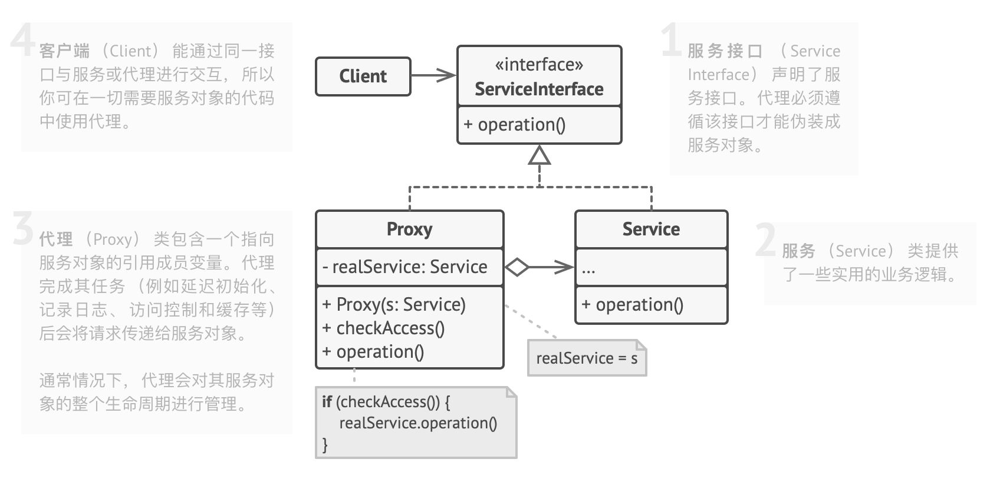

## 3 行为型

### 3.1 责任链模式

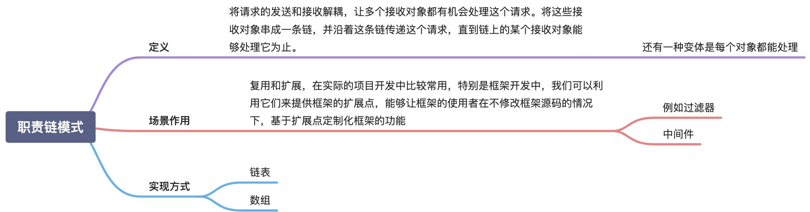

 #### 3.1.1 概念&作用

**责任链**是一种行为设计模式， 允许你将请求沿着处理者链进行发送， 直至其中一个处理者对其进行处理。

#### 3.1.2 使用场景

- 当程序需要使用不同方式处理不同种类请求， 而且请求类型和顺序预先未知时， 可以使用责任链模式。
- 当必须按顺序执行多个处理者时， 可以使用该模式。
- 如果所需处理者及其顺序必须在运行时进行改变， 可以使用责任链模式。

#### 3.1.3 比较不同

- **责任链/命令/中介者/观察者模式**：责任链模式、 命令模式、 中介者模式和观察者模式用于处理请求发送者和接收者之间的不同连接方式。
  - 责任链按照顺序将请求动态传递给一系列的潜在接收者， 直至其中一名接收者对请求进行处理。
  - 命令在发送者和请求者之间建立单向连接。
  - 中介者清除了发送者和请求者之间的直接连接， 强制它们通过一个中介对象进行间接沟通。
  - 观察者允许接收者动态地订阅或取消接收请求。

- **责任链/组合模式**：责任链通常和组合模式结合使用。 在这种情况下， 叶组件接收到请求后， 可以将请求沿包含全体父组件的链一直传递至对象树的底部。
- **责任链/命令模式**：责任链的管理者可使用命令模式实现。 在这种情况下， 你可以对由请求代表的同一个上下文对象执行许多不同的操作。
- **装饰/责任链模式**：责任链和装饰模式的类结构非常相似。 两者都依赖递归组合将需要执行的操作传递给一系列对象。 但是， 两者有几点重要的不同之处。
  - 责任链的管理者可以相互独立地执行一切操作， 还可以随时停止传递请求。 另一方面， 各种装饰可以在遵循基本接口的情况下扩展对象的行为。 此外， 装饰无法中断请求的传递。

#### 3.1.4 模式结构

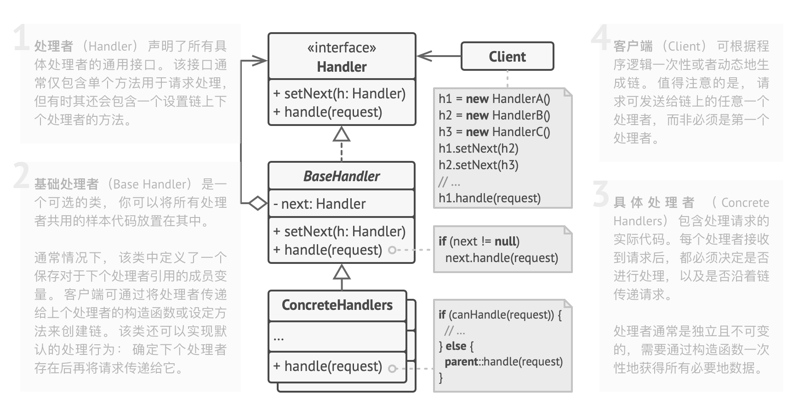

### 3.2 命令模式

 #### 3.2.1 概念&作用

#### 3.2.2 使用场景

#### 3.2.3 比较不同

#### 3.2.4 模式结构


### 3.3 迭代器模式

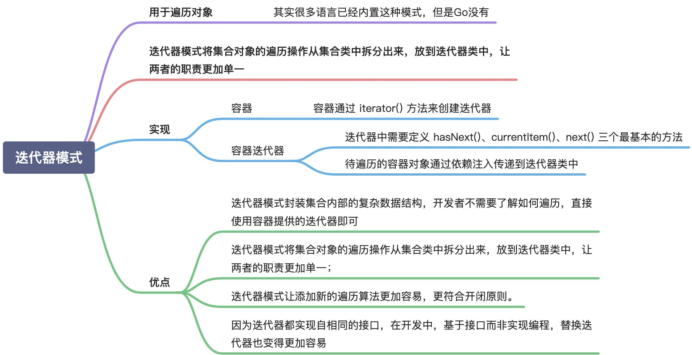

 #### 3.3.1 概念&作用

**迭代器模式**是一种行为设计模式， 让你能在不暴露集合底层表现形式 （列表、 栈和树等） 的情况下遍历集合中所有的元素。

#### 3.3.2 使用场景

- 当集合背后为复杂的数据结构， 且你希望对客户端隐藏其复杂性时 （出于使用便利性或安全性的考虑）， 可以使用迭代器模式。
- 使用该模式可以减少程序中重复的遍历代码。
- 如果你希望代码能够遍历不同的甚至是无法预知的数据结构， 可以使用迭代器模式。

#### 3.3.3 比较不同

- **迭代器/组合模式**：你可以使用迭代器模式来遍历组合模式树。
- **工厂方法/迭代器模式**：你可以同时使用工厂方法模式和迭代器来让子类集合返回不同类型的迭代器， 并使得迭代器与集合相匹配。
- **备忘录/迭代器模式**：你可以同时使用备忘录模式和迭代器来获取当前迭代器的状态， 并且在需要的时候进行回滚。
- **访问者/迭代器模式**：可以同时使用访问者模式和迭代器来遍历复杂数据结构， 并对其中的元素执行所需操作， 即使这些元素所属的类完全不同。

#### 3.3.4 模式结构

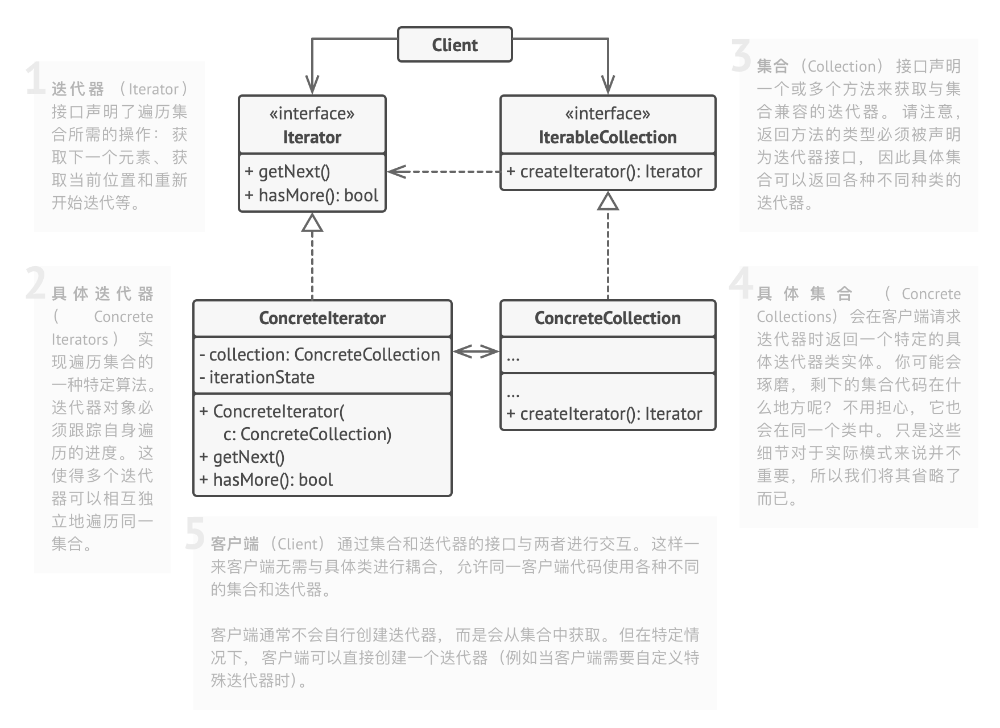

### 3.4 中介者模式

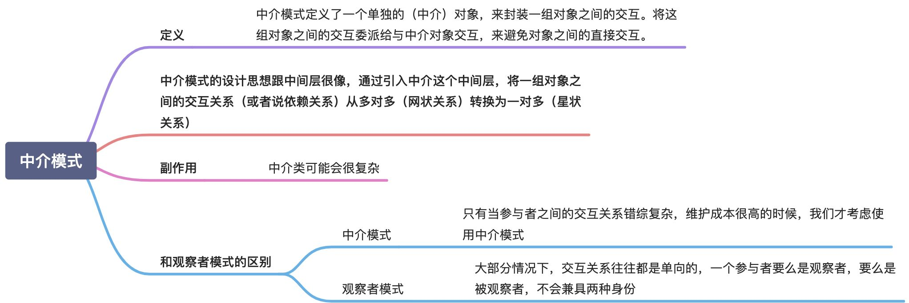

 #### 3.4.1 概念&作用

**中介者模式**是一种行为设计模式， 能让你减少对象之间混乱无序的依赖关系。 该模式会限制对象之间的直接交互， 迫使它们通过一个中介者对象进行合作。

#### 3.4.2 使用场景

- 当一些对象和其他对象紧密耦合以致难以对其进行修改时， 可使用中介者模式。该模式让你将对象间的所有关系抽取成为一个单独的类， 以使对于特定组件的修改工作独立于其他组件。
- 当组件因过于依赖其他组件而无法在不同应用中复用时， 可使用中介者模式。
- 如果为了能在不同情景下复用一些基本行为， 导致你需要被迫创建大量组件子类时， 可使用中介者模式。

#### 3.4.3 比较不同

- **责任链/命令/中介者/观察者模式**：责任链模式、 命令模式、 中介者模式和观察者模式用于处理请求发送者和接收者之间的不同连接方式：
  - 责任链按照顺序将请求动态传递给一系列的潜在接收者， 直至其中一名接收者对请求进行处理。
  - 命令在发送者和请求者之间建立单向连接。
  - 中介者清除了发送者和请求者之间的直接连接， 强制它们通过一个中介对象进行间接沟通。
  - 观察者允许接收者动态地订阅或取消接收请求。
- **外观/中介者模式**：它们都尝试在大量紧密耦合的类中组织起合作。
  - 外观为子系统中的所有对象定义了一个简单接口， 但是它不提供任何新功能。 子系统本身不会意识到外观的存在。 子系统中的对象可以直接进行交流。
  - 中介者将系统中组件的沟通行为中心化。 各组件只知道中介者对象， 无法直接相互交流。
- **观察者/中介者模式**：在大部分情况下， 你可以使用其中一种模式， 而有时可以同时使用。 让我们来看看如何做到这一点。
  - 中介者的主要目标是消除一系列系统组件之间的相互依赖。 这些组件将依赖于同一个中介者对象。 观察者的目标是在对象之间建立动态的单向连接， 使得部分对象可作为其他对象的附属发挥作用。
  - 有一种流行的中介者模式实现方式依赖于观察者。 中介者对象担当发布者的角色， 其他组件则作为订阅者， 可以订阅中介者的事件或取消订阅。 当中介者以这种方式实现时， 它可能看上去与观察者非常相似。

#### 3.4.4 模式结构

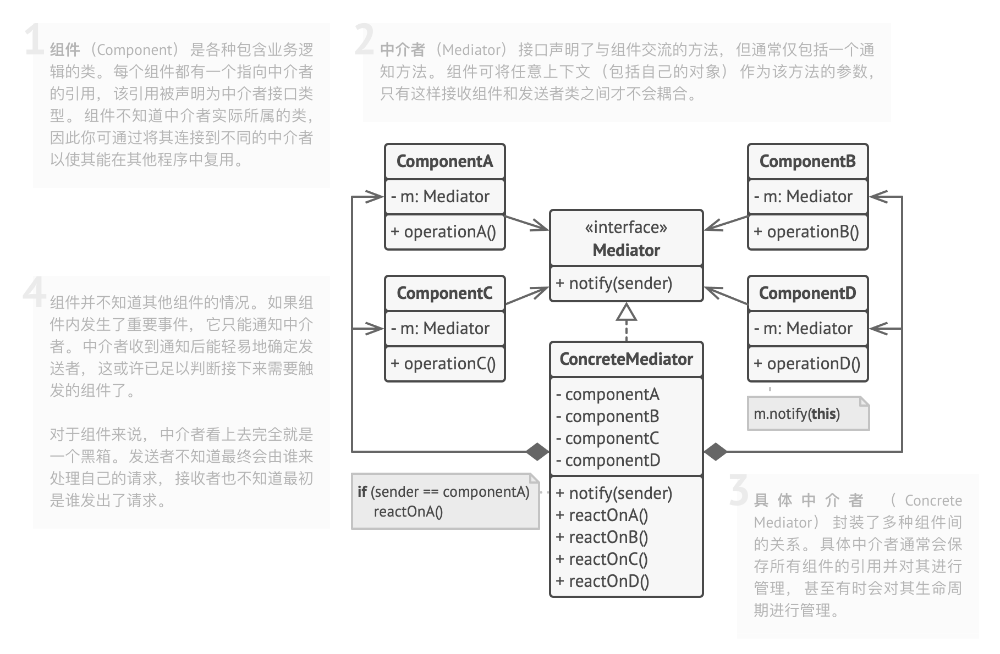

### 3.5 备忘录模式

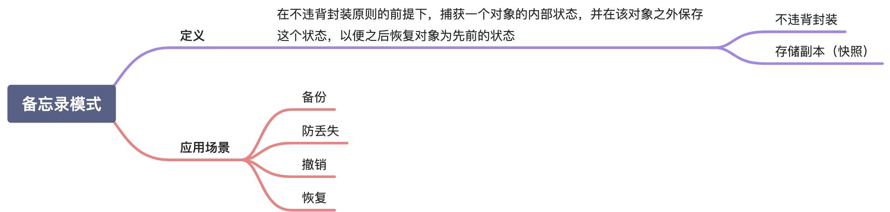

 #### 3.5.1 概念&作用

**备忘录模式**是一种行为设计模式， 允许在不暴露对象实现细节的情况下保存和恢复对象之前的状态。

#### 3.5.2 使用场景

- 当你需要创建对象状态快照来恢复其之前的状态时， 可以使用备忘录模式。
  - 撤销
  - 事务
- 当直接访问对象的成员变量、 获取器或设置器将导致封装被突破时， 可以使用该模式。

#### 3.5.3 比较不同

- **命令/备忘录模式**：你可以同时使用命令模式和备忘录模式来实现 “撤销”。 在这种情况下， 命令用于对目标对象执行各种不同的操作， 备忘录用来保存一条命令执行前该对象的状态。
- **迭代器/备忘录模式**：你可以同时使用备忘录和迭代器模式来获取当前迭代器的状态， 并且在需要的时候进行回滚。
- **原型/备忘录模式**：有时候原型模式可以作为备忘录的一个简化版本， 其条件是你需要在历史记录中存储的对象的状态比较简单， 不需要链接其他外部资源， 或者链接可以方便地重建。

#### 3.5.4 模式结构

##### 3.5.4.1 基于嵌套类

该模式的经典实现方式依赖于许多流行编程语言 （例如 C++、 C# 和 Java） 所支持的嵌套类。

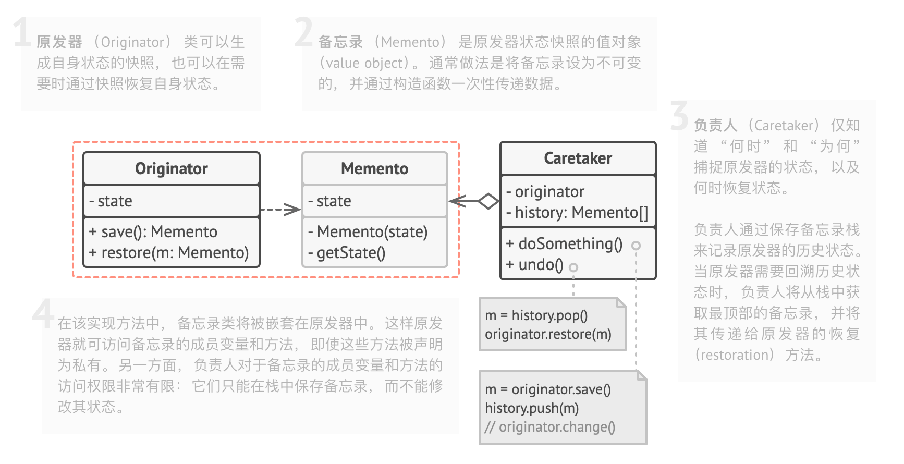

##### 3.5.4.2 基于中间接口

另外一种实现方法适用于不支持嵌套类的编程语言 （没错， 我说的就是 PHP）。

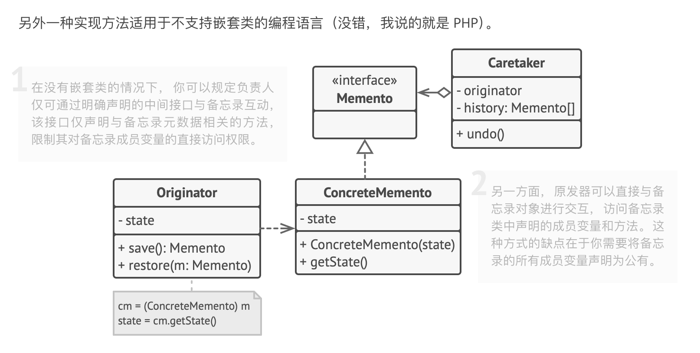

##### 3.5.4.3 更严格的实现

如果你不想让其他类有任何机会通过备忘录来访问原发器的状态， 那么还有另一种可用的实现方式。

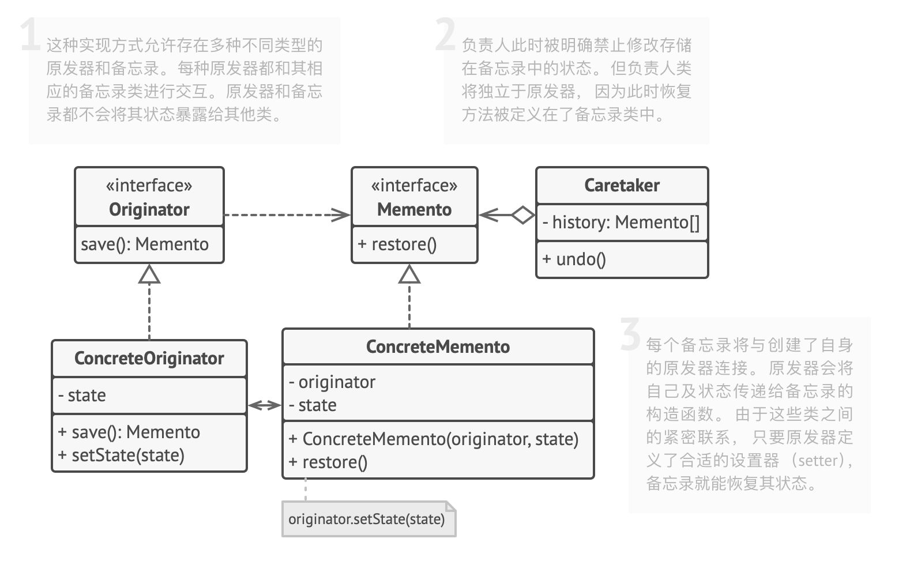

### 3.6 观察者模式

 #### 3.6.1 概念&作用

#### 3.6.2 使用场景

#### 3.6.3 比较不同

#### 3.6.4 模式结构


### 3.7 状态模式

 #### 3.7.1 概念&作用

#### 3.7.2 使用场景

#### 3.7.3 比较不同

#### 3.7.4 模式结构


### 3.8 策略模式

 #### 3.8.1 概念&作用

#### 3.8.2 使用场景

#### 3.8.3 比较不同

#### 3.8.4 模式结构


### 3.9 模板方法模式

 #### 3.9.1 概念&作用

#### 3.9.2 使用场景

#### 3.9.3 比较不同

#### 3.9.4 模式结构


### 3.10 访问者模式

 #### 3.10.1 概念&作用

#### 3.10.2 使用场景

#### 3.10.3 比较不同

#### 3.10.4 模式结构