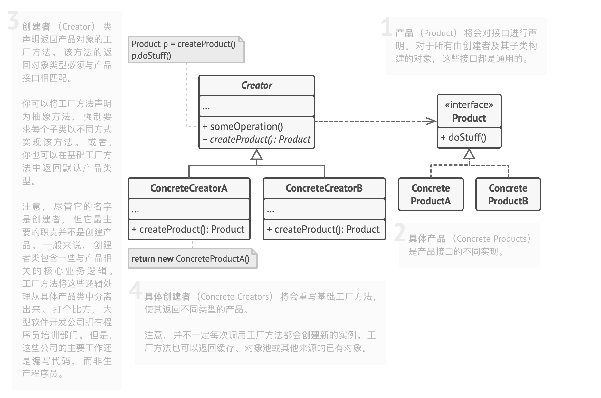
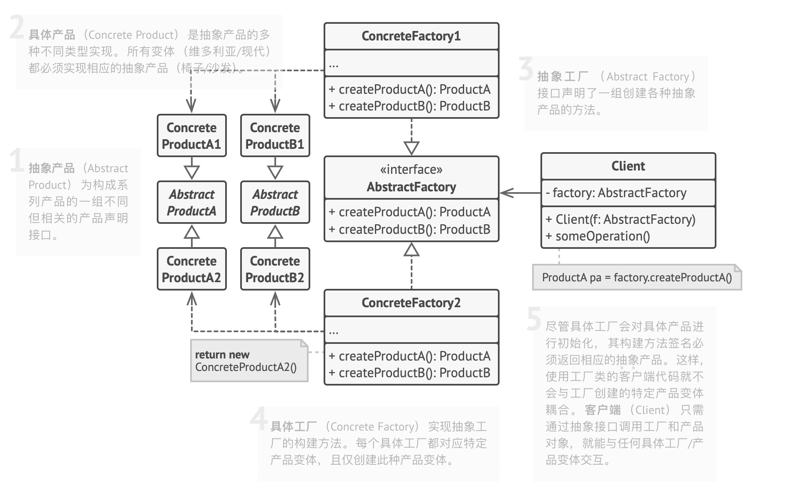
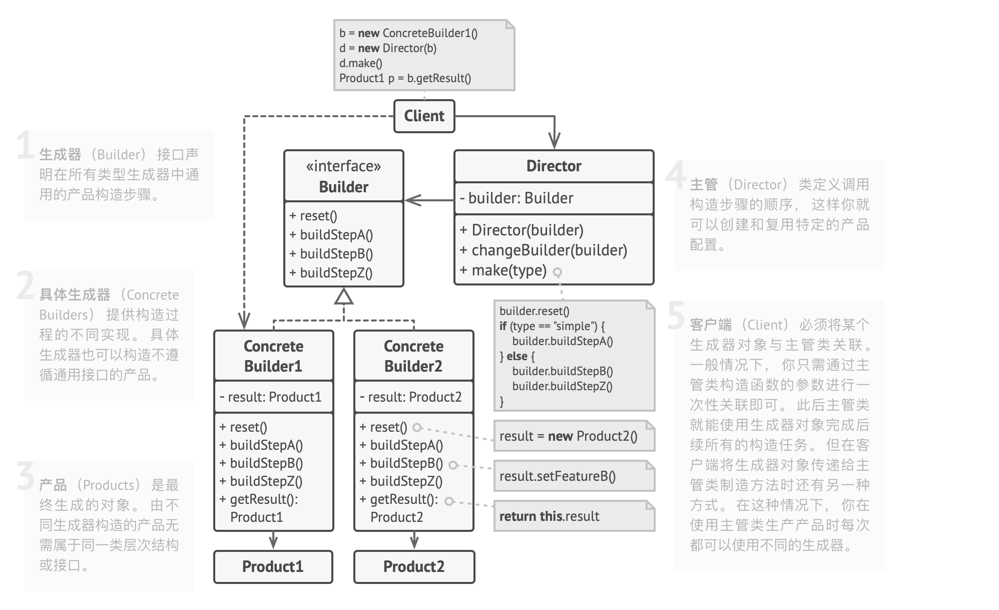

[toc]

# 设计模式

**设计模式的思想**：

- 单一职责原则：每个类只有单一的功能。
- 迪米特法则：一个对象应当对其他对象有尽可能少的了解。
- 开闭原则：要求软件对扩展开放，对修改关闭。

**参考资料**：

- [GURU](https://refactoringguru.cn/design-patterns)
- [博客](https://lailin.xyz/post/go-design-pattern.html)
- [常见的UML图](https://blog.csdn.net/qq_35423190/article/details/125069834)

## 1 创建型

### 1.1 简单工厂模式
使用场景：实现简单，但是会有较多的if else分支，适用于改动的不频繁的方法。

### 1.2 工厂方法模式

#### 1.2.1 概念&作用

**工厂方法**是一种创建型设计模式，在父类中提供一个创建对象的方法， 允许子类决定实例化对象的类型。

当对象的创建逻辑比较复杂，不只是简单的new一下就可以，而是要组合其他类对象，做各种初始化操作的时候，我们推荐使用工厂方法模式，将复杂的创建逻辑拆分到多个工厂类中，让每个工厂类都不至于过于复杂。

#### 1.2.2 使用场景

- 当你在编写代码的过程中，如果无法预知对象确切类别及其依赖关系时，可使用工厂方法。
- 如果你希望用户能扩展你软件库或框架的内部组件，可使用工厂方法。
-  如果你希望复用现有对象来节省系统资源，而不是每次都重新创建对象，可使用工厂方法。

#### 1.2.3 比较不同

- **简单工厂/工厂方法/抽象工厂**

  - **简单工厂**描述了一个类，它拥有一个包含大量条件语句的构建方法，可根据方法的参数来选择对何种产品进行初始化并将其返回。

    ```java
    class UserFactory {
        public static function create($type) {
            switch ($type) {
                case 'user': return new User();
                case 'customer': return new Customer();
                case 'admin': return new Admin();
                default:
                    throw new Exception('传递的用户类型错误。');
            }
        }
    }
    ```

  - **工厂方法**在父类中提供一个创建对象的方法， 允许子类决定实例化对象的类型。

    ```java
    abstract class Department {
        public abstract function createEmployee($id);
    
        public function fire($id) {
            $employee = $this->createEmployee($id);
            $employee->paySalary();
            $employee->dismiss();
        }
    }
    
    class ITDepartment extends Department {
        public function createEmployee($id) {
            return new Programmer($id);
        }
    }
    
    class AccountingDepartment extends Department {
        public function createEmployee($id) {
            return new Accountant($id);
        }
    }
    ```

  - **抽象工厂**能创建一系列相关或相互依赖的对象， 而无需指定其具体类。

  >[工厂模式比较](https://refactoringguru.cn/design-patterns/factory-comparison)

- **工厂方法/模版方法**

  - 工厂方法是模版方法模式的一种特殊形式。

#### 1.2.4 模式结构



### 1.3 抽象工厂模式

#### 1.3.1 概念&作用

**抽象工厂**是一种创建型设计模式， 它能创建一系列相关的对象， 而无需指定其具体类。

#### 1.3.2 使用场景

- 如果代码需要与多个不同系列的相关产品交互， 但是由于无法提前获取相关信息， 或者出于对未来扩展性的考虑， 你不希望代码基于产品的具体类进行构建， 在这种情况下， 你可以使用抽象工厂。
- 如果你有一个基于一组抽象方法的类， 且其主要功能因此变得不明确， 那么在这种情况下可以考虑使用抽象工厂模式。

#### 1.3.3 比较不同

- **简单工厂/工厂方法/抽象工厂**
  - 详见1.2.3

- **建造者/抽象工厂**
  - **建造者**重点关注如何分步生成复杂对象；而**抽象工厂**专门用于生产一系列相关对象。

- **原型/抽象工厂**
  - **抽象工厂**通常基于一组工厂方法，但你也可以使用**原型模式**来生成这些类的方法。

#### 1.3.4 模式结构



### 1.4 建造者模式

#### 1.4.1 概念&作用

**建造者模式**是一种创建型设计模式， 使你能够分步骤创建复杂对象。 该模式允许你使用相同的创建代码生成不同类型和形式的对象。

#### 1.4.2 使用场景

- 使用建造者模式可避免"重叠构造函数（telescoping constructor）"的出现。
- 当你希望使用代码创建不同形式的产品（例如石头或木头房屋） 时，可使用建造者模式。
- 使用建造者构造组合树或其他复杂对象。

#### 1.4.3 比较不同

- **建造者/抽象工厂**
  - 建造者重点关注如何分步生成复杂对象。 抽象工厂专门用于生产一系列相关对象。

- **建造者/组合模式**
  - 可以在创建复杂组合模式树时使用建造者，因为这可使其构造步骤以递归的方式运行。
- **建造者/桥接模式**
  - 可以结合使用建造者和桥接模式：主管类负责抽象工作， 各种不同的建造者负责实现工作。

#### 1.4.4 模式结构



### 1.5 原型模式


### 1.6 单例模式


## 1.2 结构型


## 1.3 行为型