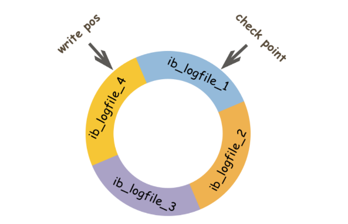

# 1. Go语法

## 1.1 slice类型nil和空切片的区别?

问题：var a int[]和a:=make([]int,0)或者a := []int{}的区别？

区别：

- 相同点
  - append：作用是相同的
  - 打印：都是[]
- 不同点
  - json序列化：前者是null，后者是[]

```go
func TestQuestion_1_1(t *testing.T) {
	var a1 []int
	a2 := []int{}
	fmt.Println(a1, a2) // [] []
	b1, _ := json.Marshal(a1)
	b2, _ := json.Marshal(a2)
	fmt.Println(string(b1), string(b2)) // null []
}
```

使用建议：

- 针对判断问题，这两者是不相等的。
- 在判断是否位空时，建议统一使用len(a)==0做判断。

注意事项：

- slice的底层数据结构

  ```go
  // runtime/slice.go
  type slice struct {
  	array unsafe.Pointer
  	len   int
  	cap   int
  }
  
  func TestQuestion_1_1_2(t *testing.T) {
  	var a1 []int
  	a2 := make([]int, 0) // 其slice.array的初始值其实是一个全局变量的值 var zerobase uintptr（位于runtime/malloc.go）
  	a3 := []string{}     // 其slice.array的初始值其实是一个全局变量的值 var zerobase uintptr（位于runtime/malloc.go）
  	p1 := (*slice)(unsafe.Pointer(&a1))
  	p2 := (*slice)(unsafe.Pointer(&a2))
  	p3 := (*slice)(unsafe.Pointer(&a3))
  	// a1, array=0, len=0, cap=0
  	fmt.Printf("a1, array=%x, len=%d, cap=%d\n", uintptr(p1.array), uintptr(p1.len), uintptr(p1.cap))
  	// a2, array=c000051e80, len=0, cap=0
  	fmt.Printf("a2, array=%x, len=%d, cap=%d\n", uintptr(p2.array), uintptr(p2.len), uintptr(p2.cap))
  	// a3, array=c000051e80, len=0, cap=0
  	fmt.Printf("a3, array=%x, len=%d, cap=%d\n", uintptr(p3.array), uintptr(p3.len), uintptr(p3.cap))
  }
  ```

## 1.2 map类型nil和空切片的区别？

问题：var a map[int]int和a:=make(map[int]int,0)或者a:=map[int]int{}的区别？

区别：

- 相同点
  - 查询元素：效果相同
  - 删除元素：效果相同
  - 打印：都是map[]
- 不同点
  - 添加元素：前者会panic，后者不会
  - json序列化：前者是null，后者是{}

```go
func TestQuestion_1_2(t *testing.T) {
	var a1 map[int]int
	a2 := map[int]int{}
	//a1[2] = 2 // 这里会panic
	a2[3] = 3
	delete(a1, 1)
	delete(a2, 1)
	fmt.Println(a1, a2) // map[] map[]
	b1, _ := json.Marshal(a1)
	b2, _ := json.Marshal(a2)
	fmt.Println(string(b1), string(b2)) // null {}
}
```

使用建议：

- 在判断是否位空时，建议统一使用len(a)==0做判断。

注意事项：

- map的底层数据结构

  ```go
  // runtime/map.go
  type hmap struct {
  	// Note: the format of the hmap is also encoded in cmd/compile/internal/gc/reflect.go.
  	// Make sure this stays in sync with the compiler's definition.
  	count     int // # live cells == size of map.  Must be first (used by len() builtin)
  	flags     uint8
  	B         uint8  // log_2 of # of buckets (can hold up to loadFactor * 2^B items)
  	noverflow uint16 // approximate number of overflow buckets; see incrnoverflow for details
  	hash0     uint32 // hash seed
  
  	buckets    unsafe.Pointer // array of 2^B Buckets. may be nil if count==0.
  	oldbuckets unsafe.Pointer // previous bucket array of half the size, non-nil only when growing
  	nevacuate  uintptr        // progress counter for evacuation (buckets less than this have been evacuated)
  
  	extra *mapextra // optional fields
  }
  ```

## 1.3 interface{}的底层原理?

> 参考文章：

# 2. 网络及通信协议

# 3. MySQL

## 3.1 缓存一致性

缓存的四种方案：

- 先更新数据库，再更新缓存

  ```go
  // 有如下两个缺点
  // 一、从线程安全角度，会出现脏数据
  // 举例：当A先更新了数据库，但是由于网络原因，导致A却比B更晚更新了缓存，这会导致脏数据
  // 1.线程A更新了数据库
  // 2.线程B更新了数据库
  // 3.线程B更新了缓存
  // 4.线程A更新了缓存
  // 二、从业务角度，会导致性能降低
  // 1.若写多读少，会导致数据压根没读到，缓存就被频繁的更新，浪费性能。
  // 2.若写入数据库的值，不是直接写入缓存，而是要经过复杂的计算再写入缓存，这样做会浪费性能。
  ```

- 先更新缓存，再更新数据库

  ```go
  // 举例：由于网络原因，可能会出现脏数据
  // 1.线程A更新了缓存
  // 2.线程B更新了缓存
  // 3.线程B更新了数据库
  // 4.线程A更新了数据库
  ```

- 先删除缓存，再更新数据库

  ```go
  // 举例：在一读一写情况下会出现数据库和缓存数据不一致
  // 1.线程A删除缓存
  // 2.线程B发现缓存不存在，就去查询数据库得到旧值
  // 3.线程B将旧值写入缓存
  // 4.线程A将新值写入数据库
  
  // 解决办法：延迟双删
  // 1.先删除缓存
  // 2.再更新数据库
  // 3.休眠"一段时间"，再次删除缓存（可以将这个操作做成异步，提高系统吞吐量）
  
  // 问题："一段时间"如何确定呢?
  // 针对一般架构：读业务逻辑的时间+几百毫秒
  // 针对读写分离的架构：主从延时的时间+几百毫秒
  
  // 问题：第二次删除失败怎么办？
  // 方法一：采用先更新数据库，再删除缓存的方法
  // 方法二：消息队列+失败重试
  ```

- 先更新数据库，再删除缓存（推荐，Cache Aside）

  ```go
  // 举例：下面这种一读一写情况仍会出现缓存不一致，但是概率非常小
  // 1.缓存失效
  // 2.线程A查询数据库得到旧值
  // 3.线程B更新数据库
  // 4.线程B删除缓存
  // 5.线程A将旧值写入缓存
  // 出现缓存不一致的前提条件：第三步写数据库比第2步读操作耗时更短（但是在读写分离情况下这种情况很难出现）
  
  // 问题：概率小不代表不会发生，怎么彻底杜绝呢？
  // 采用延迟双删
  
  // 问题："先更新数据库，再删除缓存"，缓存删除失败了怎么办呢?
  // 解决办法一：删除缓存失败==>存入消息队列==>重试直到成功。这种方法会对业务造成大量的侵入性。
  // 解决方法二：将删除操作放到非业务代码中，另起一个程序去删除缓存：更新数据库==>订阅binlog==>消息队列==>另一个程序删除直至成功
  
  // 问题：针对解决方案二，针对读写分离的架构，由于主从数据库存在同步延时，如果删除缓存之后，数据同步到备库之前已经有请求过来时，会从备库读到脏数据，该如何解决这种情况呢？
  // 解决办法：从从库中拉取binlog数据，而不是从主库中拉取即可。
  
  // 总结：
// 1.采用先更新数据库，再删除缓存的方式，会有极小的概率（必须以写操作耗时小于读操作耗时）造成缓存不一致，在读写分离的情况下，发生的概率就更小了。
  // 2.对于这种小概率事件，采用延迟双删可以解决
  // 3.针对先更新数据库，再删除缓存这种方案，如何避免缓存删除失败，需要一步一步进阶考虑：对业务侵入==>对业务不侵入==>主从情况下，订阅从库binlog
  ```

缓存穿透/缓存击穿/缓存雪崩问题：

- 缓存穿透：
  - 原因：查不到
  - 解决办法：缓存空数据、使用布隆过滤器

- 缓存击穿：
  - 原因：持续抗住高并发的某一个key过期
  - 解决办法：设置缓存永不过期（通过异步线程去更新）、数据库端限流

- 缓存雪崩：
  - 原因：大量key统一时间过期
  - 解决办法：过期时间加一个随机值、数据库端限流


> 参考文章：[Facebook缓存一致性解决方案](https://www.usenix.org/system/files/conference/nsdi13/nsdi13-final170_update.pdf)

## 3.2 索引

B树与B+树的区别：

- B树：每个节点都存储数据，导致树高度较大。
- B+树：只有叶子节点存储数据，所以树高度很小；叶子节点组成一个双向链表，便于区间查找与遍历

MyIsam和InnoDB的索引区别：

- MyIsam和InnoDB都才有B+树作为索引。
- MyIsam的B+树的叶子节点的Data字段存储的是数据记录的地址，即MyIsam的索引方式是非聚集的。MyIsam中的索引与数据记录是单独存放的。
- MyIsam的主键索引的叶子节点的Data字段存储的是数据记录（聚集索引），而非主键索引的叶子节点的Data字段存储的是主键（非聚集索引）。InnoDB中的数据记录是与主键索引存放在一起的（若没指定主键，则会在隐藏字段字段创建一个主键）。

联合索引的底层实现：

- 联合索引的key是多个列拼接成的key，一级key先有序，一级key相等的时候，二级key有序。

覆盖索引：

- 是一种查询优化的手段，本质是避免了回表。

> 参考文章：[MySQL索引背后的数据结构及算法原理](http://blog.codinglabs.org/articles/theory-of-mysql-index.html)

## 3.3 MVCC

概念：MVCC：Multiversion Concurrency Control，多版本并发控制技术。其原理是通过数据行的多个版本管理来实现数据库的并发控制，简单来说就是保存数据的历史版本，读取数据的时候不需要加锁就可以达到保证事务的隔离效果。

作用：解决了并发读写问题；解决了不同隔离级别实现的难点（MVCC可实现读未提交、读已提交、可重复读三种隔离级别）。

实现原理：事务ID+Roll Pointer+undo Log+read view。在使用MVCC时，InnoDB会通过从最新版本的Roll Pointer一步步计算到我们可见的数据版本。

- 事务ID(Transaction ID，简称Trx ID)：指最后一个对数据插入、删除或者更新的事务ID。【原理之一】

- Roll Pointer：回滚指针，指向undo Log信息。【原理之二】

- undo log：解决了数据变更的问题（MVCC中根据undo log的计算实在内存中进行的，而实际事务中的回滚操作是在B+树中操作的）。【原理之三】

- read view：控制可见性，达到想要的隔离级别。【原理之四】

  - read view本质上是一个存在于内存中的结构体。在进行判断时，首先会拿记录的最新版本即B+树中的最新数据来比较，若该版本无法被当前事务看到，则通过记录的Roll Pointer跳转到undo log中找到上一个版本，重新进行比较，直至找到一个能被当前事务看到的版本。

    

    ```go
    // read view的组成：
    // 1.trx_ids：系统当前正在活跃的事务ID集合
    // 2.low_limit_id（高水位）：活跃事务中最大的事务ID
    // 3.up_limit_id（低水位）：活跃事务中最小的事务ID
    // 4.creator_trx_id：创建这个read view的事务ID
    // 注意事项：上述活跃指的是未提交的事务。
    
    // 根据Trx ID和read view判断可见性：
    // 1.若Trx ID==creator_trx_id：表示更新这个数据版本的事务是当前事务自己生成的，可见
    // 2.若Trx ID<up_limit_id：表示更新这个数据版本的事务在当前事务启动之前就已提交，可见
    // 3.若Trx ID>low_limit_id：表示更新这个数据版本的事务是在当前事务启动之后新开始的事务，不可见
    // 4.若up_limit_id<=Trx ID<=low_limit_id，则分两种情况
    //	 4.1 若Trx ID in trx_ids：表示更新这个数据版本的事务还未提交，不可见
    //	 4.2 若Trx ID not in trx_ids：表示更新这个数据版本的事务已提交，可见
    ```

  - 通过在不同的时机生成一个read view就可以实现不同的隔离级别
    - 不生成read view：可实现读未提交。
    - 每条语句执行前生成一个read view：可实现读已提交。
    - 事务开始前生成一个read view：在整个事务过程中，可见性不变，实现了可重复读。

- Row ID：若无主键就会自动创建。InnoDB必须存在主键，因为数据是存储在主键索引上的；而MyIsam不一定需要主键，因为数据是单独存放的。

- deleted flag：删除标记。

InnoDB中的两种读操作：（区分两种读操作的方法：只要当前行数据的读操作走了MVCC的可见性逻辑，就是快照读，其他都是锁定读）

- 快照读：也叫非锁定读，读取的是快照数据。
- 当前读：也叫锁定读，读取的是最新数据。
  - update/delete/insert、；若某个事务中一条行数据被加锁，那么之后的这个事务中的该行数据的读操作就是当前读。

MVCC失效的场景：

- MVCC只能在快照读的场景下起到性能优化的作用，而一旦加锁，对应的行数据就不会再使用MVCC了。
- MVCC只是针对聚集索引（主键索引）而言（因为只有聚集索引才有隐藏数据列Trx ID和Roll Pointer），二级索引也是不使用MVCC的。
- MVCC在可重复读隔离级别下是不能解决幻读的，但是通过主动加锁（间隙锁）可以避免幻读。

> 相关文章：《MySQL技术内幕(InnoDB存储引擎)》、《极客时间-MySQL 45讲》、[MVCC原理](https://zhuanlan.zhihu.com/p/147372839)、[不可重复度与幻读的区别](https://www.jianshu.com/p/97f2a6e8f57c)、[阿里面试题](https://baijiahao.baidu.com/s?id=1698260328423240859&wfr=spider&for=pc)

## 3.4 redo log/undo log/binlog

二进制日志：

- binlog：
  - 作用：用于记录数据库执行的写入性操作（不包括查询）信息，是MySQL的逻辑日志，**由Server层进行记录**，使用任何存储引擎的MySQL都会记录binlog日志。binlog是通过**追加写**方式进行写入，可以通过`max_binlog_size`参数设置每个binlog文件的大小。主要作用是**主从复制**、**数据恢复**（可以使用mysqlbinlog工具来恢复数据）。
    - 逻辑日志：记录的就是SQL语句。
    - 物理日志：记录的是数据页变更。
  - binlog的刷盘时机：只有在事务提交时才会记录binlog，此时binlog日志还在内存中。
    - sync_binlog=0：不去强制要求，由系统自行判断何时写入磁盘。
    - sync_binlog=1(**默认**)：每次 commit 的时候都要将 `binlog` 写入磁盘。
    - sync_binlog=N：每N个事务，才会将 binlog写入磁盘。
  - binlog日志格式：
    - binlog_format=STATMENT：基于SQL语句的复制。优点是减少了binlog日志量、节约了IO；缺点是可能会导致主从数据不一致。
    - binlog_format=ROW(**默认**)：基于行的复制。优点是不会导致数据不一致；缺点是会产生大量的日志。
    - binlog_format=MIXED：基于STATMENT+ROW的混合复制。一般的复制使用STATEMENT模式；对于 STATEMENT模式无法复制的操作使用 ROW模式。

事务日志：

- undo log
  - 原子性的底层实现。
  - MVCC实现的关键。

- redo log

  - 作用：由**InnoDB存储引擎**实现。降低对数据页刷盘的要求，采用WAL+追加写的方式先记录数据页的变更，后续再将变更写入到数据页。主要作用是**提高处理性能**、**崩溃恢复(Crash Safe)**。

  - 原理：redo log包括内存中的**日志缓冲**(redo log buffer)、磁盘上的**日志文件**(redo log file)。采用的是**预写日志**技术(WAL，Write Ahead Logging)。redo log buffer 写入 redo logfile实际上是先写入OS Buffer，然后再通过系统调用 fsync将其刷到 redo log file。

  - 日志刷盘时机：

    - innodb_flush_log_at_trx_commit=0：延迟写。事务提交时不会将redo log buffer写入OS Buffer，大约每秒写入OS buffer，再刷新写入到磁盘中，可能会丢失1s数据。
    - innodb_flush_log_at_trx_commit=1(**默认**)：实时写，实时刷新。不会丢失数据，但是IO性能较差。
    - innodb_flush_log_at_trx_commit=2：实时写，延迟刷新。事务提交时会将redo log buffer写入OS Buffer，但是不会刷新写入到磁盘中，每隔1s调用fsync刷新到磁盘。

  - 记录形式：采用**环形循环**写入方式。

    - write pos：表示redo log当前记录的位置。

    - check point：表示数据页更改记录刷盘后的位置

    - write pos到check point之间的部分用于记录新的记录；check point到write pos之间的部分是数据页待落盘的记录。

      

> 相关文章：[mysql三大日志](https://mp.weixin.qq.com/s/A0Du0ipee7nzXN-fKG6K5g)

## 3.5 MySQL中的锁

Server层：

- MDL(MetaData Lock)：元数据锁。比如表结构就是元数据。MDL主要解决了2个问题：事务隔离问题、数据复制问题。MDL的根本作用是对元数据进行保护，保证DML和DDL的一致性。
- Table Lock：表锁，分为S(共享锁)和X(排他锁)。表锁的实现可以是THR_LOCK，也可以是MDL。对于InnoDB引擎而言，lock tables会加两把锁，一是MySQL表锁，一是引擎表锁。

InnoDB层：

- 表级锁
  - IS：意向读锁。作用是为了后续在加表级别的S锁和X锁时，判断表中是否有已经被加锁的记录，以避免用遍历的方式来查看表中有没有上锁的记录。当对表数据进行操作时就会加意向锁：读操作加IS锁，写操作加IX锁。
  - IX：意向写锁。
  - S：读锁。除`lock tables t read`时会加S锁外，其他都不会使用S锁。
  - X：写锁。除`lock tables t write`时会加X锁外，其他都不会使用X锁。
  - AUTO-INC锁：针对AUTO_INCREMENT修饰的字段。
- 行级锁
  - Record Lock：记录锁，只能加在一行记录的索引上。记录锁又可分为S锁(读记录锁)和X锁(写记录锁)。
    - 读操作默认是不加锁的。
    - 可以采用`SELECT ... FOR SHARE`在读操作时加读记录锁。
    - 也可以采用`SELECT ... FOR UPDATE`在读操作时加写记录锁。
    - UPDATE/DELETE/INSERT都会加写记录锁。
  - Gap Lock：间隙锁。主要通过锁住一个区间（开区间）来解决MVCC下的幻读问题。
    - 间隙锁又分为S间隙锁和X间隙锁。但是二者作用没区别，都是为了防止插入操作引起的幻读。间隙锁允许重复加锁。
  - Next-key Lock：左开右闭区间，等于Record Lock+Gap Lock。
  - Insert Intention Lock：即插入意向锁，是特殊的Gap Lock锁，专为Insert操作设计。其目的是如果插入到同一行间隙中的多个事务未插入到间隙内的同一未知，则它们无需互相等待。Gap Lock锁住的是一个不存在数据的区间，而Insert Intention Lock也是Gap Lock，只是其锁住的范围从区间变成了一个具体的记录。

注意事项：**没有索引时，InnoDB使用的是引擎表锁**这句话是错误的，InnoDB仍然使用的是行级锁，不过是锁住了所有的行，间记为锁住了表。

> 参考文章：[阿里数据库内核月报](http://mysql.taobao.org/monthly/)

## 3.6 InnoDB IO优化

两个努力方向：

- 将随机写变为顺序写
- 将单个写变为批量写

 InnoDB 内存级别 IO优化：

- Buffer Pool
- Read-Ahead
- Change Buffer


# 4. Redis

# 5. Kafka

# 6. ElasticSearch

# 7. Kubernates

# 8. 分布式存储

## 8.1 levelDB的设计


# 9. 系统设计

## 9.1 如何设计一个IM系统?


