# Go

## 0 学习&面试

- 学习：https://www.topgoer.com/
- 面试：https://www.golangroadmap.com/
- 反问环节：https://github.com/yifeikong/reverse-interview-zh

## 1 切片和数组的区别

**区别：**makeslice返回unsafe.Pointer。

- 数组长度固定，切片长度可变。

- 数组可以进行比较；切片不能进行比较。

- 数组属于值类型，**函数内部改变传入的数组元素值不会影响函数外部数组的元素值**；切片属于引用类型。

  ```go
  func Test_interview_array_1(t *testing.T) {
  	nums := [4]int{1, 2, 3, 4}
  	modifyArray(nums)
  	fmt.Println(nums) // [1 2 3 4]
  }
  
  func modifyArray(nums [4]int) {
  	nums[0] = 10
  }
  ```

**联系：**

- 切片的的底层也是数组。

  ```go
  type slice struct {
  	array unsafe.Pointer	//指向底层数组的指针
  	len int					//切片长度
  	cap int					//切片容量
  }
  ```

**注意事项：**

- 使用`copy`内置函数拷贝两个切片时，会将源切片的数据逐个拷贝到目的切片指向的数组中，拷贝数量取两个切片的最小值。例如长度为10的切片拷贝到长度为5的切片时，将拷贝5个元素。也就是说，拷贝过程中不会发生扩容。

- `copy`函数有返回值，它返回实际上复制的元素个数，这个值就是两个slice长度的较小值。

  ```go
  func Test_interview_slice_5(t *testing.T) {
  	s1 := []int{1, 2, 3, 4}
  	s2 := make([]int, 2)
  	l := copy(s2, s1)
  	fmt.Println(s2) // [1 2]
      fmt.Println(l)  // 2
  }
  ```

**面试题：**

- 使用append函数时，需要考虑append返回的切片是否跟原切片共享底层的数组。

  ```go
  func Test_interview_slice_6(t *testing.T) {
  	x := make([]int, 0, 10)
  	x = append(x, 1, 2, 3)
  	y := append(x, 4)
  	z := append(x, 5)
  	fmt.Println(x) // [1 2 3]
  	fmt.Println(y) // [1 2 3 5]
  	fmt.Println(z) // [1 2 3 5]
  }
  ```

- 切片作为函数传参：

  ```go
  func Test_interview_slice_7(t *testing.T) {
  	a := []int{1, 2, 3}     // 长度为3，容量为3
  	b := make([]int, 1, 10) // 长度为1，容量为10
  	modify(a, b)
  	fmt.Println("out a =", a) // out a = [1 2 3]
  	fmt.Println("out b =", b) // out b = [3]
  }
  
  func modify(a, b []int) {
  	a = append(a, 4)            // 引发扩容，此时返回的a是一个新的切片
  	b = append(b, 2)            // 没有引发扩容，仍然是原切片
  	a[0] = 3                    //改变a切片元素
  	b[0] = 3                    //改变b切片元素
  	fmt.Println("inner a =", a) // inner a = [3 2 3 4]
  	fmt.Println("inner b =", b) // inner b = [3 2]
  }
  ```

## 2 channel操作总结

| 操作      | nil channel | closed channel                           | not nil, not closed channel |
| :-------- | ----------- | ---------------------------------------- | --------------------------- |
| close     | panic       | panic                                    | 正常关闭                    |
| 读 <-chan | 阻塞        | 先读通道内剩余的元素，再读对应类型的零值 | 阻塞或正常读取数据          |
| 写chan<-  | 阻塞        | panic                                    | 阻塞或正常写入数据          |

## 3 Go语言如何处理继承

Go语言中通过结构体组合来实现继承。

```go
type People struct {
    Name string
}

// Student继承了People
type Student struct{
    People
    Grade int
}
```

## 4 数组怎么转集合

可以使用数组的索引作为map的key，数组的值作为map的值。

```go
func Test_interview_array_2(t *testing.T) {
	arr := [5]int{1, 2, 3, 4, 5}
	m := make(map[int]int, 5)
	for i, v := range arr {
		m[i] = v
	}
	fmt.Println(m)
}
```

## 5 Go的GMP模型

GMP是在GM调度模型的基础上演进过来的，GM调度器的缺点：

- `单一全局互斥锁(Sched.Lock)和集中状态存储`。导致所有 goroutine 相关操作，比如：创建、结束、重新调度等都要上锁。
- `Goroutine 传递问题`。M 经常在 M 之间传递”可运行”的 goroutine，这导致调度延迟增大以及额外的性能损耗（刚创建的 G 放到了全局队列，而不是本地 M 执行，不必要的开销和延迟）。
- `Per-M 持有内存缓存 (M.mcache)`。每个 M 持有 mcache 和 stack alloc，然而只有在 M 运行 Go 代码时才需要使用的内存(每个 mcache 可以高达2mb)，当 M 在处于 syscall 时并不需要。运行 Go 代码和阻塞在 syscall 的 M 的比例高达1:100，造成了很大的浪费。同时内存亲缘性也较差。G 当前在 M运 行后对 M 的内存进行了预热，因为现在 G 调度到同一个 M 的概率不高，数据局部性不好。
- `严重的线程阻塞/解锁`。在系统调用的情况下，工作线程经常被阻塞和取消阻塞，这增加了很多开销。比如 M 找不到G，此时 M 就会进入频繁阻塞/唤醒来进行检查的逻辑，以便及时发现新的 G 来执行。

G：协程，由runtime进行调度。包含goroutine的运行时栈信息，CPU的一些寄存器的值以及执行的函数指令等。

M：线程，由操作系统进行调度，涉及到上下文切换。M 的默认数量限制是10000，可以通过debug.SetMaxThreads修改。

P：逻辑处理器，保存了M所需的上下文环境。G只有挂载到P上，才能被与P绑定的M来执行。P决定同时执行的任务的数量，可以通过GOMAXPROCS来设置，默认等于CPU核数。

本地队列：每个P都绑定了一个长度为256的本地队列；无锁的，没有数据竞争问题，处理速度比较高。如果本地队列满了，则会把本地队列中一半的 G 移动到全局队列。

全局队列：所有P都共享一个全局队列，需要加互斥锁进行保护。

P处理G的顺序：本地队列-->任务窃取-->全局队列

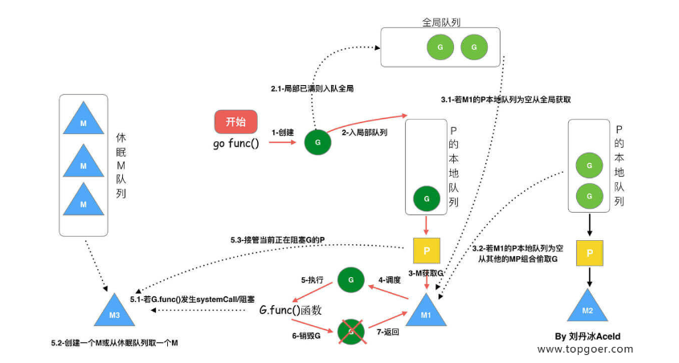

**语言组织**：首先，GMP 这三个字母的含义分别是 Goroutine，Machine，Processor。这个Goroutine，相当于操作系统中的进程控制块。其中存着 goroutine 的运行时栈信息，CPU 的一些寄存器的值以及执行的函数指令等。Machine就是代表了一个操作系统的主线。M 结构体中，保存了 M 自身使用的栈信息、当前正在 M上执行的 G 信息、与之绑定的 P 信息。M 直接关联一个 os 内核线程，用于执行 G。（这里思考一个这个模型的图片回答），这个 M 做的事情就是从关联的 P 的本地队列中直接获取待执行的 G。剩下的 Processor 是代表了 M 所需的上下文环境，代表 M 运行 G 所需要的资源。当 P 有任务时，就需要创建或者唤醒一个系统线程来执行它队列里的任务。在GMP调度模型中，P 的个数就是 GOMAXPROCS，是可以手动设置的，但一般不修改，GOMAXPOCS 默认值是当前电脑的核心数，单核CPU就只能设置为1，如果设置>1，在 GOMAXPOCS 函数中也会被修改为1。总的来说，这个 P 结构体的主要的任务就是可以根据实际情况开启协程去工作。

> 参考文章：[GMP调度模型详解](https://blog.csdn.net/xmcy001122/article/details/119392934)、[GMP原理与调度](https://www.topgoer.com/%E5%B9%B6%E5%8F%91%E7%BC%96%E7%A8%8B/GMP%E5%8E%9F%E7%90%86%E4%B8%8E%E8%B0%83%E5%BA%A6.html)

## 6 java和go比有什么不同

从面向对象上来看：

- 函数重载：go不允许函数重载；java允许函数重载。
- 继承：go通过组合实现继承，且支持多继承；java通过extends关键字实现继承，且不支持多继承。
- 多态：go通过接口来实现多态；java通过继承实现多态。

从语法层面来看：

- 编译产物不同：go编译产物是可执行二进制文件；java编译产物是字节码文件，需要在JVM上才能运行。
- 并发思想不同：go的并发哲学是通过通信来共享内存；java是通过共享内存来通信。
- 语法不同：如go支持多返回值；java不支持多返回值。
- 异常处理思想不同：go需要开发者处理每个错误；java可以往上抛给调用方。
- GC算法不同：go是基于清除思想的三色标记法；java是基于内存分代的思想，有多种gc策略，如标记-清除、标记-压缩、压缩算法。

## 7 通道原理/实现

通道类型划分：结构体hchan，makechan后返回的是*hchan

- 根据通道容量划分：无缓冲通道、有缓冲通道。
- 根据操作类型划分：发送通道、接收通道、发送接收通道。

通道的实现原理：channel是一个FIFO队列，负责协程之间的通信。

- buf：底层循环数组，针对缓冲型通道有效。

- sendx：指向底层循环数组，表示当前可以发送的元素位置索引值。

- recvx：指向底层循环数组，表示当前可以接收的元素位置索引值。

- sendq：表示向channel发送数据被阻塞的goroutine组成的双向链表。先进先出。

- recvq：表示向channel接收数据被阻塞的goroutine组成的双向链表。先进先出。

- lock：互斥锁。这也是通道读写是并发安全的原因。

  ```go
  // channel的底层结构
  type hchan struct {
   closed   uint32   // channel是否关闭的标志
   elemtype *_type   // channel中的元素类型
   
   // channel分为无缓冲和有缓冲两种。
   // 对于有缓冲的channel存储数据，使用了 ring buffer（环形缓冲区) 来缓存写入的数据，本质是循环数组
   // 为啥是循环数组？普通数组不行吗，普通数组容量固定更适合指定的空间，弹出元素时，普通数组需要全部都前移
   // 当下标超过数组容量后会回到第一个位置，所以需要有两个字段记录当前读和写的下标位置
   buf      unsafe.Pointer // 指向底层循环数组的指针（环形缓冲区）
   qcount   uint           // 循环数组中的元素数量
   dataqsiz uint           // 循环数组的长度
   elemsize uint16                 // 元素的大小
   sendx    uint           // 下一次写下标的位置
   recvx    uint           // 下一次读下标的位置
    
   // 尝试读取channel或向channel写入数据而被阻塞的goroutine
   recvq    waitq  // 读等待队列
   sendq    waitq  // 写等待队列
  
   lock mutex //互斥锁，保证读写channel时不存在并发竞争问题
  }
  ```

channel的产生背景：

- Go语言提供了一种不同的并发模型–通信顺序进程(communicating sequential processes,CSP)。
- 通过通信的方式共享内存。
- channel收发操作遵循先进先出(FIFO)的设计。

创建channel：

- 创建channel实际上就是在内存中实例化了一个hchan结构体，并返回一个chan指针。
- channle在函数间传递都是使用的这个指针，这就是为什么函数传递中无需使用channel的指针，而是直接用channel就行了，因为channel本身就是一个指针。

发送数据到channel：

- 检查 recvq 是否为空，如果不为空，则从 recvq 头部取一个 goroutine，将数据发送过去，并唤醒对应的 goroutine 即可。
- 如果 recvq 为空，则将数据放入到 buffer 中。
- 如果 buffer 已满，则将要发送的数据和当前 goroutine 打包成 sudog 对象放入到 sendq中。并将当前 goroutine 置为 waiting 状态。

从channel接收数据：

- 如果sendq不为空，且没有缓冲区，则从sendq头部取一个goroutine，将数据读取出来，并唤醒对应的goroutine，结束读取过程。
- 如果sendq不为空，且有缓冲区，则说明缓冲区已满，则从缓冲区中首部读出数据，把sendq头部的goroutine数据写入缓冲区尾部，并将goroutine唤醒，结束读取过程。
- 如果sendq为空，缓冲区有数据，则直接从缓冲区读取数据，结束读取过程。
- 如果sendq为空，且缓冲区没数据，则只能将当前的goroutine加入到recvq,并进入waiting状态，等待被写goroutine唤醒。

面试题：

- 在同一个协程里面，对无缓冲channel同时发送和接收数据有什么问题？

  - 会造成死锁，使协程阻塞住。

    ```go
    func Test_chan_2(t *testing.T) {
    	go func() {
    		ch := make(chan struct{}, 0)
    		ch <- struct{}{}
    		<-ch
    		fmt.Println("goroutine over")
    	}()
    
    	for {
    		select {
    		default:
    			fmt.Println("tick...")
    		}
    		time.Sleep(time.Second)
    	}
    }
    ```

- 任务编排：有四个goroutine，编号为1,2,3,4。每秒钟会有一个goroutine打印出它自己的编号，要求你编写一个程序，让输出的编号总是按照1、2、3、4、1、2、3、4、……的顺序打印出来。

  ```go
  type Token struct{}
  
  func newWorker(id int, ch chan Token, nextCh chan Token) {
  	for {
  		token := <-ch       // 取得令牌
  		fmt.Println(id + 1) // id从1开始
  		time.Sleep(time.Second)
  		nextCh <- token
  	}
  }
  
  func TestChannelCodePattern_3(t *testing.T) {
  	chs := []chan Token{
  		make(chan Token),
  		make(chan Token),
  		make(chan Token),
  		make(chan Token),
  	}
  
  	// 创建4个worker
  	for i := 0; i < 4; i++ {
  		go newWorker(i, chs[i], chs[(i+1)%4])
  	}
  
  	//首先把令牌交给第一个worker
  	chs[0] <- struct{}{}
  	select {}
  }
  ```

- 任务编排：使用协程goroutine和channel顺序打印1~10

  ```go
  // 不固定goroutine数
  func Test_chan_3(t *testing.T) {
  	n := 10
  	var count uint32
  	ch := make(chan uint32)
  	for i := 0; i < n; i++ {
  		go func(i uint32) {
  			for {
  				if val := atomic.LoadUint32(&count); val == i {
  					ch <- i + 1
  					atomic.AddUint32(&count, 1)
  					break
  				}
  			}
  		}(uint32(i))
  	}
  
  	for i := 0; i < n; i++ {
  		fmt.Println(<-ch)
  	}
  }
  
  // 固定goroutine数
  func Test_chan_5(t *testing.T) {
  	SeqPrint(4, 10)
  }
  
  func SeqPrint(number, target int) {
  	var wg sync.WaitGroup
  	cond := sync.NewCond(&sync.Mutex{})
  	printNum := 0
  	for i := 0; i < number; i++ {
  		index := i
  		wg.Add(1)
  		go func(index int) {
  			defer wg.Done()
  			for {
  				cond.L.Lock()
  				for printNum%number != index {
  					cond.Wait()
  				}
  				printNum++
  				if printNum > target {
  					cond.L.Unlock()
  					cond.Broadcast()
  					return
  				}
  				fmt.Println("goroutine:", index+1, "打印", printNum)
  				cond.L.Unlock()
  				cond.Broadcast()
  			}
  		}(index)
  	}
  	wg.Wait()
  }
  ```

- 任务编排：交替输出1,2,3,4,1,2,3,4...

  ```go
  // 方法一：使用原子操作+通道
  func Test_chan_4(t *testing.T) {
  	cycle := 4
  	var count uint32
  	ch := make(chan uint32)
  	limit := make(chan struct{}, 10)
  	go func() {
  		for i := 0; ; i++ {
  			limit <- struct{}{}
  			go func(i uint32) {
  				defer func() {
  					<-limit
  				}()
  				for {
  					if val := atomic.LoadUint32(&count); val == i {
  						ch <- uint32((int(i))%cycle + 1)
  						time.Sleep(time.Second)
  						atomic.AddUint32(&count, 1)
  						break
  					}
  				}
  			}(uint32(i))
  		}
  	}()
  
  	go func() {
  		for {
  			fmt.Println(<-ch)
  		}
  	}()
  	select {}
  }
  ```

## 8 channel和锁的对比

- channel：思想是通过通信来共享内存。主要用于协程间通信。
  - 关注的是并发问题的数据流动，适用于数据在多个协程中流动的场景。channel的底层也是用到了锁，故而channel是并发安全的。
- 锁：思想是通过共享内存来通信。主要用于保护临界资源不被误操作。
  - 关注的是是数据不动，某段时间只给一个协程访问数据的权限，适用于数据位置固定的场景。

## 9 channel的应用场景

使用场景：

- 协程间通信

- 解耦生产者和消费者

- 控制并发数

  ```go
  for _, url := range urls {
      ch <- struct{}{}
  	go func() {
          defer func() {
             <- ch 
          }()
  		worker(url)
  	}
  }
  ```

- 定时任务

  ```go
  select {
      case <- time.Tick(time.Second):
  }
  ```

- 超时任务

  ```go
  select {
      case <-time.After(time.Second):
  }
  ```

## 10 make和new的区别

**make和new的区别**：

- 适用类型不同：make和new都是Go中内置的用来分配内存的函数，但适用的类型不同。make只适用于slice,map,channel等引用类型，new适用于int型、数组、结构体等值类型。

- 返回类型不同：make返回类型本身，new返回一个指针。

  ```go
  func make(t Type, size ...IntegerType) Type
  func new(Type) *Type
  ```

- 使用上不同：make返回初始化之后的类型的引用，new会为类型的新值分配已置零的内存空间。

**关于引用类型和值类型**：

- 引用类型：变量存储的是一个地址，这个地址存储最终的值。内存通常在堆上分配。通过 GC 回收。包括 指针、slice、channel、map、函数、接口 interface等。
  - 对于引用类型的变量，我们不光要声明它，还要为它分配内容空间。
- 值类型：基本数据类型、数组和struct。变量直接存储值，内存通常在栈中分配，栈在函数调用后会被释放。
  - 对于值类型的则不需要显示分配内存空间，是因为Go会默认帮我们分配好。

## 11 map笔试题

面试题：

- map取一个key，然后修改这个值，原map数据的值会不会变化？

  若value是值，则不会改变；若value是指针，则指针的解引用值会改变

  ```go
  func Test_interview_map_1(t *testing.T) {
  	m := map[int]int{}
  	m[1] = 1
  	b := m[1]
  	b += 1
  	fmt.Println(m[1]) // 1
  
  	m2 := make(map[int]*int)
  	x := 1
  	m2[1] = &x
  	fmt.Println(*m2[1], m2[1]) // 1 0xc00000a3c0
  	c := m2[1]
  	*c = *c + 1
  	fmt.Println(*m2[1], m2[1]) // 2 0xc00000a3c0
  }
  ```

## 12 channel笔试题

面试题：

- 向为nil的channel发送数据会怎么样？

  - 会阻塞，进而导致死锁

    ```go
    // 会报错：fatal error: all goroutines are asleep - deadlock!
    func Test_interview_channel_1(t *testing.T) {
    	var ch chan int
    	ch <- 0
    }
    
    ```

## 13 sync.WaitGroup的坑

注意事项：

- 出现panic的情况：
  - Add一个负数：如果计数器的值小于0会直接panic（虽然wg.Add方法可以传入负数，但是绝对不允许这么做）。
  - Add和Wait的调用顺序：对Add方法的首次调用,与对它的Wait方法的调用是同时发起 (即两个方法的调用在同时启动的不同的goroutine中)。
  - 重用WaitGroup：未保证其计数周期的完整性。
- 不合理的使用：
  - 复制waitgroup：禁止在函数中对sync.WaitGroup进行直接值复制,应该采用指针复制。

## 14 struct是否能比较

- 针对同类结构体，若结构体的字段没有不可比较的类型（如Slice、Map、Func），那么就可以比较，反之不可比较。
- 针对不同类结构体，若不同类的结构体的成员变量类型、变量名和顺序都相同，且结构体没有不可比较字段时，那么进行显式类型转换后就可比较，反之不能比较。

## 15 Go如何实现不重启热部署

根据系统的 SIGHUP 信号量，以此信号量触发进程重启，达到热更新的效果。

监听信号量的方法的环境是在 类 UNIX 系统中，在现在的 UNIX 内核中，允许多个进程同时监听一个端口。在收到 SIGHUP 信号量时，先 fork 出一个新的进程监听端口，同时等待旧进程处理完已经进来的连接，最后杀掉旧进程。

热部署我们需要考虑几个能力：

- 新进程启动成功，老进程不会有资源残留。
- 新进程初始化的过程中，服务不会中断。
- 新进程初始化失败，老进程仍然继续工作。
- 同一时间，只能有一个更新动作执行。

示例代码如下：https://github.com/guowei-gong/tablefilp-example

```go
import (
    "context"
    "fmt"
    "log"
    "net/http"
    "os"
    "os/signal"
    "syscall"
    "time"

    "github.com/cloudflare/tableflip"
)

// 当前程序的版本
const version = "v0.0.1"

func main() {
    upg, err := tableflip.New(tableflip.Options{})
    if err != nil {
        panic(err)
    }
    defer upg.Stop()

    // 为了演示方便，为程序启动强行加入 1s 的延时，并在日志中附上进程 pid
    time.Sleep(time.Second)
    log.SetPrefix(fmt.Sprintf("[PID: %d] ", os.Getpid()))

    // 监听系统的 SIGHUP 信号，以此信号触发进程重启
    go func() {
        sig := make(chan os.Signal, 1)
        signal.Notify(sig, syscall.SIGHUP)
        for range sig {
            // 核心的 Upgrade 调用
            err := upg.Upgrade()
            if err != nil {
                log.Println("Upgrade failed:", err)
            }
        }
    }()

    // 注意必须使用 upg.Listen 对端口进行监听
    ln, err := upg.Listen("tcp", ":8080")
    if err != nil {
        log.Fatalln("Can't listen:", err)
    }

    // 创建一个简单的 http server，/version 返回当前的程序版本
    mux := http.NewServeMux()
    mux.HandleFunc("/version", func(rw http.ResponseWriter, r *http.Request) {
        log.Println(version)
        rw.Write([]byte(version + "\n"))
    })
    server := http.Server{
        Handler: mux,
    }

    // 照常启动 http server
    go func() {
        err := server.Serve(ln)
        if err != http.ErrServerClosed {
            log.Println("HTTP server:", err)
        }
    }()

    if err := upg.Ready(); err != nil {
        panic(err)
    }
    <-upg.Exit()

    // 给老进程的退出设置一个 30s 的超时时间，保证老进程的退出
    time.AfterFunc(30*time.Second, func() {
        log.Println("Graceful shutdown timed out")
        os.Exit(1)
    })

    // 等待 http server 的优雅退出
    server.Shutdown(context.Background())
}
```

## 16 读写锁底层实现

**读写锁背景**：为了区分读写操作，在进行读操作时，goroutine 就不必傻傻的等待了，而是可以并发地访问共享资源，将串行读变成了并行读，提高了读操作的性能。

**读写锁有三种工作模型**：Go中的读写锁，工作模型是Write-prferring 方案。

- Read-perferring：
优先读设计，可能会导致写饥饿。
- Write-prferring
：优先写设计，避免写饥饿。
- 不指定优先级
不区分优先级，解决饥饿问题。

**原理**：互斥锁+原子操作

```go
type RWMutex struct {
	w           Mutex  // 互斥锁，写协程获得该锁后，其他协程处于等待
	writerSem   uint32 // writer等待读完成排队的信号量
	readerSem   uint32 // read等待write完成排队的信号量
	readerCount int32  // 读锁的计数器
	readerWait  int32  // 等待读锁释放的数量
}

// 关于readerCount
// 1.在读锁操作的情况下，加一个读锁会为其加一，释放后会减一。
// 2.在写锁操作时，会将 rederCount 减 2^30，此时就变成负值。在写锁释放的时候会加2^30。
// 3.读加锁时可以通过readerCount是否小于零来判断是否有写锁定，如果小于零说明有写操作，当前读操作阻塞等待。

// 关于readerWait
// 可以解决写锁饥饿问题。
```

- 加读锁

  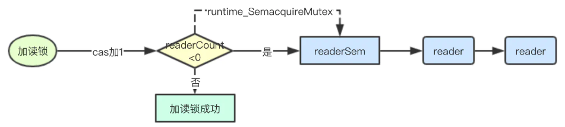

- 释放读锁

  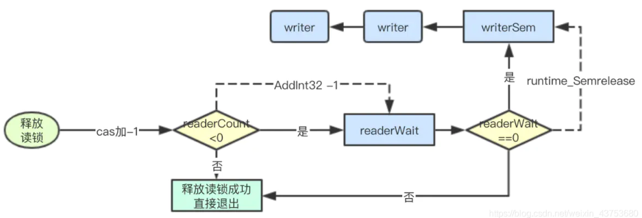

- 加写锁：一句话总结就是写锁优先。当有写锁来的时候，你们这些读的赶紧读，读完我要写。其他后面来的读的，你们先等着，等我写完后你们再读。

  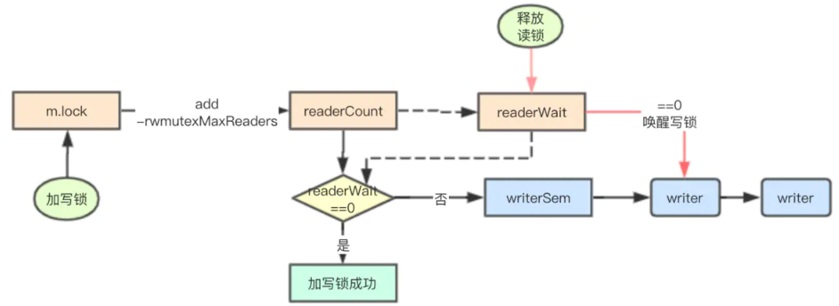

- 释放写锁：
  - readerCount原子加rwmutexMaxReaders。
  - 唤醒reader。
  - 释放互斥锁。

**总结**：

- 写写互斥通过互斥锁实现。
- 写读互斥通过原子操作readerCount+信号量实现。
- 通过readerWait解决写饥饿问题。

> 参考文章：[读写锁原理](https://blog.csdn.net/weixin_43753680/article/details/114374660)


## 17 数组如何实现下标访问任意元素

数组中的元素在内存中连续存储的，并且存储元素的数据类型相同。可以通过首地址+数据类型大小*偏移量计算得到任意元素的地址，进而获取到其值。

## 18 两个协程交替打印字母和数字

```go
// 方案一：使用缓冲通道
func Test_chan_6(t *testing.T) {
	limit := 26
	numChan := make(chan struct{}, 1)
	charChan := make(chan struct{}, 1)
	mainChan := make(chan struct{}, 1)
	go func() {
		for i := 0; i < limit; i++ {
			<-charChan
			fmt.Printf("%c\n", 'a'+i)
			numChan <- struct{}{}
		}
	}()
	go func() {
		for i := 0; i < limit; i++ {
			<-numChan
			fmt.Println(i + 1)
			charChan <- struct{}{}
		}
		mainChan <- struct{}{}
	}()
	charChan <- struct{}{}
	<-mainChan
	close(charChan)
	close(numChan)
	close(mainChan)
}

// 方案二：使用无缓冲通道
func Test_chan_7(t *testing.T) {
	limit := 26
	numChan := make(chan struct{})
	charChan := make(chan struct{})
	mainChan := make(chan struct{})
	go func() {
		for i := 0; i < limit; i++ {
			<-charChan
			fmt.Printf("%c\n", 'a'+i)
			numChan <- struct{}{}
		}
	}()
	go func() {
		for i := 0; i < limit; i++ {
			<-numChan
			fmt.Println(i + 1)
			if i != limit-1 {
				charChan <- struct{}{}
			}
		}
		mainChan <- struct{}{}
	}()
	charChan <- struct{}{}
	<-mainChan
	close(charChan)
	close(numChan)
	close(mainChan)
}

// 方案三：使用通道+互斥锁
func Test_chan_8(t *testing.T) {
	numLock := sync.Mutex{}
	charLock := sync.Mutex{}
	numLock.Lock()
	limit := 26
	doneC := make(chan int, 1)
	go func() {
		for i := 0; i < limit; i++ {
			numLock.Lock()
			fmt.Println(i + 1)
			charLock.Unlock()
		}
	}()
	go func() {
		for i := 0; i < limit; i++ {
			charLock.Lock()
			fmt.Println(fmt.Sprintf("%c", 'a'+i))
			numLock.Unlock()
		}
		doneC <- 1
	}()
	<-doneC
	close(doneC)
}
```

## 19 goroutine与线程的区别

协程与线程的区别：

- 调度方式不一样：协程由runtime调度，线程由操作系统进行调度。
- 占用空间不一样：协程占用大小2kb，线程占用2M。
- 二者联系：协程需要线程来承载运行。

## 20 常见的gc算法

常见的垃圾回收算法：

- 引用计数：对每个对象维护一个引用计数，当引用该对象的对象被销毁时，引用计数减1，当引用计数器为0时回收该对象。
  - 优点：对象可以很快的被回收，不会出现内存耗尽或达到某个阀值时才回收。
  - 缺点：不能很好的处理循环引用，而且实时维护引用计数，有也一定的代价。
  - 代表语言：Python、PHP
- 标记清除：从根变量开始遍历所有引用的对象，引用的对象标记为"被引用"，没有被标记的进行回收。
  - 优点：解决了循环引用。
  - 缺点：需要STW，即要暂时停掉程序运行。
  - 代表语言：Go（混合屏障三色标记法）
- 分代收集：按照对象生命周期长短划分不同的代空间，生命周期长的放入老年代，而短的放入新生代，不同代有不能的回收算法和回收频率。
  - 优点：回收性能好。
  - 缺点：算法比较复杂。
  - 代表语言：Java

关于三色标记法：

- 初始状态下所有对象都是白色的。
- 从根节点开始遍历所有对象，把遍历到的对象变成灰色对象。
- 遍历灰色对象，将灰色对象引用的对象也变成灰色，然后将遍历过的灰色对象变成黑色对象。
- 循环第三步，直到灰色对象全部变黑色。
- 回收所有白色对象（垃圾）。

## 21 Go何时触发垃圾回收

触发方式：

- 主动触发（手动触发）：通过调用 runtime.GC 来触发GC，此调用阻塞式地等待当前GC运行完毕。
- 被动触发（分两种方式）：
  - 使用步调（Pacing）算法，其核心思想是控制内存增长的比例,每次内存分配时检查当前内存分配量是否已达到阈值（环境变量GOGC）：默认100%，即当内存扩大一倍时启用GC。
  - 使用系统监控，当超过两分钟没有产生任何GC时，强制触发 GC。

## 22 深拷贝和浅拷贝

**深拷贝**：拷贝的是数据本身，创造一个新对象，新创建的对象与原对象不共享内存，新创建的对象在内存中开辟一个新的内存地址，新对象值修改时不会影响原对象值。

- 实现深拷贝的方式：

  ```go
  func copy(dst, src []Type) int
  ```

**浅拷贝**：拷贝的是数据地址，只复制指向的对象的指针，此时新对象和老对象指向的内存地址是一样的，新对象值修改时老对象也会变化。

- 实现浅拷贝的方式：引用类型的变量，默认赋值操作就是浅拷贝。

  ```go
  slice2 := slice1
  ```

## 23 为何不要大量使用协程

大量创建goroutine，势必会消耗大量的系统资源（如内存、CPU等），从而可能导致系统崩溃。避免不必要的麻烦，应该合理创建goroutine的数量。

> 参考文章：[Go语言调度模型G/M/P的数量多少合适](https://www.jianshu.com/p/1a50330adf1b)

## 24 channel有缓冲和无缓冲的区别

无缓冲：发送和接收需要同步。发送阻塞直到数据被接收，接收阻塞直到读到数据。

有缓冲：不要求发送和接收同步。当缓冲满时发送阻塞，当缓冲空时接收阻塞。

## 25 Go的优势

优点：

- 开发效率、运行效率折中。
- 在语言层面支持高并发。

Go和Java在垃圾回收方面的对比总结：

|                  | **Java**                                                     | **Go**                                                       |
| ---------------- | ------------------------------------------------------------ | ------------------------------------------------------------ |
| GC区域           | Java堆和方法区                                               | Go堆                                                         |
| 触发GC时机       | 分代收集导致触发时机很多                                     | 申请内存、手动触发、定时触发                                 |
| 垃圾收集算法     | 分代收集。在新生代（“标记-复制”）； 老年代（“标记-清除”或“标记-整理”） | 标记清除算法                                                 |
| 垃圾种类         | 死亡对象（可能会逃脱）、废弃常量和无用的类                   | 全局变量和G Stack中的引用指针                                |
| 标记阶段         | 三色可达性分析算法（插入写屏障，删除写屏障）                 | 三色可达性分析算法(混合写屏障)                               |
| 空间压缩整理     | 是                                                           | 否                                                           |
| 内存分配         | 指针碰撞/空闲列表                                            | span内存池                                                   |
| 垃圾碎片解决方案 | 分代GC、对象移动、划分region等设计                           | Go语言span内存池、tcmalloc分配机制、对象可以分配在栈上、对象池 |

> 参考文章：[彻底搞懂JAVA与Go垃圾回收](https://blog.csdn.net/Moonxiyue/article/details/124992811)

## 26 如何判断channel是否关闭

**读channel**：

```go
// ok为false表示关闭
_,ok := <- jobs
```

**写channel**：使用select

```go
func Test_chan_9(t *testing.T) {
	done := make(chan struct{})
	go func() {
		time.Sleep(time.Second * 3)
		done <- struct{}{}
	}()

	for {
		select {
		case <-done:
			close(done)
			return
		default:
			fmt.Println("滴答滴答...")
		}
		time.Sleep(time.Second)
	}
}
```

## 27 切片如何扩容

**切片append的逻辑**：

- 计算追加后slice的总长度n
- 如果总长度n大于原cap，则调用growslice func进行扩容（cap最小为n，具体扩容规则见growslice）
  - 原cap扩容一倍，即doublecap
    - Go 1.18已经不是doublecap，newcap += (newcap + 3*threshold) / 4，其中newcap是扩容后的容量，先根据原切片的长度、容量和要添加的元素个数确定newcap大小，最后再对newcap做内存对齐得到最后的newcap。
  - 如果指定cap大于doublecap则使用cap，否则执行如下
  - 如果原数据长度小于1024，则使用doublecap
  - 否则在原cap的基础上每次扩容1/4，直至不小于cap
- 对扩容后的slice进行切片，长度为n，获取slice s，用以存储所有的数据.
- 根据不同的数据类型，调用对应的复制方法，将原slice及追加的slice的数据复制到新的slice。

**总结**：

- slice本身并非指针，append追加元素后，意味着底层数组数据（或数组）、len、cap会发生变化，因此append后需要返回新的slice。
- append在追加元素时，当前cap足够容纳元素，则直接存入数据，否则需要扩容后重新创建新的底层数组，拷贝原数组元素后，再存入追加元素。
- cap的扩容意味着内存的重新分配，数据的拷贝等操作，为了提高append的效率，若是能预估cap的大小的话，尽量提前声明cap，避免后期的扩容操作。

**扩展**：切片的扩容与追加元素息息相关。是否扩容是由中间代码生成阶段的 cmd/compile/internal/gc.state.append 方法的返回值决定的，这个方法的返回值是一个新切片，如果这个新切片不赋值回原变量，那么 go 会获取这个切片的数组指针、大小和容量，判断追加元素后切片大小是否大于容量，如果大于，会调用 runtime.growslice 对切片进行扩容并将新元素依次加入新切片。如果方法返回的新切片，赋值回原变量，那么会以另外一种方式判断是否需要扩容，当然，扩容还是通过 runtime.growslice。不过它们的区别在新切片是否会赋值回原变量，如果覆盖原变量，就无须担心切片发生复制而影响性能。

## 28 如何实现线程安全的map

三种方式：

- 加读写锁
- 分片加锁：可以降低锁的粒度，性能更好。
- 使用sync.Map，使用场景如下：https://golang.org/pkg/sync/#Map
  - 只会增长的缓存系统，一个 key 值写入一次而被读很多次。
  - 多个 goroutine 为不相交的键读、写和重写键值对。

## 29 Go的互斥锁是否可重入

Go的互斥锁不可重入。讨论这个问题前，先解释一下“重入”这个概念。当一个线程获取到锁时，如果没有其他线程拥有这个锁，那么这个线程就会成功获取到这个锁。线程持有这个锁后，其他线程再请求这个锁，其他线程就会进入阻塞等待的状态。但是如果持有这个锁的线程再请求这把锁的话，就不会阻塞，而是成功返回，这就是可重入锁。可重入锁也叫做递归锁。为什么 go 的锁不是可重入锁，因为 Mutex 的实现中，没有记录哪个 goroutine 拥有这把锁。换句话说，我们可以通过扩展来将 go 的锁变为可重入锁。

可重入锁（方案一）：

```go
// ------------------------------------设计可重入锁（方案一）-------------------------------------------------------------
// RecursiveMutex 包装一个Mutex,实现可重入
type RecursiveMutex struct {
	sync.Mutex
	owner     int64 // 当前持有锁的goroutine id
	recursion int32 // 这个goroutine 重入的次数
}

func (m *RecursiveMutex) Lock() {
	gid := goid.Get()
	// 如果当前持有锁的goroutine就是这次调用的goroutine,说明是重入
	if atomic.LoadInt64(&m.owner) == gid {
		m.recursion++
		return
	}
	m.Mutex.Lock()
	// 获得锁的goroutine第一次调用，记录下它的goroutine id,调用次数加1
	atomic.StoreInt64(&m.owner, gid)
	m.recursion = 1
}

func (m *RecursiveMutex) Unlock() {
	gid := goid.Get()
	// 非持有锁的goroutine尝试释放锁，错误的使用
	if atomic.LoadInt64(&m.owner) != gid {
		panic(fmt.Sprintf("wrong the owner(%d): %d!", m.owner, gid))
	}
	// 调用次数减1
	m.recursion--
	if m.recursion != 0 { // 如果这个goroutine还没有完全释放，则直接返回
		return
	}
	// 此goroutine最后一次调用，需要释放锁
	atomic.StoreInt64(&m.owner, -1)
	m.Mutex.Unlock()
}
```

可重入锁（方案二）：

```go
// ------------------------------------设计可重入锁（方案二）-------------------------------------------------------------
// Token方式的递归锁
type TokenRecursiveMutex struct {
	sync.Mutex
	token     int64
	recursion int32
}

// 请求锁，需要传入token
func (m *TokenRecursiveMutex) Lock(token int64) {
	if atomic.LoadInt64(&m.token) == token { //如果传入的token和持有锁的token一致，说明是递归调用
		m.recursion++
		return
	}
	m.Mutex.Lock() // 传入的token不一致，说明不是递归调用
	// 抢到锁之后记录这个token
	atomic.StoreInt64(&m.token, token)
	m.recursion = 1
}

// 释放锁
func (m *TokenRecursiveMutex) Unlock(token int64) {
	if atomic.LoadInt64(&m.token) != token { // 释放其它token持有的锁
		panic(fmt.Sprintf("wrong the owner(%d): %d!", m.token, token))
	}
	m.recursion--         // 当前持有这个锁的token释放锁
	if m.recursion != 0 { // 还没有回退到最初的递归调用
		return
	}
	atomic.StoreInt64(&m.token, 0) // 没有递归调用了，释放锁
	m.Mutex.Unlock()
}
```

## 30 Go map的底层实现

原理是：哈希表+链地址法解决哈希冲突。

特性：无序、长度不固定、引用类型。

底层实现：

- 结构组成：hmap中含有n个bmap（bucket），是一个数组。每个bucket可包含8个K-V键值对，如果装满后可通过链表指向下个bucket。
- 寻址：
  - key低位哈希：确定哪个bucket
  - key高位哈希：确定K-V键值对在bucket中的具体位置。
- 扩容：容量是之前的2倍。渐进式扩容。新hmap有个指针指向旧的hmap。
- 何时触发扩容：
  - 触发条件一：装载因子超过阈值（阈值是6.5），loadFactor=count/(2^B)。表明bucket快要装满了。
  - 触发条件二：overflow的bucket数量过多。表明出现了许多哈希冲突,效率比较低了。
- K-V的删除：不会直接删除旧的bucket，而是把原来的引用去掉，利用GC清除内存。

## 31 Go的引用类型有哪些

Go 语言中，引用类型有 切片(slice)、字典(map)、接口(interface)、函数(func) 以及 通道(chan) 。

> 参考文章：[Go 类型：基本类型/引用类型/结构类型/自定义类型](https://www.cnblogs.com/52php/p/6727082.html)

## 32 map中key的可选类型

map中键的限制：

- 键类型的约束: 键要求支持判等操作,不能是 函数/字典/切片, 但可以是 通道
- 若键类型为interface{},则键值的实际类型也不能是 函数/字典/切片(否则编译时不会报错,但运行时会panic),所以尽量不要设置键类型为interface{}
- 如果键的类型是数组类型，那么还要确保该类型的元素类型不是函数类型、字典类型或切片类型 (无论嵌套多深)
- 如果键的类型是结构体类型，那么还要保证其中字段均可以进行判等操作 (无论嵌套多深)

## 33 Go的GC原理

Go的GC：标记清除-->三色标记法-->混合写屏障

- 标记清除
  - 步骤：
    - 第一步，找出不可达的对象，然后做上标记。
    - 第二步，回收标记好的对象。
  - 缺点：
    - STW
    - heap会产生碎片
- 三色并发标记
  - 步骤：
    - 第一步：初始状态下所有对象都标记为白色的。
    - 第二步：从根节点开始遍历所有对象，把遍历到的对象变成灰色对象。
    - 第三步：遍历灰色对象，将灰色对象引用的对象也变成灰色，然后将遍历过的灰色对象变成黑色对象。
    - 第四步：循环第三步，直到灰色对象全部变黑色。
    - 第五步：回收所有白色对象（垃圾）。
    - 第六步：将所有黑色对象变为白色。
- 混合写屏障
  - 产生背景：当GC进行时，新创建一个对象，按照三色标记法的步骤,对象会被标记为白色，这样新生成的对象最后会被清除掉，这样会影响程序逻辑。
  - 解决办法：引入写屏障机制，可以监控对象的内存修改，并对对象进行重新标记。GC一旦开始，无论是创建对象还是对象的引用改变，都会先变为灰色。
  - 具体包含：
    - Dijkstra插入屏障
    - Yuasa删除屏障

## 34 for 遍历多次执行协程存在问题

**问题**：假如在协程中打印for的下标i或当前下标的元素，会随机打印载体中的元素。

原因：

- Go是值拷贝传递。for循环很快就执行完了，但是创建的10个协程需要做初始化。上下文准备、堆栈、和内核态的线程映射关系的工作，是需要时间的，比for慢，等都准备好了的时候，会同时访问i。这个时候的i肯定是for执行完成后的下标。（也可能有个别的协程已经准备好了，取i的时候，正好是5，或者7，就输出了这些数字）。
- 解决办法
  - 给匿名函数增加入参。因为是值传递，所以每次for创建一个协程的时候，会拷贝一份i传到这个协程里面去。
  - 在开启协程之前声明一个新的变量 = i。

**问题**：假如当前for是并发读取文件，程序会panic:too many open files。

解决办法：通过带缓冲的channel和sync.waitgroup控制协程并发量。

## 35 GMP当G堵塞时，G/M/P会发生什么

问题：GMP当一个G堵塞时，G/M/P会发生什么？

解答：

- 当G阻塞时，P会和M解绑，去寻找下一个可用的M（新建或从休眠线程中唤醒）继续执行本地队列中的其余G。

- 当G完成阻塞后，当前M会优先寻找原来的P。如果此时P已绑定其他M，当前M会进入休眠，G会以可运行的状态进入全局队列。

## 36 Go逃逸分析

**逃逸分析**：

- 概念：指编译器根据代码的特征和生命周期，自动的把变量分配到堆或者是栈上面。通过优化了内存管理机制，解放广大程序员的双手，让程序员更关注于业务。

- 注意事项：Go 在编译阶段确立逃逸，并不是在运行时。

- 好处：通过逃逸分析，那些不需要分配到堆上的变量直接分配到栈上，堆上的变量少了不但同时减少 GC 的压力，还减轻了内存分配的开销。

- 举例：func（函数类型）数据类型、

  - 举例1：**func（函数类型）数据类型**、**interface{} 数据类型**、**指针类型**、**channel 或者栈空间不足**

    - 代码：

      ```go
      package main
      
      import "fmt"
      
      func main() {
          name := test()
          fmt.Println(name())
      }
      
      func test() func() string {
          return func() string {
              return "后端时光"
          }
      }
      ```

    - 分析指令：`go build -gcflags="-m -l" main.go`，其中`-m`：表示内存分析，`-l`：表示防止内联优化。

    - 分析结果：name 逃逸到了堆上。

      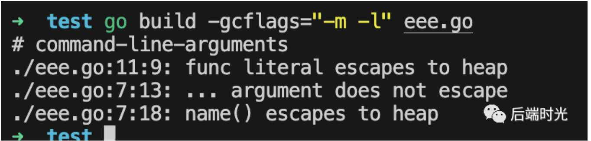

  - 举例2：**interface{} 数据类型**

    - 代码：

      ```go
      package main
      
      import "fmt"
      
      func main() {
          name := "Golang"
          fmt.Println(name)
      }
      ```

    - 分析结果：name 变量也逃逸到堆上了。

      

    - 原因：/src/fmt/print.go 文件中 Println 传参数类型 interface{}，编译器对传入的变量类型未知，所有统一处理分配到了堆上面去了。

  - 举例3：**指针类型**

    - 代码：

      ```go
      package main
      
      import "fmt"
      
      func main() {
          name := point()
          fmt.Println(*name)
      }
      
      func point() *string {
          name := "指针"
          return &name
      }
      ```

    - 分析结果：name 逃逸到了堆上。

      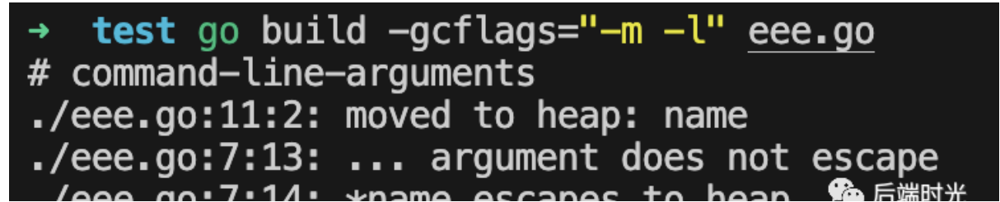

**栈**：

- 在内存中从高地址向下分配的。
- 分配大小空间有限。
- 连续的空间。
- 系统字段分配，效率高。
- 自动回收。

**堆**：

- 在内存中是从低地址向高地址分配的。
- 分配大小受虚拟内存大小限制。
- 非连续的空间。
- new分配的内存，比较慢，容易产生碎片。
- 忘记回收，容易导致内存泄漏。

> 参考文章：[面试官：简单聊聊 Go 逃逸分析？](https://mp.weixin.qq.com/s/JXLGLya8ryCMS3g6loTZHw)

## 37 Mutex获取不到锁会一直等待吗

**问题**：Mutex获取不到锁会一直等待吗?

**解答**：不会。在 2016 年 Go 1.9 中 Mutex 增加了饥饿模式，让锁变得更公平，不公平的等待时间限制在 1 毫秒，并且修复了一个大 Bug：总是把唤醒的 goroutine 放在等待队列的尾部，会导致出现不公平的等待时间。**那什么时候会进入饥饿模式？1 毫秒，一旦等待者等待时间超过这个时间阈值，就可能会进入饥饿模式，优先让等待着先获取到锁。**有饥饿模式自然就有正常模式了，这里就不展开了。你只需要记住，Mutex 锁不会容忍一个 goroutine 被落下，永远没有机会获取锁。Mutex 尽可能地让等待较长的 goroutine 更有机会获取到锁。

## 38 如何实现一个timeout的锁

**问题**：如何实现一个timeout的锁？

**解答**：用 for 循环和 TryLock 实现。先记录开始的时间，用 for 循环判断是否超时，没有超时则反复尝试 TryLock，直到获取成功；如果超时直接返回失败。可这样有一个问题，高频的 CAS 自旋操作，如果失败的太多，会消耗大量的 CPU，我们需要进行优化，将 TryLock 的抢占实现分为两部分，一个是 fast path，另一个是竞争状态下的，后者的 CAS 操作很多，可以考虑减少 slow 方法的频率，例如调用 n 次 fast path 失败后，再调用一次整个 TryLock。我们还可以借鉴 TCP 重试机制进行优化，for 循环中的重试增加休眠时间，每次失败将休眠时间乘以一个系数，直到达到上限，减少自旋带来的性能损耗。

## 39 管道是否能二次关闭

问题：管道是否能二次关闭？

解答：关闭已关闭的通道，会引发`panic: close of closed channel`。

```go
//关闭一个已经关闭的管道
func main() {
    channel := make(chan int, 10)
    close(channel)
    close(channel)
}
//[Output]: panic: close of closed channel
```

## 40 管道关闭是否能读写

问题：管道关闭是否能读写？

解答：

- 读已关闭的channel能一直读到东西，但是读到的内容根据通道内关闭前是否有元素而不同。
  - 如果chan关闭前，buffer内有元素还未读,会正确读到chan内的值，且返回的第二个bool值（是否读成功）为true。
  - 如果chan关闭前，buffer内有元素已经被读完，chan内无值，接下来所有接收的值都会非阻塞直接成功，返回 channel 元素的零 值，但是第二个bool值一直为false。

- 往已关闭的channel写入会引发panic。

## 41 如何等待所有goroutine结束

问题：如何等待所有goroutine结束？

解答：使用channel或sync.WaitGroup

- 使用channel

  ```go
  func main() {
      ch := make(chan int, 2)
  
      go func() {
          for i := 0; i < 10; i++ {
              time.Sleep(1 * time.Second)
              fmt.Println("go routine1", i)
          }
          ch <- 1
      }()
      go func() {
          for i := 0; i < 10; i++ {
              time.Sleep(1 * time.Second)
              fmt.Println("go routine2", i)
          }
          ch <- 2
      }()
  
      // 等待
      for i := 0; i < 2; i++ {
          <-ch
      }
      fmt.Println("main exist")
  }
  ```

- 使用sync.WaitGroup

  ```go
  func main() {
      var wg sync.WaitGroup
  
      for i := 0; i < 10; i++ {
          wg.Add(1)
          go func(i int) {
              defer wg.Done()
              time.Sleep(1 * time.Second)
              fmt.Println(i)
          }(i)
      }
      wg.Wait() // 等待
      fmt.Println("main exist")
  }
  ```

## 42 如何用Go实现栈

问题：如何用Go实现栈?

解答：参考力扣[225. 用队列实现栈](https://leetcode.cn/problems/implement-stack-using-queues/)

```go
type MyStack struct {
	s1 []int
}

func Constructor() MyStack {
	return MyStack{
		s1: []int{},
	}
}

func (this *MyStack) Push(x int)  {
	this.s1 = append(this.s1, x)
}

func (this *MyStack) Pop() int {
	v := this.s1[len(this.s1)-1]
	this.s1 = this.s1[:len(this.s1)-1]
	return v
}

func (this *MyStack) Top() int {
	return this.s1[len(this.s1)-1]
}

func (this *MyStack) Empty() bool {
	return len(this.s1) == 0
}
```

## 43 channel是否线程安全

channel为什么设计成线程安全?

- 不同协程通过channel进行通信，本身的使用场景就是多线程，为了保证数据的一致性，必须实现线程安全。

channel如何实现线程安全的?

- channel的底层实现中， hchan结构体中采用Mutex锁来保证数据读写安全。在对循环数组buf中的数据进行入队和出队操作时，必须先获取互斥锁，才能操作channel数据。

## 44 map是否线程安全

map是否线程安全？

- Map默认不是并发安全的，并发读写时程序会panic。

map为什么不支持线程安全？

- 和场景有关，官方认为大部分场景不需要多个协程进行并发访问，如果为小部分场景加锁实现并发访问，大部分场景将付出加锁代价（性能降低）。

怎么实现map的线程安全？

- 加读写锁（map+sync.RWMutex）
- 使用Go提供的sync.Map（内部加了锁）

## 45 slice是否线程安全

slice是否线程安全？

- slice底层结构并没有使用加锁等方式，不支持并发读写，所以并不是线程安全的，使用多个协程对类型为slice的变量进行操作，每次输出的值大概率都不会一样，与预期值不一致; slice在并发执行中不会报错，但是数据会丢失。

## 46 Go中实现线程安全的几种方式

Go语言实现线程安全常用的几种方式：

- 互斥锁
- 读写锁
- channel
- 原子操作：sync.atomic
- sync.once

## 47 goroutine为什么轻量

问题：goroutine为什么轻量？

解答：

- 从资源消耗方面来看：它只需要一个2Kb的内存栈就可以运行。
- 从运行时来看：它的运行成本很低，将一个goroutine切换到另一个goroutine由运行时进行调度，并不需要很多操作。

## 48 ♥内存模型#56

## 49 深拷贝

概念：

- **深拷贝**：拷贝的是数据本身，创造一个样的新对象，新创建的对象与原对象不共享内存，新创建的对象在内存中开辟一个新的内存地址，新对象值修改时不会影响原对象值。既然内存地址不同，释放内存地址时，可分别释放。
- **浅拷贝**：拷贝的是数据地址，只复制指向的对象的指针，此时新对象和老对象指向的内存地址是一样的，新对象值修改时老对象也会变化。释放内存地址时，同时释放内存地址。

go 深拷贝发生在什么情况下？

- 值类型的数据，默认全部都是深拷贝：Array、Int、String、Struct、Float，Bool
- 引用类型的数据，默认全部都是浅拷贝：Slice，Map，chan。对于引用类型，想实现深拷贝，不能直接 := ，而是要先开辟地址空间（new） ，再进行赋值。

怎么进行（切片的）深拷贝？

- 可以使用 copy() 函数来进行深拷贝，copy 不会进行扩容，当要复制的 slice 比原 slice 要大的时候，只会移除多余的。

  ```go
  func main() {
      slice1 := []int{1, 2, 3, 4, 5}
      slice2 := []int{6, 7, 8}
  
      copy(slice2, slice1) // 复制slice1的前3个元素到slice2中
      fmt.Println(slice1, slice2)
      copy(slice1, slice2) // 复制slice2的3个元素到slice1的前3个位置
      fmt.Println(slice1, slice2)
  }
  ```

- 使用 append() 函数来进行深拷贝，append 会进行扩容（这里涉及到的就是 [Slice 的扩容机制](https://www.yuque.com/xiaoshan_wgo/gonotes/gguirt) ）。

## 50 空结构体

空结构体占不占内存空间？

- 不占。通过 unsafe.Sizeof() 可以查看空结构体的宽度。准确的来说，空结构体有一个特殊起点： `zerobase` 变量。`zerobase`是一个占用 8 个字节的`uintptr`全局变量。每次定义 `struct {}` 类型的变量，编译器只是把`zerobase`变量的地址给出去。也就是说空结构体的变量的内存地址都是一样的。

  ```go
  var s struct{}
  fmt.Println(unsafe.Sizeof(s)) // 0
  ```

空结构体的使用场景主要有三种：

- **实现方法接收者**：在业务场景下，我们需要将方法组合起来，代表其是一个 ”分组“ 的，便于后续拓展和维护。
- **实现集合类型**：在 Go 语言的标准库中并没有提供集合（Set）的相关实现，因此一般在代码中我们图方便，会直接用 map 来替代：`type Set map[string]struct{}`。
- **实现空通道**：在 Go channel 的使用场景中，常常会遇到通知型 channel，其不需要发送任何数据，只是用于协调 Goroutine 的运行，用于流转各类状态或是控制并发情况。

## 51 Go并发模型

Go几种经典的并发模型：

- 使用最基本通过**channel**通知实现并发控制
- 通过sync包中的**WaitGroup**实现并发控制
- 在Go 1.7 以后引进的强大的**Context**上下文，实现并发控制

> 参考文章：[Golang并发模型](https://studygolang.com/articles/10631?fr=sidebar)

## 52 Context的作用

Context的作用：

- Cancel取消机制、控制goroutine的运行

  ```go
  func WithCancel(parent Context) (ctx Context, cancel CancelFunc)
  ```

- Timeout超时机制

  ```go
  func WithDeadline(parent Context, d time.Time) (Context, CancelFunc) 
  func WithTimeout(parent Context, timeout time.Duration) (Context, CancelFunc)
  ```

- 上下文信息传递

  ```go
  func WithValue(parent Context, key, val interface{}) Context 
  ```

## 53 GMP饥饿/数量

全局队列中的G会不会饥饿？

- 全局队列中的G不会饥饿。 因为线程想运行任务就得获取P，从P的本地队列获取G，P本地队列为空时，M也会尝试从全局队列拿一批G放到P的本地队列，或从其他P的本地队列偷一半放到自己P的本地队列。M运行G，G执行之后，M会从P获取下一个G，不断重复下去。所以全局队列中的G总是能被消费掉。

P的数量是多少？能修改吗?

- 可以理解为最大值是本机可执行的cpu的数量。
- 通过runtime.GOMAXPROCS(runtime.NumCPU())设置；runtime.NumCPU()方法返回当前进程可用的逻辑cpu数量。

M的数量是多少?

- Go语⾔本身是限定M的最⼤量是10000。
- runtime/debug包中的SetMaxThreads函数来设置。

## 54 panic 如何恢复

panic 如何恢复？

- recover 可以中止 panic 造成的程序崩溃，或者说平息运行时恐慌，recover 函数不需要任何参数，并且会返回一个空接口类型的值。需要注意的是 recover 只能在 defer 中发挥作用，在其他作用域中调用不会发挥作用。

  - 代码：

    ```go
    // 正确使用
    defer func() {
        if e := recover(); e != nil {
            fmt.Println(e)
        }
    }
    
    // 错误使用
    defer recover()
    ```

  - 详细：编译器会将 recover 转换成 runtime.gorecover，该函数的实现逻辑是如果当前 goroutine 没有调用 panic，那么该函数会直接返回 nil，当前 goroutine 调用 panic 后，会先调用 runtime.gopaic 函数runtime.gopaic 会从 runtime._defer 结构体中取出程序计数器 pc 和栈指针 sp，再调用 runtime.recovery 函数来恢复程序，runtime.recovery 会根据传入的 pc 和 sp 跳转回 runtime.deferproc，编译器自动生成的代码会发现 runtime.deferproc 的返回值不为 0，这时会调回 runtime.deferreturn 并恢复到正常的执行流程。总的来说恢复流程就是通过程序计数器来回跳转。

## 55 defer执行顺序

defer执行顺序?

- 类似于栈，先进后出。

## 56 服务器能开多少个M

服务器能开多少个M由什么决定？

- 由于M必须持有一个P才可以运行Go代码，所以同时运行的M个数，也即线程数一般等同于CPU的个数，以达到尽可能的使用CPU而又不至于产生过多的线程切换开销。
- P的个数默认等于CPU核数，每个M必须持有一个P才可以执行G，一般情况下M的个数会略大于P的个数，这多出来的M将会在G产生系统调用时发挥作用。
- Go语⾔本身是限定M的最⼤量是10000，可以在runtime/debug包中的SetMaxThreads函数来修改设置。

## 57 服务器能开多少个P

服务器能开多少个P由什么决定？

- P的个数在程序启动时决定，默认情况下等同于CPU的核数。
- 程序中可以使用 runtime.GOMAXPROCS() 设置P的个数，在某些IO密集型的场景下可以在一定程度上提高性能。
- 一般来讲，程序运行时就将GOMAXPROCS大小设置为CPU核数，可让Go程序充分利用CPU。在某些IO密集型的应用里，这个值可能并不意味着性能最好。理论上当某个Goroutine进入系统调用时，会有一个新的M被启用或创建，继续占满CPU。但由于Go调度器检测到M被阻塞是有一定延迟的，也即旧的M被阻塞和新的M得到运行之间是有一定间隔的，所以在IO密集型应用中不妨把GOMAXPROCS设置的大一些，或许会有好的效果。

## 58 M和P的关系

M和P是怎么样的关系？

- M必须拥有P才可以执行G中的代码，理想情况下一个M对应一个P，P含有包含多个G的队列，P会周期性地将G调度到M种执行。

## 59 同时启动了一万个G，如何调度

同时启动了一万个G，如何调度？

- 一万个G会按照P的设定个数，尽量平均地分配到每个P的本地队列中。如果所有本地队列都满了，那么剩余的G则会分配到GMP的全局队列上。接下来开始执行GMP模型调度策略。
- **本地队列轮转**：每个P维护着一个包含G的队列，不考虑G进入系统调用或IO操作的情况下，P周期性的将G调度到M中执行，执行一小段时间，将上下文保存下来，然后将G放到队列尾部，然后从队首中重新取出一个G进行调度。
- **系统调用**：上面说到P的个数默认等于CPU核数，每个M必须持有一个P才可以执行G，一般情况下M的个数会略大于P的个数，这多出来的M将会在G产生系统调用时发挥作用。当该G即将进入系统调用时，对应的M由于陷入系统调用而进被阻塞，将释放P，进而某个空闲的M1获取P，继续执行P队列中剩下的G。
- **工作量窃取**：多个P中维护的G队列有可能是不均衡的，当某个P已经将G全部执行完，然后去查询全局队列，全局队列中也没有新的G，而另一个M中队列中还有很多G待运行。此时，空闲的P会将其他P中的G偷取一部分过来，一般每次偷取一半。

## 60 init执行时机

init函数的主要作用：

- 初始化不能采用初始化表达式初始化的变量。
- 程序运行前的注册。
- 实现sync.Once功能。

init函数的主要特点：

- init函数先于main函数自动执行，不能被其他函数调用。
- init函数没有输入参数、返回值。
- 每个包可以有多个init函数。
- 包的每个源文件也可以有多个init函数，这点比较特殊。
- 同一个包的init执行顺序，golang没有明确定义，编程时要注意程序不要依赖这个执行顺序。
- 不同包的init函数按照包导入的依赖关系决定执行顺序。

golang程序初始化：**变量初始化 --> init() --> main()**

- 初始化导入的包（包的初始化顺序并不是按导入顺序（“从上到下”）执行的，runtime需要解析包依赖关系，没有依赖的包最先初始化，与变量初始化依赖关系类似。
- 初始化包作用域的变量（该作用域的变量的初始化也并非按照“从上到下、从左到右”的顺序，runtime解析变量依赖关系，没有依赖的变量最先初始化。
- 执行包的init函数。
- 执行main函数。

## 61 多个init函数执行顺序是否能保证

多个init函数执行顺序能保证吗？

- Go中不同包中init函数的执行顺序是根据包的导入关系决定的。嵌套最深的包内的init函数最先执行。

  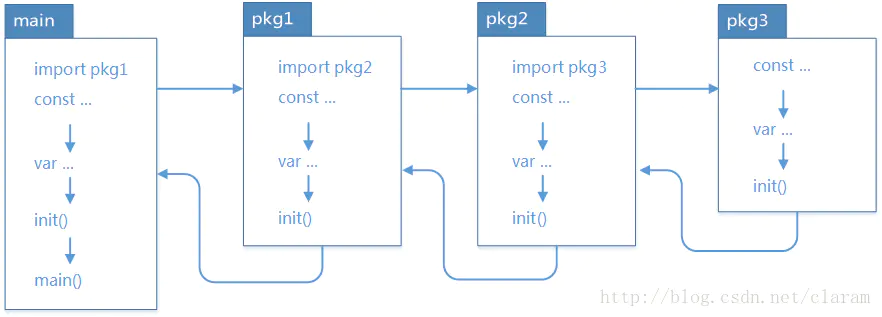

## 62 gin框架的路由是如何处理的

gin框架的路由是怎么处理的？

- Gin框架中的路由使用的是httprouter这个库。使用了类似前缀树的数据结构-压缩版前缀树：对于基数树的每个节点，如果该节点是唯一的子树的话，就和父节点合并。

> 参考文章：[前缀树和后缀树](https://blog.csdn.net/u013949069/article/details/78056102)

## 63 runtime常见方法

runtime提供常见的方法?

- **Gosched()**：让当前线程让出 cpu 以让其它线程运行，它不会挂起当前线程，因此当前线程未来会继续执行。
- **NumCPU()**：返回当前系统的 CPU 核数量。
- **GOMAXPROCS()**：设置最大的可同时使用的 CPU 核数。
  - 通过runtime.GOMAXPROCS函数，应用程序可以设置运行时系统中的 P 最大数量。注意，如果在运行期间设置该值的话，会引起“Stop the World”。所以，应在应用程序最早期调用，并且最好是在运行Go程序之前设置好操作程序的环境变量GOMAXPROCS，而不是在程序中调用runtime.GOMAXPROCS函数。无论我们传递给函数的整数值是什么值，运行时系统的P最大值总会在1~256之间。
  - go1.8 前，还是要设置一下，可以更高效的利用 cpu。
  - go1.8 后，默认让程序运行在多个核上，可以不用设置了。
- **Goexit()**：退出当前 goroutine（但是defer语句会照常执行）。
- **NumGoroutine**：返回正在执行和排队的任务总数。
  - runtime.NumGoroutine函数在被调用后，会返回系统中的处于特定状态的 Goroutine 的数量。这里的特定状态是指GrunnableGruningGsyscallGwaition。处于这些状态的Groutine即被看做是活跃的或者说正在被调度。
  - 注意：垃圾回收所在Groutine的状态也处于这个范围内的话，也会被纳入该计数器。
- **GOOS**：查看目标操作系统。很多时候，我们会根据平台的不同实现不同的操作，就可以用GOOS来查看自己所在的操作系统。
- **runtime.GC**：会让运行时系统进行一次强制性的垃圾收集。
  - 强制的垃圾回收：不管怎样，都要进行的垃圾回收。非强制的垃圾回收：只会在一定条件下进行的垃圾回收（即运行时，系统自上次垃圾回收之后新申请的堆内存的单元（也成为单元增量）达到指定的数值）。
- **GOROOT()**：获取 goroot 目录。
- **runtime.LockOSThread 和 runtime.UnlockOSThread 函数**：前者调用会使调用他的 Goroutine 与当前运行它的M锁定到一起，后者调用会解除这样的锁定。

## 64 profile工具

profile就是定时采样，收集cpu，内存等信息，进而给出性能优化指导。

```go
//（以net/http/pprof举例）
import (
"net/http"
    _ "net/http/pprof"
)

func main(){
  err :=http.ListenAndServe(":9909",nil)
  if err != nil {
     panic(err)
  }
}
```

**Go 内存使用采样，有四个相应的指标：**

- **inuse_objects**：当我们认为内存中的驻留对象过多时，就会关注该指标。
- **inuse_space**：当我们认为应用程序占据的 RSS 过大时，会关注该指标。
- **alloc_objects**：当应用曾经发生过历史上的大量内存分配行为导致 CPU 或内存使用大幅上升时，可能关注该指标。
- **alloc_space**：当应用历史上发生过内存使用大量上升时，会关注该指标。

| 类型             | 描述                                                         |
| :--------------- | :----------------------------------------------------------- |
| **allocs**       | 所有过去内存分配的采样信息（所有对象）                       |
| **blocks**       | 阻塞操作情况的采样信息（用于记录 goroutine 在等待共享资源花费的时间） |
| **cmdline**      | 当前程序的命令行的完整调用路径goroutine，显示程序启动命令参数及其参数 |
| **goroutine**    | 显示当前所有协程的堆栈信息                                   |
| **heap**         | 堆上的内存分配情况的采样信息（活跃对象）                     |
| **mutex**        | 锁竞争情况的采样信息                                         |
| **profile**      | cpu占用情况的采样信息，点击会下载文件                        |
| **threadcreate** | 系统线程创建情况的采样信息                                   |
| **trace**        | 程序运行跟踪信息                                             |

## 65 怎么检查Go问题

怎么检查go问题？

- **golangci-lint：**golangci-lint 是一个集成工具，它集成了很多静态代码分析工具（静态代码分析是不会运行代码的），我们通过配置这个工具，便可灵活启用需要的代码规范检查。

  ```go
  go get github.com/golangci/golangci-lint/cmd/golangci-lint
  ```

- 自带的vet：vet 是 go 中自带的**静态分析工具**，可以让我们检查出 package 或者源码文件中一些隐含的错误。

  ```go
  //分析某个文件
  go vet test/main.go
  
  //分析某个包
  go vet test/*.go
  go vet test/...
  ```

- **benchmark**基准测试。
- **profile**定时采样，收集cpu，内存等信息，进而给出性能优化指导。可以通过编译后文件，查看火焰图，查看函数执行时长、内存分析，CPU执行时长。

## 66 ♥context实现原理#78


## 67 ♥sync.Pool实现原理#79


## 68 信令用WSS还是WS

信令：信令（Signaling）是指通讯系统中的控制指令。**信令（io）是基于ws进行扩展的协议**。

WSS：WSS 是 Web Socket Secure 的简称, 它是 WebSocket 的加密版本. 我们知道 WebSocket 中的数据是不加密的, 但是不加密的数据很容易被别有用心的人窃取, 因此为了保护数据安全, 人们将 WebSocket 与 SSL 结合, 实现了安全的 WebSocket 通信, 即 WebSocket Secure。所以说 WSS 是使用 SSL 进行加密了的 WebSocket 通信技术。

WS：即Web Socket。

## 69 Go怎么实现封装/继承/多态

封装：通过结构体+字段首字母大小写。

继承：通过组合实现。

多态：通过接口实现。

## 70 用Channel和两个协程实现数组相加#85

用Channel和两个协程实现数组相加？

- 代码如下：

  ```go
  func Test_chan_10(t *testing.T) {
  	a := []int{2, 4, 6}
  	b := []int{1, 3, 5, 7}
  	ans := add(a, b)
  	fmt.Println(ans)
  }
  
  func add(a, b []int) []int {
  	la, lb := len(a), len(b)
  	x, y := a, b
  	l := la
  	if lb > la {
  		l = lb
  		x, y = b, a
  	}
  
  	ch := make(chan int)
  	done := make(chan struct{})
  	c := make([]int, l)
  	go func() {
  		for _, v := range y {
  			ch <- v
  		}
  		close(ch)
  	}()
  	go func() {
  		for i, t := range x {
  			temp := <-ch
  			c[i] = temp + t
  		}
  		done <- struct{}{}
  	}()
  	<-done
  	return c
  }
  ```

  


# 系统设计


# 计算机与网络


# 项目 && 线上故障 && Linux

## 1 ※遇到的一些故障问题

### 1.1 磁盘写爆，导致宕机

背景：压测导致流量变大，日志写多比较多，然后日志磁盘比较小，写满后导致机器宕机了。

措施：

- 日志级别设置error，服务上云，保证宕机后会重新启动一台机器。
- 对磁盘进行监控告警。
- tke上的磁盘是否可自动扩容?

### 1.2 北极星故障导致流量聚集到单点机器

- 从es上根据服务名+错误码对server_ip进行聚合，出现ip聚集现象。
- 从tke上看到机器实例比较多，但是其他pod的cpu利用比较低。
  - linux命令：top
- 查看北极星日志，发现有实例被摘除了。
- 与北极星确认，是由于北极星故障导致的。

### 1.3 Mysql binlog_row_image 设置为MINIMAL导致测试环境和现网不一致

binlog_row_image参数值类型：

- MINIMAL：只是记录最少需要的列。
- FULL：在“前镜像”和“后镜像”中记录所有的列。是默认取值。

### 1.4 close_wait定位问题


## 2 ※项目问题

### 2.1 排行榜问题

#### 2.1.1 千万级排行榜怎么设计?

**数据结构**：使用zset，每个zset放入数据最多100w比较合适。

**设计思想**：分而治之，防止出现大key和热key

- topN按照精确排名+百分比模糊排名
- 按照分数进行分桶，分桶的区间及大小由需要根据根据高数、概率论知识进行预估。
  - 这里可能会出现分数桶分布不均匀的问题，解决办法：
    - 算法工程师分析分数分布情况，给出预估。
    - 采用动态扩容。
- 使用多个key存储每个桶之前所有桶的总数，使用定时任务去异步刷新校对（如每秒刷新一次）：ZCARD命令时间复杂度是O(1)
- redis采用分片+读写分离。

>参考文章：[设计一个排行榜](https://segmentfault.com/a/1190000039320528)、[千万用户排名设计](https://zhuanlan.zhihu.com/p/50770947)、[亿级用户游戏排行榜设计方案](https://blog.csdn.net/riemann_/article/details/113828075)

#### 2.1.2 怎么解决热点key和大key问题？

##### 2.1.2.1 大key问题

**概念**：所谓的bigkey就是存储本身的key值空间太大，或者hash，list，set等存储中value值过多。主要包括：

- 单个简单的key存储的value很大。
- hash， set，zset，list 中存储过多的元素。
- 一个集群存储了上亿的key。

**导致问题**：

- **客户端超时阻塞**。由于 Redis 执行命令是单线程处理，然后在操作大 key 时会比较耗时，那么就会阻塞 Redis，从客户端这一视角看，就是很久很久都没有响应。
- **引发网络阻塞**。每次获取大 key 产生的网络流量较大，如果一个 key 的大小是 1 MB，每秒访问量为 1000，那么每秒会产生 1000MB 的流量，这对于普通千兆网卡的服务器来说是灾难性的。
- **阻塞工作线程**。如果使用 del 删除大 key 时，会阻塞工作线程，这样就没办法处理后续的命令。
- **内存分布不均**。集群模型在 slot 分片均匀情况下，会出现数据和查询倾斜情况，部分有大 key 的 Redis 节点占用内存多，QPS 也会比较大。

- 删除一个大Key造成主库较长时间的阻塞并引发**同步中断**或**主从切换**。

**解决办法**：

- 对大Key进行拆分：哈希后取模。

> 参考文章：[Redis—大key问题讨论及解决方案](https://blog.csdn.net/zhulj625/article/details/106695714/)、[Redis大key要如何处理?](https://blog.csdn.net/qq_34827674/article/details/126225192)

##### 2.1.2.2 热key问题

**概念**：在Redis中，我们把访问频率高的Key，称为热Key。比如突然又几十万的请求去访问redis中某个特定的Key，那么这样会造成redis服务器短时间流量过于集中，很可能导致redis的服务器宕机。那么接下来对这个Key的请求，都会直接请求到我们的后端数据库中，数据库性能本来就不高，这样就可能直接压垮数据库，进而导致后端服务不可用。

**产生原因**：

- 短时间请求量过大：如商品秒杀、热点新闻、热点评论等读多写少的场景。
  - 例如：双十一秒杀商品，短时间内某个爆款商品可能被点击/购买上百万次，或者某条爆炸性新闻等被大量浏览，此时会造成一个较大的请求Redis量，这种情况下就会造成热点Key问题。
- 请求分片集中，超过单台Redis服务器的性能极限。
  - 例如：在服务端读数据进行访问时，往往会对数据进行分片切分，例如采用固定Hash分片，hash落入同一台redis服务器，如果瞬间访问量过大，超过机器瓶颈时，就会导致热点 Key 问题的产生。

**危害**：容易造成缓存击穿，压垮redis服务器，导致大量请求直接发往后端服务，并且DB本身性能较弱，很可能进一步导致后端服务雪崩。

**如何识别热点key？**

- 凭借个人经验，结合业务场景，判断哪些是热Key。
  - 例如：比如，双十一大促的时候，苹果手机正在秒杀，那么我们可以判断苹果手机这个sku就是热Key。
- 使用redis之前，在客户端写程序统计上报。
  - 例如：修改我们的业务代码，在操作redis之前，加入Key使用次数的统计逻辑，定时把收集到的数据上报到统一的服务进行聚合计算，这样我们就可以找到那些热点Key。缺点就是对我们的业务代码有一定的侵入性。
- 服务代理层上报：这个要看具体公司redis集群架构是怎么样的，如果是在redis前面有一个代理层，那么我们可以在代理层进行收集上报，也是可以找到热点Key。

- 使用redis自带的命令。
  - 例如：可以使用monitor、redis-cli加上--hotkeys选项等，不过这种方式执行起来很慢，可能会降低redis的处理请求的性能，慎用。
    - monitor命令：可以实时抓取出redis服务器接收到的命令，然后写代码统计出热Key，也有现成的分析工具可以使用。
- redis节点抓包分析。自己写程序监听端口，解析数据，进行分析。

**如何解决热点key问题？**

- Redis集群扩容：增加分片副本，分摊客户端发过来的读请求（随机key）。
- 采用读写分离。

- 使用二级缓存，即本地缓存，减少Redis的读请求。

> 参考文章：[Redis中什么是热Key问题？如何解决热Key问题?](https://blog.csdn.net/Weixiaohuai/article/details/125310401)、[Redis中大key/热key问题的解决方案](https://www.cnblogs.com/cxy2020/p/13810963.html)、

#### 2.2.3 跳表问题?

##### 2.2.3.1 redis几种数据结构

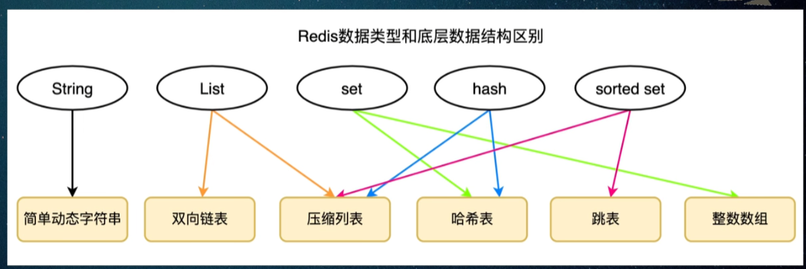

##### 2.2.3.2 zset底层数据结构?简单说说跳表底层的数据结构

zset底层数据结构是压缩列表和跳表。

压缩列表的底层数据结构：


什么是跳表?


##### 2.2.3.3 什么时候采用压缩列表、什么时候采用跳表呢?

下面情况使用压缩列表：


##### 2.2.3.4 跳表的时间复杂度

思想类似于二分法，查找/删除/插入的时间复杂度都是O(log(n))

##### 2.2.3.5 简单描述一下跳表如何查找/插入/删除某个元素呢?

查找一个元素：

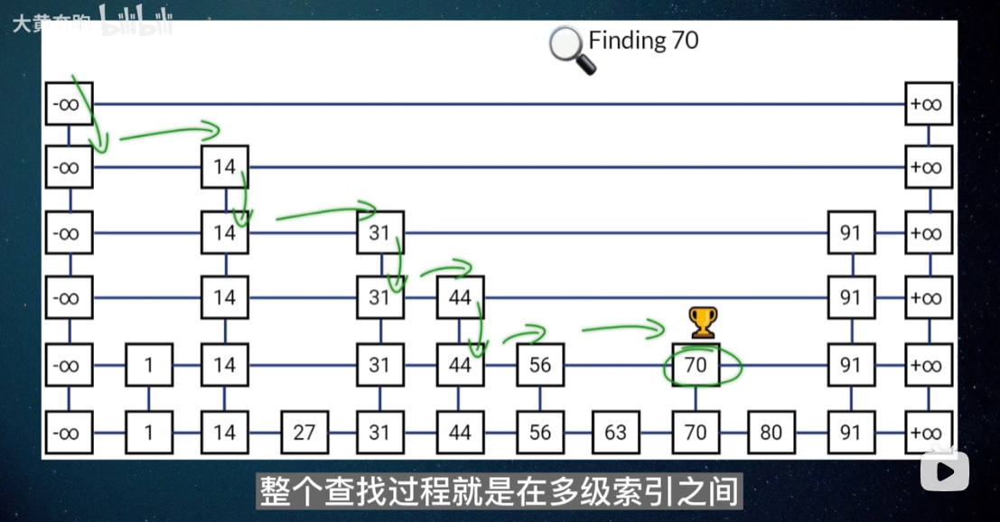

插入一个元素：

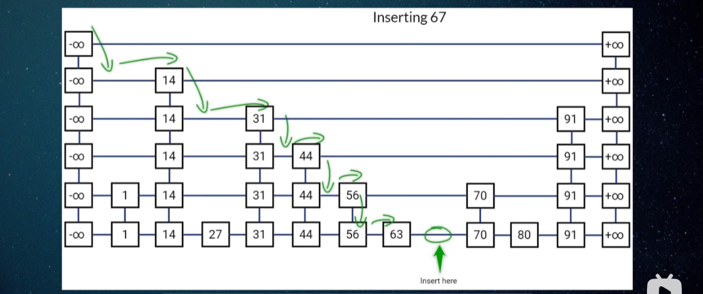

删除一个元素：

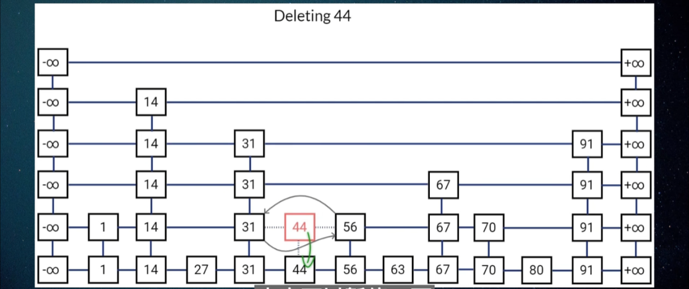

##### 2.2.3.6 zset为什么用跳表而不用二叉树或者红黑树呢?

两个原因：

- 范围查找：跳表效率比红黑树高。
- 跳表的实现比红黑树简单，易懂，可以有效的控制跳表的层级来控制内存的消耗。

##### 2.2.3.7 插入元素的时候索引的层数怎么确定?

一般来说，上层节点个数应该是下层节点个数的二分之一，因此希望新节点添加到上一层的概率是二分之一最简单的方式就是抛硬币，最后正面出现的次数k就代表我们需要在第一层到第k层之间添加索引。当然也不能让层数无限增长，所以还要添加一个最大值来进行限制。

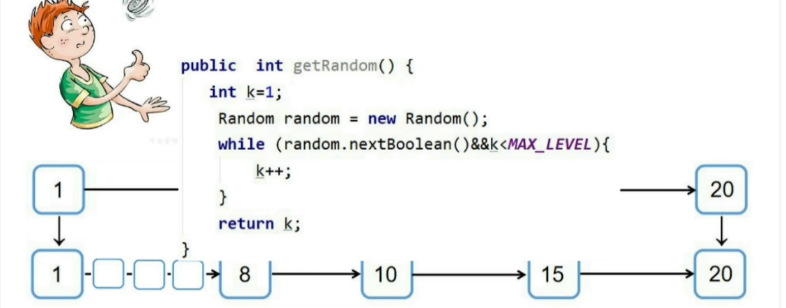


#### 2.2.4 使用的腾讯云Redis宕机了怎么办?

**腾讯云Redis架构图**：

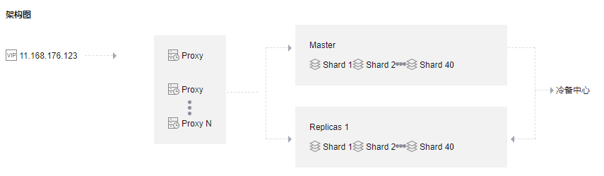

**腾讯云Redis的关键配置**：

- 内存容量：320GB
- 分片设置：40分片/8GB/1副本
- 架构：集群架构

- 内存淘汰策略：maxmemory-policy： noeviction

**解决方案**：

- 架构上容灾：分片+主从+哨兵
- 持久化机制：
  - 主节点：AOF
  - 从节点：RDB+AOF

#### 2.2.5 redis的一致性是怎么实现的?与etcd的区别是?


#### 2.2.6 怎么设计一个秒杀系统?

思考方向：

- 高性能

  - 动静分离：数据拆分、静态缓存、数据整合
    - 静态数据缓存方式：浏览器、CDN、服务端
  - 热点问题
    - 热点识别：
    - 热点隔离：业务隔离、系统隔离、数据隔离。
    - 热点优化：缓存、限流、熔断降级。
  - 系统优化
    - 减少序列化
    - 裁剪日志

- 高一致

  - 减库存方式
    - 下单减库存：会出现竞争对手恶意下单不付款。
    - 付款减库存：会出现很多买家下单成功却无法付款。
    - 预扣库存：不会出现超卖。
  - 事务、分布式锁、lua原子脚本、最终一致性。

- 高可用

  - 增加操作复杂度（例如图片验证）。

  - 消息队列、线程池加锁：流量削峰。
  - 过滤：限流+缓存。

> 参考文章：[一个秒杀系统的设计思考](https://segmentfault.com/a/1190000020970562)、[如何设计一个秒杀系统](https://blog.csdn.net/weixin_42754896/article/details/126110420)

#### 2.2.7 怎么使用redis设计一个分布式锁?

需要考虑以下几点：

- 使用命令SETNX key value EX：保证只有第一个请求的客户端才能获取到锁。
- 给key加上过期时间：防止某个客户端获取锁之后，释放锁失败造成死锁。
  - 需要预估过期时间：比如业务处理时间在3秒左右，过期时间设置为2倍，可以避免锁提前释放，也可以防止释放锁失败的情况。
- 客户端保证每次只释放掉自己的锁：value使用随机数。
- 释放锁的时候使用lua原子脚本：先get key，判断value是自己的后再delete。
- redis主从架构下，可能会出现不同客户端获取到同一个锁的情况：解决办法是需要基于redis集群来实现可靠的分布式锁。

常见的解决方案：

- redlock

> 参考文章：[基于Redis的分布式锁到底安全吗(上)](http://zhangtielei.com/posts/blog-redlock-reasoning.html)、[基于Redis的分布式锁到底安全吗(下)](http://zhangtielei.com/posts/blog-redlock-reasoning-part2.html)、[redlock](https://redis.io/topics/distlock)

#### 2.2.8 redis一致性hash和hash槽

注意事项：

- **一致性哈希**用于解决分布式缓存系统中的数据选择节点存储问题和数据选择节点读取问题以及在增删节点后减少数据缓存的消失范畴，防止雪崩的发生。
- **哈希槽**是在redis cluster集群方案中采用的，redis cluster集群**没有采用一致性哈希方案**，而是**采用数据分片中的哈希槽**来进行数据存储与读取的。


> 参考文章：[redis一致性hash和hash槽](https://blog.csdn.net/weixin_43001336/article/details/122834046)、[Redis的集群扩容和缩容——思考一致性hash算法](http://events.jianshu.io/p/022b3764327b)、[Redis Cluster数据分片实现原理、及请求路由实现](https://zhuanlan.zhihu.com/p/511199672)


### 2.2 监控系统设计

#### 2.2.1 日志收集的Agent设计原理?

**设计原理**：通过在服务启动的时候加载trpc-edu-log插件，加载插件的时候可以注册**服务端拦截器**（针对被调方的请求响应日志进行记录写到es）和客户端拦截器（针对主调方的请求响应日志进行记录写到es）。为了防止日志重复，一般都是配置的服务端拦截器。trpc-edu-log插件可以通过设置`side_car_agent: true`来确定是否部署在side car模式的Agent上。

#### 2.2.2 ElasticSearch的架构信息?

**腾讯云es节点信息**：

- 单日写入量：高达40T。
- 节点信息：
  - 热节点：12个
  - 冷节点：10个
  - 专用主节点：3个
  - kibana节点：1个
- 分片数：不同索引分片数不一样，比如ke索引是100个、tiny索引是40个，imlog索引是20个。
- 冷热集群的淘汰策略：即采用es自身的保护机制。
  - 磁盘最大使用率默认为85%，如果数据太多会直接抛弃数据，触发集群只读和索引只读。
  - 参见文档：[es6.8官方文档-disk-allocator](https://www.elastic.co/guide/en/elasticsearch/reference/6.8/disk-allocator.html)、[es磁盘容量策略](http://xn--es -4h6hl39c0r6bi4f7ydx1gy8if5ot45dstp/)、[es节点磁盘使用率过高索引无副本](https://www.bbsmax.com/A/Ae5RPjl3zQ/)

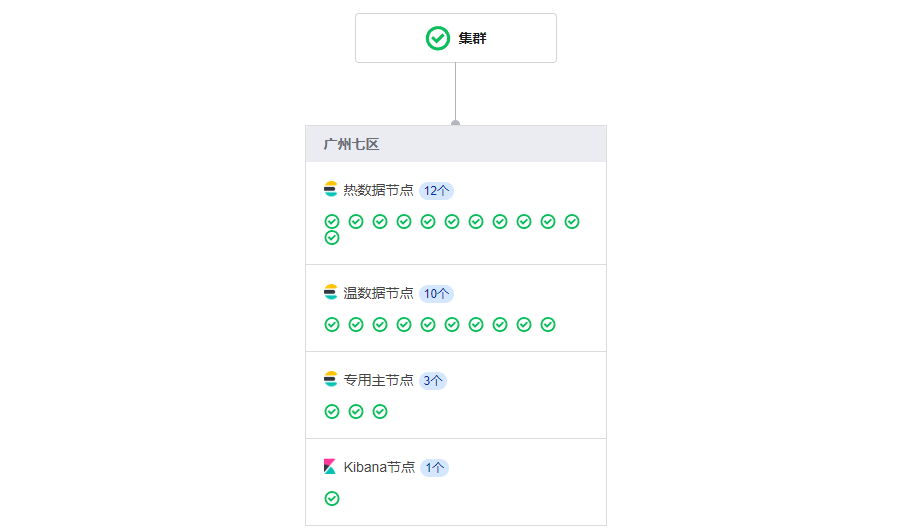

#### 2.2.3 ElasticSearch拒绝率太高的解决方案?

**ES日志拒绝率太高，排查了哪几个方面**：

- 腾讯云有针对 es 的监控（cpu、内存、写入拒绝率，读取拒绝率）。
- 客户端写 es 的时候也有报错 429 XXXX。

**常见解决方案**：

- 冷热数据分离
- 索引按天拆分
- 索引生命周期管理/删除过期索引
- 添加副本
- 根据天级数据分配合理的 shard 数目
- 优化查询语句
- 索引模板里面调整控制索引的相关参数值：减少对不必要的字段进行索引
- flush 落盘的大小和时间间隔
- es 集群本身的一些参数设置

- 主动丢弃一段时间
  - 为什么不能用消息队列来削峰平谷？
    - 监控需要考虑实时性。

## 3 ※常用的linux命令

### 3.1 进程间通信方式有哪些?

背景：每个进程的用户地址空间都是独立的，一般而言是不能互相访问的，但内核空间是每个进程都共享的， 所以进程之间要通信必须通过内核。

进程间通信的六种方式：

- 管道：单向传输数据
- 消息队列：存在用户态与内核态之间的数据拷贝开销。
- 共享内存：拿出一块虚拟地址空间来，映射到相同的物理内存中。
- 信号量：一个整型的计数器，主要用于实现进程间的互斥与同步，而不是用于缓存进程间通信的数据。
- 信号：一般用于一些异常情况下的进程间通信，是一种异步通信。
- Socket：跨网络与不同主机上的进程之间通信。

>参考文章：[进程间的六种通信方式](https://blog.csdn.net/GMLGDJ/article/details/124627224)


# Redis


# Mysql


# Kafka


# Kubernetes


