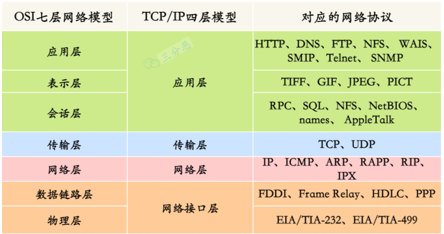
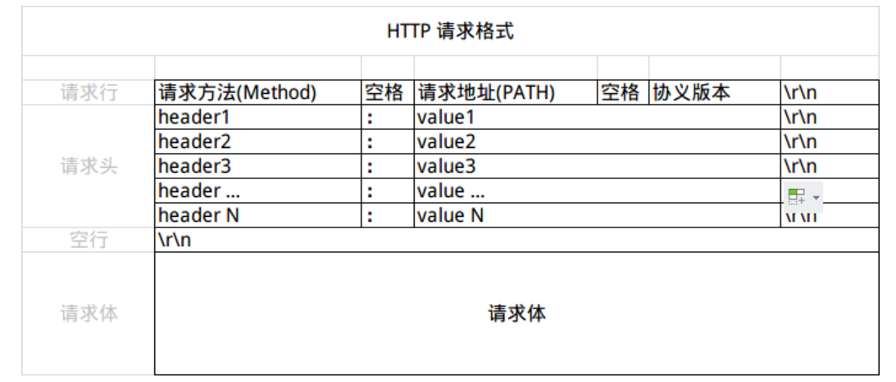
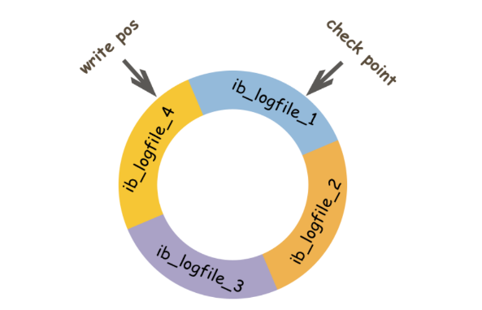
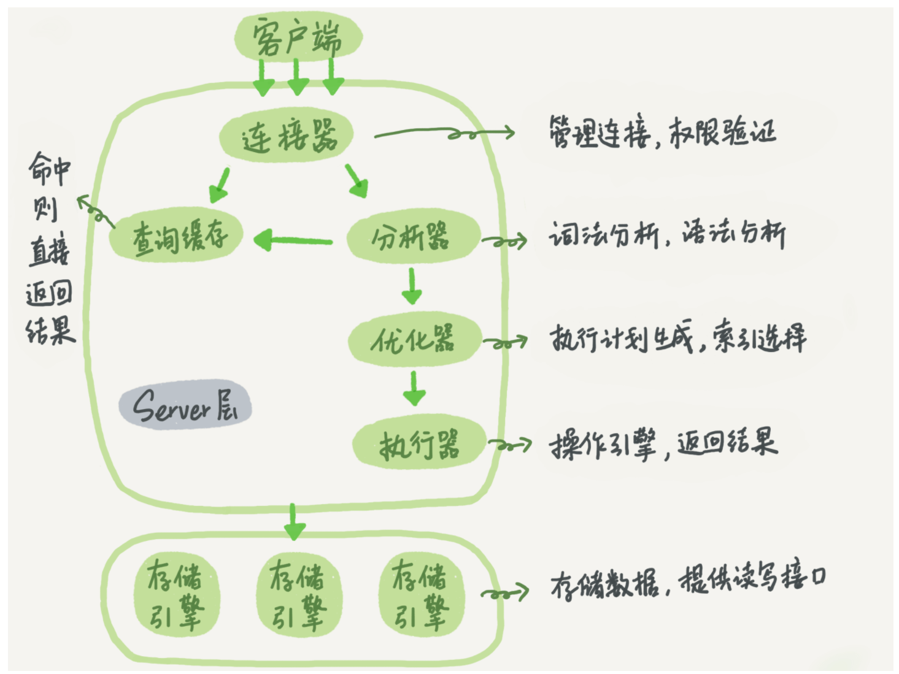
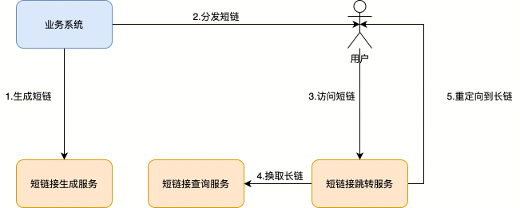
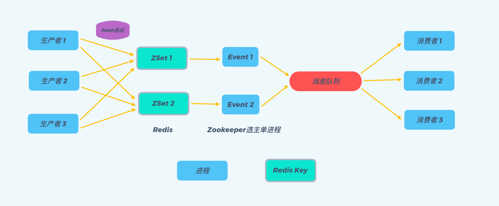
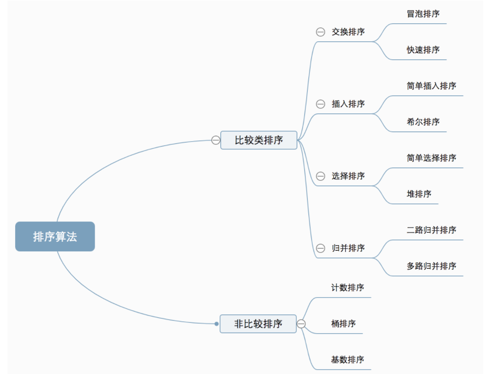
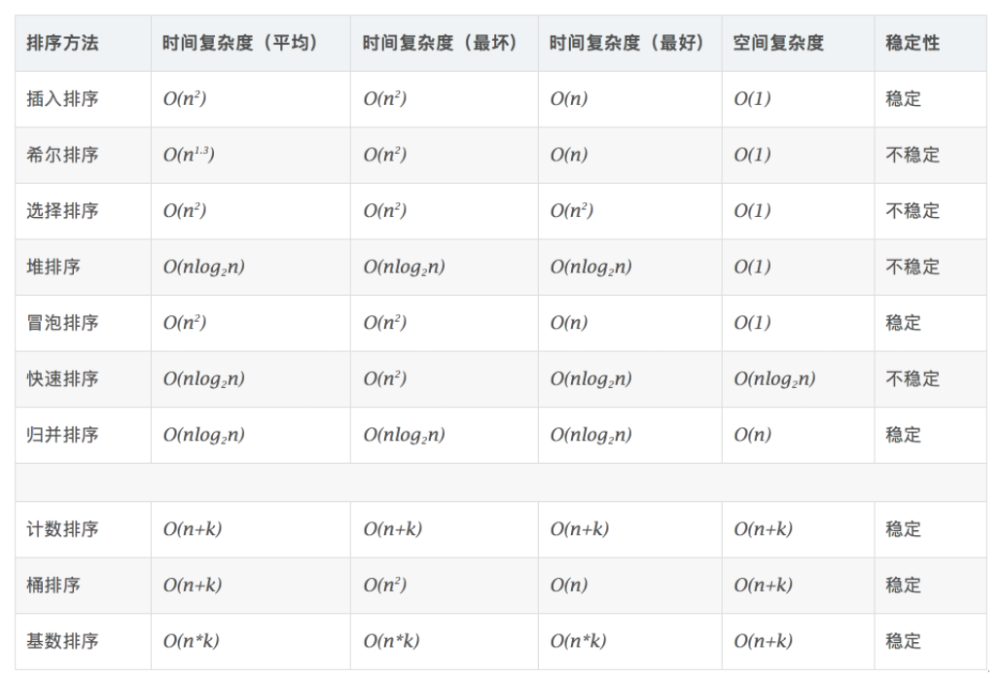

# 0. Blog

- 官方博客：https://go.dev/blog/all

# 1. Go语法

## 1.1 slice类型nil和空切片的区别?

问题：var a int[]和a:=make([]int,0)或者a := []int{}的区别？

区别：

- 相同点
  - append：作用是相同的
  - 打印：都是[]
- 不同点
  - json序列化：前者是null，后者是[]

```go
func TestQuestion_1_1(t *testing.T) {
	var a1 []int
	a2 := []int{}
	fmt.Println(a1, a2) // [] []
	b1, _ := json.Marshal(a1)
	b2, _ := json.Marshal(a2)
	fmt.Println(string(b1), string(b2)) // null []
}
```

使用建议：

- 针对判断问题，这两者是不相等的。
- 在判断是否位空时，建议统一使用len(a)==0做判断。

注意事项：

- slice的底层数据结构

  ```go
  // runtime/slice.go
  type slice struct {
  	array unsafe.Pointer
  	len   int
  	cap   int
  }
  
  func TestQuestion_1_1_2(t *testing.T) {
  	var a1 []int
  	a2 := make([]int, 0) // 其slice.array的初始值其实是一个全局变量的值 var zerobase uintptr（位于runtime/malloc.go）
  	a3 := []string{}     // 其slice.array的初始值其实是一个全局变量的值 var zerobase uintptr（位于runtime/malloc.go）
  	p1 := (*slice)(unsafe.Pointer(&a1))
  	p2 := (*slice)(unsafe.Pointer(&a2))
  	p3 := (*slice)(unsafe.Pointer(&a3))
  	// a1, array=0, len=0, cap=0
  	fmt.Printf("a1, array=%x, len=%d, cap=%d\n", uintptr(p1.array), uintptr(p1.len), uintptr(p1.cap))
  	// a2, array=c000051e80, len=0, cap=0
  	fmt.Printf("a2, array=%x, len=%d, cap=%d\n", uintptr(p2.array), uintptr(p2.len), uintptr(p2.cap))
  	// a3, array=c000051e80, len=0, cap=0
  	fmt.Printf("a3, array=%x, len=%d, cap=%d\n", uintptr(p3.array), uintptr(p3.len), uintptr(p3.cap))
  }
  ```

## 1.2 map类型nil和空切片的区别？

问题：var a map[int]int和a:=make(map[int]int,0)或者a:=map[int]int{}的区别？

区别：

- 相同点
  - 查询元素：效果相同
  - 删除元素：效果相同
  - 打印：都是map[]
- 不同点
  - 添加元素：前者会panic，后者不会
  - json序列化：前者是null，后者是{}

```go
func TestQuestion_1_2(t *testing.T) {
	var a1 map[int]int
	a2 := map[int]int{}
	//a1[2] = 2 // 这里会panic
	a2[3] = 3
	delete(a1, 1)
	delete(a2, 1)
	fmt.Println(a1, a2) // map[] map[]
	b1, _ := json.Marshal(a1)
	b2, _ := json.Marshal(a2)
	fmt.Println(string(b1), string(b2)) // null {}
}
```

使用建议：

- 在判断是否位空时，建议统一使用len(a)==0做判断。

注意事项：

- map的底层数据结构

  ```go
  // runtime/map.go
  type hmap struct {
  	// Note: the format of the hmap is also encoded in cmd/compile/internal/gc/reflect.go.
  	// Make sure this stays in sync with the compiler's definition.
  	count     int // # live cells == size of map.  Must be first (used by len() builtin)
  	flags     uint8
  	B         uint8  // log_2 of # of buckets (can hold up to loadFactor * 2^B items)
  	noverflow uint16 // approximate number of overflow buckets; see incrnoverflow for details
  	hash0     uint32 // hash seed
  
  	buckets    unsafe.Pointer // array of 2^B Buckets. may be nil if count==0.
  	oldbuckets unsafe.Pointer // previous bucket array of half the size, non-nil only when growing
  	nevacuate  uintptr        // progress counter for evacuation (buckets less than this have been evacuated)
  
  	extra *mapextra // optional fields
  }
  ```

## 1.3 interface{}的底层原理?

> 参考文章：[深度解密Go语言之关于 interface 的 10 个问题](https://mp.weixin.qq.com/s/EbxkBokYBajkCR-MazL0ZA)

## 1.4 切片及切片指针

切片与切片指针作为函数参数的区别：

- 切片指针作为函数参数传入函数内部时，不论是修改还是追加都能保证函数内的操作影响到函数外部。
- 切片作为函数参数传入函数内部，只有修改会影响外部，而追加则无法对外部造成影响。

```go
func TestQuestion_1_4(t *testing.T) {
	var (
		s1 = []int{1, 2, 3}
		s2 = []int{11, 12, 13}
	)
	sliceOpt(s1)
	slicePointerOpt(&s2)
	fmt.Println(s1) // [0 2 3]
	fmt.Println(s2) // [0 12 13 14]
}

func sliceOpt(s []int) {
	if len(s) > 0 {
		s[0] = 0
	}
	s = append(s, 4)
}

func slicePointerOpt(s *[]int) {
	if len(*s) > 0 {
		(*s)[0] = 0
	}
	*s = append(*s, 14)
}

```

总结：

- 数组传参只能改不能加且无法影响外部。
- 切片传参改能影响外部，加无法影响外部。
- 字典传参能改能加且均会影响外部。
- 切片指针能改能加且均会影响外部。

> 相关文章：[数组指针、切片指针与结构体指针](https://blog.csdn.net/u013792921/article/details/84565336)

## 1.5 错误处理


> 参考文章：[Working with Errors in Go 1.13](https://go.dev/blog/go1.13-errors)、[Go 1.13中的错误处理](https://mp.weixin.qq.com/s/3gEf-vL_iAIaL_tWCddILQ)、[pkg/errors](https://pkg.go.dev/github.com/pkg/errors)

## 1.6 定时器


> 参考文章：[Golang中的定时器](https://www.cnblogs.com/zhangmingcheng/p/15817344.html)

# 2. 网络及通信协议

## 2.1 计算机网络的应用层协议有哪些?



- Telnet：远程登陆协议
- FTP：文本传输协议
- HTTP：超文本传输协议
- DNS：域名服务协议
- SMTP：简单邮件传输协议

注意事项：

- ping工作在网络层，通信协议是ICMP（英特网报文控制协议）

## 2.2 HTTP协议有哪些请求方法？

| 方法    | 描述                                     | 是否包含主体 |
| ------- | ---------------------------------------- | ------------ |
| GET     | 从服务器获取一份文档                     | 否           |
| HEAD    | 服务器在响应中只返回首部                 | 否           |
| POST    | 向服务器发送带要处理的数据               | 是           |
| PUT     | 向服务器写入文档                         | 是           |
| TRACE   | 对报文进行追踪，确认经过了哪些代理服务器 | 否           |
| OPTIONS | 诮求Web服务器告知其支持的各种功能        | 否           |
| DELETE  | 请服务器删除请求URL所指定的资源          | 否           |

> 参考文章：[HTTP请求方法](https://blog.csdn.net/sphinx1122/article/details/104608388)

## 2.3 GET和POST的区别?

GET和POST请求的区别：

- 可发送数据量不同：由于浏览器对URL的长度有限制，所以GET请求能发送的数据量少于POST请求。
- 安全性不同：GET请求参数是URL的一部分，而POST请求参数封装在请求体中，POST请求更加安全。
- 支持的数据格式不同：GET请求只允许ASCII字符；而POST请求没有限制，也允许二进制数据。

- 编码类型不同：GET请求为`application/x-www-form-urlencoded`，POST请求为`application/x-www-form-urlencoded`或`multipart/form-data`

  - 关于`application/x-www-form-urlencoded`或`multipart/form-data`的区别：

    - application/x-www-form-urlencoded：只能上传键值对，并且键值对都是间隔分开的。

    - multipart/form-data：既可以上传文件等二进制数据（可以用来上传文件），也可以上传表单键值对。


- 报文上的区别：
  - 请求行方法名不同
  - 请求url不同：GET请求参数在url中；POST请求参数在请求体中

- 书签：GET请求可收藏为书签；POST请求不能收藏为书签。

- 缓存：GET请求能被缓存；而POST请求不能被缓存。
- 历史：GET请求参数会保留在浏览器历史中；POST请求参数不会保存在浏览器历史中。

> 参靠文章：[GET和POST请求的区别](https://blog.csdn.net/qq_43588129/article/details/115218995)、[multipart/form-data 和 x-www-form-urlencoded的区别](https://blog.csdn.net/yamadeee/article/details/84250297)

## 2.4 HTTP的请求头和请求体用什么来区分？

http的请求头和boby用空行来分隔：



> 参考文章：[HTTP请求头与请求体](https://www.cnblogs.com/gxz-sw/p/6761984.html)

## 2.5 HTTP请求头可以携带二进制数据吗?

不可以，HTTP请求头和响应头都是以ASCII文本方式传输的。通过请求体可以携带二进制数据。

## 2.6 进程的通讯方式

- 管道pipe：管道是一种半双工的通信方式，数据只能单向流动，而且只能在具有亲缘关系的进程间使用。进程的亲缘关系通常是指父子进程关系。
- 命名管道FIFO：有名管道也是半双工的通信方式，但是它允许无亲缘关系进程间的通信。
- 消息队列MessageQueue：消息队列是由消息的链表，存放在内核中并由消息队列标识符标识。消息队列克服了信号传递信息少、管道只能承载无格式字节流以及缓冲区大小受限等缺点。
- 共享存储SharedMemory：共享内存就是映射一段能被其他进程所访问的内存，这段共享内存由一个进程创建，但多个进程都可以访问。共享内存是最快的 IPC 方式，它是针对其他进程间通信方式运行效率低而专门设计的。它往往与其他通信机制，如信号量，配合使用，来实现进程间的同步和通信。
- 信号量Semaphore：信号量是一个计数器，可以用来控制多个进程对共享资源的访问。它常作为一种锁机制，防止某进程正在访问共享资源时，其他进程也访问该资源。因此，主要作为进程间以及同一进程内不同线程之间的同步手段。
- 套接字Socket：套解口也是一种进程间通信机制，与其他通信机制不同的是，它可用于不同及其间的进程通信。
- 信号 ( sinal ) ： 信号是一种比较复杂的通信方式，用于通知接收进程某个事件已经发生。

> 参考文章：[进程间通讯的7种方式](https://blog.csdn.net/zhaohong_bo/article/details/89552188)、[进程间8种通信方式详解](https://blog.csdn.net/violet_echo_0908/article/details/51201278)、


> 相关文章：[计算机网络总结](https://blog.csdn.net/sinat_40770656/article/details/122814377?utm_medium=distribute.pc_feed_v2.none-task-blog-expert_recommend-1.pc_personrecdepth_1-utm_source=distribute.pc_feed_v2.none-task-blog-expert_recommend-1.pc_personrec)

# 3. MySQL

## 3.1 缓存一致性

缓存的四种方案：

- 先更新数据库，再更新缓存

  ```go
  // 有如下两个缺点
  // 一、从线程安全角度，会出现脏数据
  // 举例：当A先更新了数据库，但是由于网络原因，导致A却比B更晚更新了缓存，这会导致脏数据
  // 1.线程A更新了数据库
  // 2.线程B更新了数据库
  // 3.线程B更新了缓存
  // 4.线程A更新了缓存
  // 二、从业务角度，会导致性能降低
  // 1.若写多读少，会导致数据压根没读到，缓存就被频繁的更新，浪费性能。
  // 2.若写入数据库的值，不是直接写入缓存，而是要经过复杂的计算再写入缓存，这样做会浪费性能。
  ```

- 先更新缓存，再更新数据库

  ```go
  // 举例：由于网络原因，可能会出现脏数据
  // 1.线程A更新了缓存
  // 2.线程B更新了缓存
  // 3.线程B更新了数据库
  // 4.线程A更新了数据库
  ```

- 先删除缓存，再更新数据库

  ```go
  // 举例：在一读一写情况下会出现数据库和缓存数据不一致
  // 1.线程A删除缓存
  // 2.线程B发现缓存不存在，就去查询数据库得到旧值
  // 3.线程B将旧值写入缓存
  // 4.线程A将新值写入数据库
  
  // 解决办法：延迟双删
  // 1.先删除缓存
  // 2.再更新数据库
  // 3.休眠"一段时间"，再次删除缓存（可以将这个操作做成异步，提高系统吞吐量）
  
  // 问题："一段时间"如何确定呢?
  // 针对一般架构：读业务逻辑的时间+几百毫秒
  // 针对读写分离的架构：主从延时的时间+几百毫秒
  
  // 问题：第二次删除失败怎么办？
  // 方法一：采用先更新数据库，再删除缓存的方法
  // 方法二：消息队列+失败重试
  ```

- 先更新数据库，再删除缓存（推荐，Cache Aside）

  ```go
  // 举例：下面这种一读一写情况仍会出现缓存不一致，但是概率非常小
  // 1.缓存失效
  // 2.线程A查询数据库得到旧值
  // 3.线程B更新数据库
  // 4.线程B删除缓存
  // 5.线程A将旧值写入缓存
  // 出现缓存不一致的前提条件：第三步写数据库比第2步读操作耗时更短（但是在读写分离情况下这种情况很难出现）
  
  // 问题：概率小不代表不会发生，怎么彻底杜绝呢？
  // 采用延迟双删
  
  // 问题："先更新数据库，再删除缓存"，缓存删除失败了怎么办呢?
  // 解决办法一：删除缓存失败==>存入消息队列==>重试直到成功。这种方法会对业务造成大量的侵入性。
  // 解决方法二：将删除操作放到非业务代码中，另起一个程序去删除缓存：更新数据库==>订阅binlog==>消息队列==>另一个程序删除直至成功
  
  // 问题：针对解决方案二，针对读写分离的架构，由于主从数据库存在同步延时，如果删除缓存之后，数据同步到备库之前已经有请求过来时，会从备库读到脏数据，该如何解决这种情况呢？
  // 解决办法：从从库中拉取binlog数据，而不是从主库中拉取即可。
  
  // 总结：
// 1.采用先更新数据库，再删除缓存的方式，会有极小的概率（必须以写操作耗时小于读操作耗时）造成缓存不一致，在读写分离的情况下，发生的概率就更小了。
  // 2.对于这种小概率事件，采用延迟双删可以解决
  // 3.针对先更新数据库，再删除缓存这种方案，如何避免缓存删除失败，需要一步一步进阶考虑：对业务侵入==>对业务不侵入==>主从情况下，订阅从库binlog
  ```

缓存穿透/缓存击穿/缓存雪崩问题：

- 缓存穿透：
  - 原因：查不到
  - 解决办法：缓存空数据、使用布隆过滤器

- 缓存击穿：
  - 原因：持续抗住高并发的某一个key过期
  - 解决办法：设置缓存永不过期（通过异步线程去更新）、数据库端限流

- 缓存雪崩：
  - 原因：大量key统一时间过期
  - 解决办法：过期时间加一个随机值、数据库端限流


> 参考文章：[Facebook缓存一致性解决方案](https://www.usenix.org/system/files/conference/nsdi13/nsdi13-final170_update.pdf)

## 3.2 索引

B树与B+树的区别：

- B树：每个节点都存储数据，导致树高度较大。
- B+树：只有叶子节点存储数据，所以树高度很小；叶子节点组成一个双向链表，便于区间查找与遍历

MyIsam和InnoDB的索引区别：

- MyIsam和InnoDB都才有B+树作为索引。
- MyIsam的B+树的叶子节点的Data字段存储的是数据记录的地址，即MyIsam的索引方式是非聚集的。MyIsam中的索引与数据记录是单独存放的。
- MyIsam的主键索引的叶子节点的Data字段存储的是数据记录（聚集索引），而非主键索引的叶子节点的Data字段存储的是主键（非聚集索引）。InnoDB中的数据记录是与主键索引存放在一起的（若没指定主键，则会在隐藏字段字段创建一个主键）。

联合索引的底层实现：

- 联合索引的key是多个列拼接成的key，一级key先有序，一级key相等的时候，二级key有序。

覆盖索引：

- 是一种查询优化的手段，本质是避免了回表。

> 参考文章：[MySQL索引背后的数据结构及算法原理](http://blog.codinglabs.org/articles/theory-of-mysql-index.html)

## 3.3 MVCC

概念：MVCC：Multiversion Concurrency Control，多版本并发控制技术。其原理是通过数据行的多个版本管理来实现数据库的并发控制，简单来说就是保存数据的历史版本，读取数据的时候不需要加锁就可以达到保证事务的隔离效果。

作用：解决了并发读写问题；解决了不同隔离级别实现的难点（MVCC可实现读未提交、读已提交、可重复读三种隔离级别）。

实现原理：事务ID+Roll Pointer+undo Log+read view。在使用MVCC时，InnoDB会通过从最新版本的Roll Pointer一步步计算到我们可见的数据版本。

- 事务ID(Transaction ID，简称Trx ID)：指最后一个对数据插入、删除或者更新的事务ID。【原理之一】

- Roll Pointer：回滚指针，指向undo Log信息。【原理之二】

- undo log：解决了数据变更的问题（MVCC中根据undo log的计算实在内存中进行的，而实际事务中的回滚操作是在B+树中操作的）。【原理之三】

- read view：控制可见性，达到想要的隔离级别。【原理之四】

  - read view本质上是一个存在于内存中的结构体。在进行判断时，首先会拿记录的最新版本即B+树中的最新数据来比较，若该版本无法被当前事务看到，则通过记录的Roll Pointer跳转到undo log中找到上一个版本，重新进行比较，直至找到一个能被当前事务看到的版本。

    

    ```go
    // read view的组成：
    // 1.trx_ids：系统当前正在活跃的事务ID集合
    // 2.up_limit_id（高水位）：活跃事务中最大的事务ID
    // 3.low_limit_id（低水位）：活跃事务中最小的事务ID
    // 4.creator_trx_id：创建这个read view的事务ID
    // 注意事项：上述活跃指的是未提交的事务。
    
    // 根据Trx ID和read view判断可见性：
    // 1.若Trx ID==creator_trx_id：表示更新这个数据版本的事务是当前事务自己生成的，可见
    // 2.若Trx ID<low_limit_id：表示更新这个数据版本的事务在当前事务启动之前就已提交，可见
    // 3.若Trx ID>up_limit_id：表示更新这个数据版本的事务是在当前事务启动之后新开始的事务，不可见
    // 4.若low_limit_id<=Trx ID<=up_limit_id，则分两种情况
    //	 4.1 若Trx ID in trx_ids：表示更新这个数据版本的事务还未提交，不可见
    //	 4.2 若Trx ID not in trx_ids：表示更新这个数据版本的事务已提交，可见
    ```

  - 通过在不同的时机生成一个read view就可以实现不同的隔离级别
    - 不生成read view：可实现读未提交。
    - 每条语句执行前生成一个read view：可实现读已提交。
    - 事务开始前生成一个read view：在整个事务过程中，可见性不变，实现了可重复读。

- Row ID：若无主键就会自动创建。InnoDB必须存在主键，因为数据是存储在主键索引上的；而MyIsam不一定需要主键，因为数据是单独存放的。

- deleted flag：删除标记。

InnoDB中的两种读操作：（区分两种读操作的方法：只要当前行数据的读操作走了MVCC的可见性逻辑，就是快照读，其他都是锁定读）

- 快照读：也叫非锁定读，读取的是快照数据。
- 当前读：也叫锁定读，读取的是最新数据。
  - update/delete/insert/select...lock in share mode/select...for update；若某个事务中一条行数据被加锁，那么之后的这个事务中的该行数据的读操作就是当前读。

MVCC失效的场景：

- MVCC只能在快照读的场景下起到性能优化的作用，而一旦加锁，对应的行数据就不会再使用MVCC了。
- MVCC只是针对聚集索引（主键索引）而言（因为只有聚集索引才有隐藏数据列Trx ID和Roll Pointer），二级索引也是不使用MVCC的。
- MVCC在可重复读隔离级别下是不能解决幻读的，但是通过主动加锁（间隙锁）可以避免幻读。

> 相关文章：《MySQL技术内幕(InnoDB存储引擎)》、《极客时间-MySQL 45讲》、[MVCC原理](https://zhuanlan.zhihu.com/p/147372839)、[不可重复度与幻读的区别](https://www.jianshu.com/p/97f2a6e8f57c)、[阿里面试题](https://baijiahao.baidu.com/s?id=1698260328423240859&wfr=spider&for=pc)

## 3.4 redo log/undo log/binlog

二进制日志：

- binlog：
  - 作用：用于记录数据库执行的写入性操作（不包括查询）信息，是MySQL的逻辑日志，**由Server层进行记录**，使用任何存储引擎的MySQL都会记录binlog日志。binlog是通过**追加写**方式进行写入，可以通过`max_binlog_size`参数设置每个binlog文件的大小。主要作用是**主从复制**、**数据恢复**（可以使用mysqlbinlog工具来恢复数据）。
    - 逻辑日志：记录的就是SQL语句。
    - 物理日志：记录的是数据页变更。
  - binlog的刷盘时机：只有在事务提交时才会记录binlog，此时binlog日志还在内存中。
    - sync_binlog=0：不去强制要求，由系统自行判断何时写入磁盘。
    - sync_binlog=1(**默认**)：每次 commit 的时候都要将 `binlog` 写入磁盘。
    - sync_binlog=N：每N个事务，才会将 binlog写入磁盘。
  - binlog日志格式：
    - binlog_format=STATMENT：基于SQL语句的复制。优点是减少了binlog日志量、节约了IO；缺点是可能会导致主从数据不一致。
    - binlog_format=ROW(**默认**)：基于行的复制。优点是不会导致数据不一致；缺点是会产生大量的日志。
    - binlog_format=MIXED：基于STATMENT+ROW的混合复制。一般的复制使用STATEMENT模式；对于 STATEMENT模式无法复制的操作使用 ROW模式。

事务日志：

- undo log
  - 原子性的底层实现。
  - MVCC实现的关键。

- redo log

  - 作用：由**InnoDB存储引擎**实现。降低对数据页刷盘的要求，采用WAL+追加写的方式先记录数据页的变更，后续再将变更写入到数据页。主要作用是**提高处理性能**、**崩溃恢复(Crash Safe)**。

  - 原理：redo log包括内存中的**日志缓冲**(redo log buffer)、磁盘上的**日志文件**(redo log file)。采用的是**预写日志**技术(WAL，Write Ahead Logging)。redo log buffer 写入 redo logfile实际上是先写入OS Buffer，然后再通过系统调用 fsync将其刷到 redo log file。

  - 日志刷盘时机：

    - innodb_flush_log_at_trx_commit=0：延迟写。事务提交时不会将redo log buffer写入OS Buffer，大约每秒写入OS buffer，再刷新写入到磁盘中，可能会丢失1s数据。
    - innodb_flush_log_at_trx_commit=1(**默认**)：实时写，实时刷新。不会丢失数据，但是IO性能较差。
    - innodb_flush_log_at_trx_commit=2：实时写，延迟刷新。事务提交时会将redo log buffer写入OS Buffer，但是不会刷新写入到磁盘中，每隔1s调用fsync刷新到磁盘。

  - 记录形式：采用**环形循环**写入方式。

    - write pos：表示redo log当前记录的位置。

    - check point：表示数据页更改记录刷盘后的位置

    - write pos到check point之间的部分用于记录新的记录；check point到write pos之间的部分是数据页待落盘的记录。

      

> 相关文章：[mysql三大日志](https://mp.weixin.qq.com/s/A0Du0ipee7nzXN-fKG6K5g)

## 3.5 MySQL中的锁

Server层：

- MDL(MetaData Lock)：元数据锁。比如表结构就是元数据。MDL主要解决了2个问题：事务隔离问题、数据复制问题。MDL的根本作用是对元数据进行保护，保证DML和DDL的一致性。
- Table Lock：表锁，分为S(共享锁)和X(排他锁)。表锁的实现可以是THR_LOCK，也可以是MDL。对于InnoDB引擎而言，lock tables会加两把锁，一是MySQL表锁，一是引擎表锁。

InnoDB层：

- 表级锁
  - IS：意向读锁。作用是为了后续在加表级别的S锁和X锁时，判断表中是否有已经被加锁的记录，以避免用遍历的方式来查看表中有没有上锁的记录。当对表数据进行操作时就会加意向锁：读操作加IS锁，写操作加IX锁。
  - IX：意向写锁。
  - S：读锁。除`lock tables t read`时会加S锁外，其他都不会使用S锁。
  - X：写锁。除`lock tables t write`时会加X锁外，其他都不会使用X锁。
  - AUTO-INC锁：针对AUTO_INCREMENT修饰的字段。
- 行级锁
  - Record Lock：记录锁，只能加在一行记录的索引上。记录锁又可分为S锁(读记录锁)和X锁(写记录锁)。
    - 读操作默认是不加锁的。
    - 可以采用`SELECT ... LOCK IN SHARE MODE`在读操作时加读记录锁。
    - 也可以采用`SELECT ... FOR UPDATE`在读操作时加写记录锁。
    - UPDATE/DELETE/INSERT都会加写记录锁。
  - Gap Lock：间隙锁。主要通过锁住一个区间（开区间）来解决MVCC下的幻读问题。
    - 间隙锁又分为S间隙锁和X间隙锁。但是二者作用没区别，都是为了防止插入操作引起的幻读。间隙锁允许重复加锁。
  - Next-key Lock：左开右闭区间，等于Record Lock+Gap Lock。
  - Insert Intention Lock：即插入意向锁，是特殊的Gap Lock锁，专为Insert操作设计。其目的是如果插入到同一行间隙中的多个事务未插入到间隙内的同一未知，则它们无需互相等待。Gap Lock锁住的是一个不存在数据的区间，而Insert Intention Lock也是Gap Lock，只是其锁住的范围从区间变成了一个具体的记录。

注意事项：**没有索引时，InnoDB使用的是引擎表锁**这句话是错误的，InnoDB仍然使用的是行级锁，不过是锁住了所有的行，简记为锁住了表。

> 参考文章：[阿里数据库内核月报](http://mysql.taobao.org/monthly/)

## 3.6 InnoDB IO优化

两个努力方向：

- 将随机写变为顺序写
- 将单个写变为批量写

 InnoDB 内存级别 IO优化：

- Buffer Pool
- Read-Ahead
- Change Buffer

## 3.7 分布式事务


## 3.8 SQL的执行过程

SQL语句的执行过程：




# 4. Redis

### 4.1 Redis数据类型及实现原理

redis底层数据结构整理如下：

| 数据结构 | 底层实现                                                   | 特点                                                         |
| -------- | ---------------------------------------------------------- | ------------------------------------------------------------ |
| string   | 字节数组<br />len字段<br />free字段                        | a.常数复杂度获取字符串长度：因为有len字段<br />b.修改时**杜绝缓冲区溢出**：首先根据len检查，若不够就会先扩容，再进行修改<br />c.减少修改字符串的内存重新分配次数：因为有free和len字段，实现了**空间预分配**和**惰性空间释放**<br />d.二进制安全：因为没有以空格作为结束标识符<br />e.兼容部分C字符串函数: |
| list     | 数据量少时：压缩列表<br />数据量多时：双向链表（不可循环） | a.常数复杂度获取链表长度：因为有len字段                      |
| hash     | 数据量少时：压缩列表<br />数据量多时：散列表               | a.解决哈希冲突的方法：链地址法<br />b.动态扩容和缩容<br />c.渐进式哈希：扩容和缩容不是一次性、集中式完成的，而是分多次、渐进式完成的。<br />原理时使用两个哈希表，在进行渐进式rehash期间，字典的删除查找更新等操作可能会在两个哈希表上进行，<br />第一个哈希表没有找到，就会去第二个哈希表上进行查找。但是进行 增加操作，一定是在新的哈希表上进行的。 |
| set      | 数据量少时：有序数组<br />数据量多时：散列表               | a.数据量少的条件：存储的数据都是整数，且存储的数据元素个数不超过512个 |
| zset     | 数据量少时：压缩列表<br />数据量多时：跳跃表               | a.数据量少的条件：保存的数据小于64字节，且元素个数小于128个<br />**自己实现一个跳表?** |
|          | 压缩列表                                                   | a.连续内存块，主要是为了节省内存。<br />b.压缩列表和数组的区别：压缩列表是数组的变种，允许存储的数据大小不同。 |

> 参考文章：[redis底层数据结构](https://www.cnblogs.com/ysocean/p/9080942.html)、[redis常用数据类型对应的数据结构](https://www.cnblogs.com/wjh123/p/11439705.html)

### 4.2 如何实现一个跳表?


### 4.3 Redis实现分布式锁？

采用SETNX key value EX 获取锁 + lua脚本 释放锁

需要考虑的问题：

- 必要的超时机制：获取锁的客户端一旦崩溃，一定要有过期机制，否则其他客户端都降无法获取锁，造成死锁问题。
- 释放锁时的校验机制：不能释放掉别人的锁，释放锁的时候要对value进行校验，若是自己设置的value，则可以删除对应key。
- 释放锁应该是原子的：通过校验value、删除key来释放锁要保证这两个操作的原子性，可以通过lua脚本实现。
- 锁续期问题：业务逻辑代码执行的时间可能会超过锁的有效时间（**锁的有效时间需要做好业务评估**），可以在客户端执行长业务时，每隔一段时间对锁做续命操作。

以上几个问题解决之后，只能在单redis节点上实现分布式锁，针对多redis节点master宕机后，由于主从复制是异步的(有延时)，这可能会丧失锁的安全性，解决方法：

- 采用readlock算法基于redis集群实现可靠的分布式锁：基于N个完全独立的节点(N通常可设置为5)
  - 获取当前时间(毫秒数)
  - 按顺序意思向N个redis节点执行获取锁的操作
  - 计算整个获取锁的过程消耗了多长时间，计算方式是用当前时间减去第1步记录的时间。如果客户端从**大多数redis节点**(>=N/2+1)成功获取到了锁，并且获取锁总共消耗的时间没有超过锁的**有效时间**，那么这时客户端才认为最终获取锁成功；否则认为获取锁失败。
  - 若最终获取锁成功了，那么锁的有效时间应该重新计算，其等于最初锁的有效时间减去第3步获取锁消耗的时间。
  - 若最终获取锁失败了，那么客户端应该立即向所有redis节点发起释放锁的操作（lua操作）。

- 对应支持redis单点与集群的库（实现了readlock）：https://github.com/bsm/redislock，在redislock.New时传client或clusterClient即可。

> 参考文章：[How to do distributed locking](https://martin.kleppmann.com/2016/02/08/how-to-do-distributed-locking.html)、[readlock](https://redis.io/docs/reference/patterns/distributed-locks/)、[基于Redis的分布式锁真的安全吗？（上）](https://mp.weixin.qq.com/s?__biz=MzkwOTIxNDQ3OA==&mid=2247533661&idx=1&sn=a2fab12fb929f2de08c645e112d71550&source=41#wechat_redirect)

### 4.4 redis集群批量获取key会有什么问题?

redis集群批量获取key会有什么问题？

- 集群批量操作时，当key的slot不同时，会报错：`No way to dispatch this command to Redis Cluster because keys have different slots`。

解决方案：

- 方案一：将批量操作换成单个操作+pipeline
- 方案二：客户端根据key计算slot，然后根据key的slot范围将命令放入不同的pipeline中，**串行**执行不同的pipeline
- 方案三：客户端根据key计算slot，然后根据key的slot范围将命令放入不同的pipeline中，**并行**执行不同的pipeline

> 参考文章：[redis集群模式批量操作及优化方案](https://blog.csdn.net/zhaohongfei_358/article/details/100573769)

### 4.5 redis集群种类？

redis集群种类：

- 主从复制
- 哨兵模式
- cluster集群（服务端sharding）
- sharding集群（客户端sharding，jedis可以实现客户端sharding）
- 利用中间件代理

> 参考文章：[Redis集群模式](https://blog.csdn.net/wy0123/article/details/79583506)

### 


# 5. Kafka

## 5.1 Kakfa消息队列积压

Kakfa消息队列挤压的原因：

- 消费者任务挂掉了，但是有没有写自动拉起任务的脚本进行重启
  - 解决方法：监控消费者任务的运行情况、自动拉起任务。

- 生产速度大于消费速度，消费者消费能力不足
  - 解决办法：
    - 增加分区数，增加消费者组的消费者数量，提升吞吐量
    - 协程池
    - 批量消费
    - 异步
    - 确定是否有频繁的发生重平衡
    - 确定消费者端业务是否有很重的业务逻辑可以优化

- 消息的key不均匀，导致分区间数据不均衡
  - 解决办法：在生产端，给key增加随机后缀，使其均衡。

> 参考文章：[Kafka集群消息积压问题及处理策略](https://www.cnblogs.com/bigdatalearnshare/p/14278093.html)

## 5.2 Kafka重试达到次数之后怎么办?

Kafka重试超过预设的阈值后，怎么办？

- **继续重试**直到天荒地老，如果是网线断了这种方法非常低效。
- 如果业务对丢失消息不敏感，可以直接**抛弃**这条信息
- 如果业务对丢消息敏感，可以把错误记录下来，然后**告警让人工介入**处理

> 参考文章：[关于Kafka重试达到次数之后的处理方案](https://segmentfault.com/q/1010000039326488)


# 6. ElasticSearch

# 7. Kubernates

# 8. 分布式存储

## 8.1 levelDB的设计

## 8.2 分布式id/雪花算法原理/数据库步长原理

雪花算法原理：一个8字节(64位)的二进制数，从左到右依次为

- 第1位：未使用
- 第2~42位：41位为毫秒级时间(41位的长度可以使用69年)
- 第43~52位：即工作机器id，5位Data Center Id和5位Worker Id(10位的长度最多支持部署1024个节点）
- 第53~64位：最后12位是毫秒内的计数号（12位的计数顺序号支持每个节点每毫秒产生4096个ID序号）

特点：

- 整体上按照时间自增排序
- 整个分布式系统内不会产生ID碰撞（由Data Center Id和Worker Id作区分）
- 效率很高，经测试snowflake每秒能够产生26万个ID

缺点：

- 强依赖机器时钟，如果机器上时钟回拨，会导致发号重复或者服务会处于不可用状态。
  - 改进：https://github.com/Meituan-Dianping/Leaf


> 参考文章：[雪花算法原理](https://www.cnblogs.com/xues/p/13418856.html)、[分布式id 雪花算法原理 数据库步长原理](https://blog.csdn.net/m0_57116438/article/details/122928191)


# 9. 系统设计

## 9.1 如何设计一个IM系统?

## 9.2 设计一个类似微信发红包的算法?

>参考文章：[微信红包的随机算法是怎样实现的](https://www.zhihu.com/question/22625187)、[社交软件红包技术解密](https://zhuanlan.zhihu.com/p/199148808)

## 9.3 订单分表场景怎么按用户关联多个分表查?

## 9.4 常见解决方案

### 9.4.1 微信红包封面2021春节推广活动架构浅析

#### 9.4.1.1 高可用

- 削峰：客户端随机丢弃->后台柔性策略(随机丢弃)->小时级频率限制->秒级频率限制

#### 9.4.1.2 高并发

- 分库存：
  - 缺点：会带来写放大的问题，但是这里可以加一套缓存来解决。
- 静态资源cdn

### 9.4.2 万级TPS优惠券系统设计与实践※

#### 9.4.2.1 优惠券创建

- 优惠券批次表：批次ID、优惠券名称、优惠券类型、库存数量、优惠规则（如立减、满减、折扣券等）、生效规则（固定生效时间、领取后生效时间）、领取规则（批次每天限领数量、用户每天险领数量、用户总限领数量）、使用规则（指定商家、指定商品、指定类目、指定场景等）。
- 优惠券表：优惠券ID（分布式ID全局唯一）、批次ID、用户ID、优惠券状态、上下文信息。

#### 9.4.2.2 优惠券派发

- 主要问题
  - 如何防止超发，保证库存安全？
  - 如何支持高并发及瞬时高流量毛刺场景？

- 主流程

  - 库存扣减

    - 方案：redis+lua+库存异步分段增补

      - redis+lua：支持高并发库存扣减

        ```lua
        --批次的HashKey
        local stockKey = KEYS[1];
        
        --Argv 参数
        local stockId = ARGV[1];
        local couponId = ARGV[2];
        local uid = ARGV[3];
        --该批次当天最大发放量
        local maxByDay = ARGV[4];
        -- 每人限领
        local maxByUser = ARGV[5];
        --当前时间Str
        local crtDateStr = ARGV[6];
        -- 每人每日限领
        local dailyMaxByUser = ARGV[7];
        
        stockId = tonumber(stockId);
        maxByUser = tonumber(maxByUser);
        maxByDay = tonumber(maxByDay);
        dailyMaxByUser = tonumber(dailyMaxByUser);
        
        --StockKey nil
        if not stockKey then
            return '-4'
        end
        --Argv nil
        if not stockId or not couponId or not uid or not maxByUser or not maxByDay or not crtDateStr or not dailyMaxByUser then
            return '-5'
        end
        
        local leftAmountField = 'left_amount';
        local res = redis.call("HMGET", stockKey, leftAmountField, crtDateStr);
        local leftAmount = tonumber(res[1]);
        local crtDispatchAmount = tonumber(res[2]);
        local couponIdSetKey = stockKey .. ':coupon:zset';
        
        --优惠券ID是否已经分配库存
        local score = redis.call("ZSCORE", couponIdSetKey, couponId);
        -- couponId 已经存在
        if score then
            return '-6';
        end
        
        -- 库存不足
        if not leftAmount or leftAmount <= 0 then
            return '-3';
        end
        
        --达到当天发放上限
        if crtDispatchAmount and crtDispatchAmount >= maxByDay then
            return '-1';
        end
        
        -- 该批次每人每日领取数量HashKey
        local dailyUserAcquireNumKey = stockKey .. ":user:acquire:" .. crtDateStr;
        if dailyMaxByUser > 0 then
          local dailyUserAcquireNum = redis.call("HGET", dailyUserAcquireNumKey, uid);
          dailyUserAcquireNum = tonumber(dailyUserAcquireNum);
          -- 达到每人每日领取上限
          if dailyUserAcquireNum and dailyUserAcquireNum >= dailyMaxByUser then
              return '-7'
          end
        end
        
        --该批次用户领取数量HashKey
        local userAcquireNumKey = stockKey .. ":user:acquire";
        local usrAcquireNum = redis.call("HGET", userAcquireNumKey, uid);
        usrAcquireNum = tonumber(usrAcquireNum);
        
        --达到用户领取上限
        if usrAcquireNum and usrAcquireNum >= maxByUser then
            return '-2'
        end
        
        --扣减库存-1
        local leftAmountAfterOp = redis.call("HINCRBY", stockKey, leftAmountField, -1);
        --当天发放量+1
        local crtDispatchAmountAfterOp = redis.call("HINCRBY", stockKey, crtDateStr, 1);
        --当前用户发放量+1
        local usrAcquireNumAfterOp = redis.call("HINCRBY", userAcquireNumKey, uid, 1);
        -- 当前用户当天发放量+1
        local dailyUserAcquireNumAfterOp = redis.call("HINCRBY", dailyUserAcquireNumKey, uid, 1);
        
        redis.call("ZADD", couponIdSetKey, uid, couponId);
        
        --返回操作之后的上下文,缓存中剩余量，当天已经发放量，用户已经领取量，用户当天已经领取量
        return '0|' .. leftAmountAfterOp .. '|' .. crtDispatchAmountAfterOp .. '|' .. usrAcquireNumAfterOp .. '|' .. dailyUserAcquireNumAfterOp
        ```

      - 库存异步分段增补：每当redis剩余库存小于M个时，异步从数据库增补N个库存到redis里，保证redis库存数量一直小于等于数据库。(支持高并发的前提下灵活分配库存)

        - 屏蔽流量直接打到数据库，减轻数据库压力
        - redis+数据库控制，双重保证不超发
        - 库存增补的M和N可以根据业务灵活调配。M可以理解为发券速率兜底（发快补慢提供无库存）、N可以理解为极端情况下最大允许丢失的库存数量。

  - 生成优惠券

    - 库存扣减成功后，异步生成优惠券，达到整体流程支持高并发，解决流量毛刺问题（但是这里需要考虑分布式事务问题）。
    - 分布式事务解决方案：本地事务表+异步轮询（最大努力通知）解决分布式事务问题。
      - 异步轮询需要考虑：重试次数策略、频率衰减策略。

  #### 9.4.2.3 后续优化方向

  - 同批次场景仍存在热点问题
    - 资源分桶：同一个批次的库存分成多份、通过分散库存扣减请求提升性能。
      - 优点：水平扩展能力强。
      - 缺点：
        - 分桶key路由倾斜问题，理想情况是所有key平均对应分桶。
        - 各桶之间库存倾斜与性能权衡的问题，理想情况是所有分桶消耗速率一致。
    - 聚合扣减：聚合相同批次的请求统一扣减，通过聚合请求量来提升服务整体性能。
      - 优点：前置聚合请求利于提高服务稳定性。
      - 缺点：
        - 聚合策略的设计需要在系统稳定性和性能上做取舍。
        - 临界库存如何与聚合策略适配的问题。
    - 热点更新：热点更新技术详见[利用热点更新技术应对秒杀场景](https://cloud.tencent.com/document/product/237/13402)
      - 优点：适用数据库锁层面的热点优化。
      - 缺点：
        - 依赖数据库适用场景较单一。

### 9.4.2 短链接生成方案※

#### 9.4.2.1 自增序列算法

- 第一步：使用雪花算法生成连接对应的唯一id
- 第二步：将唯一id转换为62进制，得到短码id（转换后的短码id大概6-7位）
- 第三步：唯一自增id生成器生成的id在base62后也是相对有序的，为了防止恶意攻击者对短链接进行遍历访问，需要对转码后的短码id进行混淆。
  - 常见的混淆算法：
    - 费斯妥网络计算（需要提供混淆key）


-

#### 9.4.2.2 预生成算法

- 第一步：按照顺序规律生成指定位数的短码id。
- 第二步：在内存中对短码id进行随机打散。
- 第三步：将打散后的短码id写到消息队列中。
- 第四步：短链直接从消息队列中取即可。

### 9.4.3 分布式事务解决方案

分布式事务的本质：幂等+一个可靠的定时器。

注意：分布式事务重点解决的是事务一致性，而paxos、raft等一致性协议则指的是副本一致性，二者不能混为一谈。

分布式事务的场景解决方案：

- 适用于数据库层面
  - 2PC：2阶段提交（执行事务->提交事务）
    - 缺点：同步阻塞、单点问题、数据不一致。
  - 3PC：3阶段提交（询问事务是否可执行->执行事务->提交事务）
    - 优点：降低参与者阻塞范围，并能够在出现单点故障后继续保持一致。
    - 缺点：无法完全避免数据的不一致。
- 适用于业务开发
  - TCC：预处理Try、确认Confirm、撤销Cancel。采用TCC则认为质只要Try成功，则Confirm一定成功（通过重试或者人工处理）。
    - 需要注意的异常问题：空回滚、幂等、悬挂。
  - 本地消息表：
  - 事务消息：半消息+事务反查

分布式事务需要考虑的问题：

- 超时的难题：要能支持对账反查。
- 对账反查能力：通过生成一个唯一事务ID，通过这个事务ID来做对账和幂等。
- 通过本地日志落地：通过WAL日志冗余记录多一些东西。
- SQL存储的落地反查：通过undo log表插入sql，类似于seata的解决方案
- NoSQL存储的落地反查：

- 外部接口：需要依赖合作方提供对账+幂等能力。

- 微服务典型复杂场景：考虑事务锁怎么加？如何细粒度锁？锁的时效性？是否存在并发锁？是否需要异步对账补偿？

  ```mysql
  事务开启
    任务1：改数据 A // sql 存储
    任务2：改数据 B // nosql 存储
    任务3：调用系统内服务接口 C // -- 被调服务可能是类似情况
    任务4：调用外部门服务接口 D
  事务结束
  ```

- 如何解决业务层面的事务问题：加一层或多层抽象。比如增加外在的事务存储（主key为事务ID）、要求事务参与方遵循某些约束（如本地事务/对账能力）、引入事务协调者。
- 牺牲一点可用性呢：一致性与可用性之间可以做置换。

分布式事务的关键：

- 要有个唯一的事务ID，将各个子任务进行关联。
- 基于事务ID实现幂等+反查对账。
- 一致性要求高的地方，对资源做锁定或预留，保证最终一致性。

### 9.4.4 浏览器春节红包活动-红包系统篇※

- 红包发放预处理：提前计算奖金并缓存，但是在拆红包之前用户在账户中不会看到。

- 拆红包流量打散：前端拉取后台下发的一个随机数，前端根据随机数展示倒计时，倒计时结束，才会弹出用户红包。

- 资源隔离，独立部署：拆金卡红包和拆红卡红包的服务和存储独立部署，互不影响。

- 非关键路径通过消息队列异步重试
- 多级缓存，层层降级
- 多地容灾

### 9.4.5 聊聊博物馆预约系统设计与实现

整体流程：判断用户在当天是否已经预约->扣减库存成功->生成全局唯一预约码->生成预约单插入数据库->更新统计数据，预约人数+1

- 如何判断用户是否已预约：采用redis的set nx ex
- 库存扣减：采用redis的hash结构来保存库存，key为日期，每个场次一个field，对应的库存设置为field的value，使用hincrby进行+1
- 生成全局唯一预约码：预约日期+当前时间戳+6位redis自增ID+4位随机数，这样根据预约码就可以定位到预约单的分表后缀。

### 9.4.6 微信小商店从0到1的系统能力构建之路

- 商品体系：
  - C侧用户
  - B侧商家（商户）
- 订单体系
  - 多维度查询：用户维度表+按月时间维度表+商户维度表。
    - 可以考虑用户维度按照userid进行TDSQL分区，然后利用dts监听用户维度表将数据写入到es（或按月时间维度表+商户维度表）中，实现按月维度和商户维度查询。
  - 数据切分：垂直切分（分库）、水平切分（分区或分表）
  - 数据冷热：订单的特点是时间越久被访问的频次越低，可以按照时间维度划分冷热数据，冷数据归档到便宜的存储上，既可以让数据库瘦身保持性能，同时也能降低存储成本。
- 订单优化
  - 读优化
    - 商家/商品：两级缓存（本地内存+redis缓存）
    - 类目/品牌：本地缓存全量cache，通过异步任务每30秒更新一次。
    - 用户地址：两级缓存（本地内存+redis缓存），同时缓存空对象
    - 库存：两级缓存（本地内存+redis缓存）
    - 商品降级：正常请求随机缓存
  - 写优化
    - 租借式：同一条库存，在某个时间节点只有一个DB可用
    - 平滑租借：从tdsql借出到入账redis过程中，使用两阶段提交的模式，一次只租借部分的库存，保证任何时刻至少有一方有库存。
    - redis可靠性：使用lua脚本保证操作的原子性，部署方案采用集群，双机热备。保证不超卖，所有扣库存的操作，都是先扣库存再写凭证；所有还库存的操作，都是先写凭证，再还库存，保证库存当前值<库存实际值。
    - 最终一致性，以写凭证为主，在系统低峰期基于凭证修复库存数。
    - 对库存进行分桶：会带来库存碎片问题。

### 9.4.7 消费券优化之路

背景：从武汉消费券到湖北消费券

- 对库存进行资源分片

- 隔离部署：按城市进行服务和存储的隔离部署

### 9.4.8 政府消费券-武汉抢券项目总结※

背景：武汉优惠券

流程：查询活动信息->常住地拦截+自然人信息查询+风控拦截+核销规则拦截->库存限额+自然人现额->发券

- 离线计算预加载："常住地拦截+自然人信息查询+风控拦截+核销规则拦截"这些数据都属于不经常变化的用户数据，可以通过离线计算存入redis中，将多次rpc请求优化为一次redis操作。
- 库存限额和自然人限额：redis+lua实现原子性操作。

- 发券方案选择：异步发券。
- 通过mq+对账脚本保证"发券数据"和"库存限额+自然人限额"最终一致性。

### 9.4.9 秒杀系统的设计※

- 可用性建设
  - 活动数据进行动静分离，静态数据走cdn，或者提前通过异步任务缓存到本地。一些动态数据是否可以考虑离线计算进行预加载到redis中。最后一部分动态数据走rpc请求。
  - 流量削峰：增加用户维度+接口维度限流，达到保护商家、保护系统的目的。
  - 异步发券：将上游的最高流量变成了可预估的流程。
  - 幂等控制：优惠券id、订单id的唯一性

- 一致性建设

  - 保证奖品不超发：先预扣库存（rpc），再扣用户限额（rpc）。如果用户限额扣减成功，则发一条订单到mq，实现库存扣减（rpc）、订单落库（rpc）；如果用户限额扣减失败，则发一条消息到mq，回滚预扣库存（rpc）。这里其实是通过TCC实现分布式事务。这里都是先扣库存，再写订单凭证，保证不超发。
    - 最好的做法应该是：将库存扣减+用户限额扣减放在redis+lua中保持原子性。
    - 其中订单落库（rpc）属于非关键路径失败不影响结果，可以通过库存进行对账补偿。

  - 通过订单数据+库存进行离线对账，对库存进行补偿。

- 安全性建设
  - 准备降级预案，暂停活动秒级生效。
  - 准备公告预案。

### 9.4.10 湖北省消费券—大库存高并发的拼抢活动应该如何保障？※

- 高性能及高并发：100w qps
  - 高读取：
    - 动静分离：静态数据可以走cdn；部分动态数据可以通过离线计算缓存到提前redis中（预处理）；动态数据（如库存）等进行库存分片提高单key的读能力，通过定时任务将单key的库存情况异步加载到本地缓存中，实现库存节点的快速路由，降低读放大的情况。
    - 合并请求：将多次rpc请求获取到的信息通过提前处理，计算后缓存到redis中，这样将多次的rpc请求优化为一次的缓存操作。
  - 高并发写：
    - 异步发券：先锁定库存（rpc），再进行用户限额（rpc）；若用户限额失败，则回滚库存（rpc）；若用户限额成功，则进行库存扣减（rpc），同时将用户抢券订单信息写到mq（这一步失败也不要紧，通过库存扣减信息进行对账可以进行补偿，恢复订单信息），进行异步发券。
    - 分set部署：16个城市分5个set进行部署，
    - 库存分片：对每个券的库存进行多个key进行拆分。再服务中通过对uin进行一致性hash，将请求均匀分配到各个库存，从而解决负载均衡的问题。如果出现某个分片库存提前消耗完的情况，我们只需要从其他库存节点选择一个未消耗完的库存来提供服务即可。
- 高可用
  - 限频：
    - 针对uin限频：每个uin每秒一次，超过直接丢弃。
    - 在整体调用量方面，进行分城市限频。
  - 前端lbs过滤
- 运营安全
  - 配置交叉check
  - 监控+报表+机器人告警

### 9.4.11 开工利是后台服务设计※※

- 第一步：红包初始化（预处理）。

  - 根据业务规则，构造每个红包挡位数量的对象（包含红包id，红包金额、支付状态(初始态)、红包序号(默认值)、领取人id(默认值)、领取人rtx(默认值)）放入本地内存的List集合中。
  - 将本地内存List集合中的对象顺序打乱，按打乱后对象的顺序给每个红包对象从1自增赋值红包序号。
  - 将本地内存List集合保存到MySQL的红包表，同时用redis的list数据结构保存红包数据。

- 第二步：用户领取红包。使用redis的list和hash来实现。list中位随机打乱金额顺序的红包对象，hash则存储用户的红包领取记录。

  - 判断是否位目标用户。
  - 通过HGET判断用户是否领取过，若没领取，则从list中取红包和往hash里放领取记录，这三个操作通过redis lua脚本来实现原子操作。
  - 将用户领取红包记录写到消息队列中，实现用户领取红包和发放红包的解耦。
    - 这一步需要保证lua操作和写消息队列的数据一致性。有以下三种办法：
      - 方法一：使用支持事务消息的消息队列，如kafka 0.11.0以上版本。
      - 方法二（使用）：写消息队列失败重试3次+机器人告警，最后通过人工补发保证数据一致性。
      - 方法三：由于redis hash中已经存放了领取记录，可以通过脚本对账来进行补偿。

- 第三步：发放红包至零钱。

  - 通过staff_id加分布式锁。
  - 从消息队列中读取红包记录，从表中读取红包记录判断是否发放过，若没发放，则通过微信开平接口进行红包发放，再更新红包表信息。若微信发放失败，则记录错误日志到数据库（记录到数据库失败，则由企业微信机器人进行告警），由运营处理补发。若微信发放提交成功，则修改红包支付状态为"支付中"。最后写一条反查消息到延时队列中。
    - 这里红包id和rtx都是唯一键，可以避免超发。
    - 消息队列数据消费时要做好去重和幂等。
    - 活动结束完后，要对redis中的领取记录和数据库中的红包支付记录进行对账，将对账结果发送到企业微信群。

  - 通过微信支付回调修改红包支付状态为"已支付"，或者消费延时队列里的消息，进行反查，更新红包支付状态为"支付中"。

思考：

- 这个发红包的思路与现实中长辈发红包一样，比较容易理解。采用了预处理的思想。

- 这里使用redis list会存在热key问题（是否真的存在热key呢？总共员工不到10w，领取时间也会比较分散），可以考虑使用分桶避免产生热key，但是这样用户自己就不知道是第几个领取的了。
- 可不可以提前将红包数据（包含领取人，领取金额）直接写到数据库，用户来领取，直接就查数据库返回结果就行了？这样在用户感知层面没有差异，但是属于提前内定，会有舆论风险。

### 9.4.12 支付优惠券系统性能可用性保障浅谈

活动预算拆分：

- 为什么要做预算拆分？
  - 高性能：活动预算单点资源，扣预算会造成锁等待。
  - 容灾：避免单点故障，影响降为1/N，byset部署的前提。
  - 可用性：预算扣减异常时跳单，拆分是前提。
- 预算拆分带来的问题？
  - 子预算一致性问题。
    - 解决方案：批次状态变更串行化，通过主批次同步状态控制，全部同步才允许下一次操作。
  - 子预算路由问题。
    - 解决方案：按照用户均匀路由，用户uin/100是均匀的；子批次独立控制发放名额、预算。
  - 平行扩容问题：拆分的维度。
  - 子预算碎片问题。
    - 何为碎片化？总预算拆分后，每个分片保有部分预算，且独立控制活动预算扣减，因业务形态和用户请求访问随机的原因，导致子预算不够扣或者花不完。碎片化会带来的业务影响：
      - 有的用户能优惠，有的不能。
      - 或均没有优惠，但其总预算还有剩余。
    - 解决方案：
      - 预算不足跳单
        - 存储请求路由的分组索引。
        - 存储分片预算剩余情况，加速跳单选择分组。
      - 随机型，采用分片用尽预算策略。
      - 降低分组影响，按名额动态分组（类似于权重法），小名额少分组。

- 预算拆分方案的优点？
  - 解决单点资源问题；减少大型活动对单批次数据操作瓶颈影响。
  - 单db故障最多影响1/N用户。
  - 解决数据倾斜问题。

代金券系统可用性保障：

- 活动维度采用DB接入DBHA、预算拆分、支持跳单。
- 用户维度采用kv进行存储。
- 全网分布，跨城容灾。

### 9.4.13 百万QPS的消费券抢券活动，如何安全、稳定、高效的常态化运营※※

面临的挑战：

- 系统并发度高。单城市抢券qps 15w+，需要解决2个问题：
  - 如何设计系统以支撑此活动量级？
  - 当请求量超出预估量级时，如何提供有损服务？

- 热点问题。怎么解决热门资源的热点问题。
- 规则复杂。自然人限领、地理位置限领、黑灰产用户限制。
- 资金安全，不能超发。

抢券系统的演进：

- 抢券系统1.0：支持单城市抢券（qps 15w+）

  - **活动资源cdn**。
  - **预处理+合并网络请求**：LBS接口、风控接口、自然人数据、常驻地信息通过离线计算，提前写入到缓存中。
  - **采用TCC实现总预算扣减与自然人限额的最终一致性**（消息队列+对账脚本进行补偿）。
    - 总预算预扣
    - try 自然人限额
    - 自然人限额成功，发一条消息到消息队列，进行总预算扣减commit
    - 自然人限额失败，发一条消息到消息队列，进行总预算预扣回滚rollback
  - **采用异步发券**，500 qps，发一条消息到消息队列，需要注意保证幂等。
    - 发代金券
    - 写中奖记录
  - **库存拆分**，解决热key问题。按照用户进行路由（一致性hash）。
    - 库存碎片问题。如何解决？
      - 一个分片不足时，跳到下一个分片。如何跳（随机、轮询、权重）。
    - 会带来读放大（一个分片库存耗尽时，路由到下一个分片）的问题。如何解决？
      - 分片库存耗尽时，直接返回没有库存。
      - 通过异步进程，周期性（如1s）地将分片的库存情况存到本地内存中。推荐用这种方法。

  - **过载保护**：
    - 前端：随机丢弃请求
    - 后端：接口限频、自然人限频、服务器负载保护、队列等待时长保护。

- 抢券系统2.0：多城市抢券（qps 50w~100w）

  - 分set部署
    - 分层分地域部署：nginx->cgi（分set）->logicsSvr（分set）->db（分set）
    - 分set部署解决如下问题：
      - 防止城市2的用户抢不了城市1的券，但是却占用了城市1的服务资源。
      - 防止单点故障，造成所有城市都抢不了券。
  - 使用缓存：将活动、券信息通过定时任务异步更新存储到本地缓存中。
    - 缓存访问策略：只访问本地缓存。
    - 缓存如何更新：使用定时任务异步拉取更新。
    - 设置多久过期：永不过期。
    - 若过期后如何应对缓存击穿：采用二级缓存，本地缓存->redis缓存。

  - 安全性：
    - 运营后台配置所见即所得
    - 接入审批
    - 灰度上线
    - 白名单验证
    - 报表统计、监控告警、企业微信告警
    - 事后审计

- 抢券系统3.0：常态化运营。

  - 沉淀功能组件
  - 抽象出规则引擎应对变化的规则。

### 9.4.14 分布式限流设计※

xxx

### 9.4.15 高并发下如何保证幂等性

- 加悲观锁，例如`select * from user id=123 for update;`
- **加乐观锁**，例如`update user set amount=amount+100,version=version+1where id=123 and version=1;`

- **利用数据库的唯一索引**。
- 建防重表（本质也是利用唯一索引）。
- **通过有限状态机**。

- **加分布式锁SetNX**。

  引入token，第一次请求获取token，第二次请求带这个token完成业务操作。

> 参考文章：[高并发下如何保证接口的幂等性？](https://mp.weixin.qq.com/s/L_Gr5QsAgct22rKUNUvvcA)

### 9.4.16 从0到1打造活动场景中的限次系统※


### 9.4.17 微信序列号生成器架构方案※


### 9.4.18 延时队列实现方案※

- 基于内存数据结构实现
  - 基于链表实现
  - 基于最小堆实现（go的定时器就是这么实现的）
  - 基于时间轮实现（模拟时钟的转动，有一级时间轮和多级时间轮）
- 基于DB定时轮询（定时精度不会很高）
- **基于zset实现**
  
  - 为了防止一个key存储较多的延时消息，可以将延迟的消息任务通过hash算法路由到不同的key上（避免热key问题），每个key都对应一个定时进程（每隔一秒执行一次，所以延时队列的精度大概就是1秒）。
  - 定时线程从redis中获取到延时任务后就发一条消息到Kafka中，然后将该延时任务从zset中删除。好处如下。
    - redis中处理的延时任务会非常快，不会造成堆积。
    - 可以通过增加消息队列的消费者数量来扩展整个系统的延时任务处理能力。
      - 需要通过幂等保证消息至少且只能被消费一次。
    - 用另一张表记录延时任务的状态，用来支持消息删除，每次从消息队列取到消息进行消费时，先从表中检查一下延时任务的状态，如果时删除状态，则直接丢弃消息。
  - 需要思考的几个问题：
    - 定制任务空转问题
    - 业务隔离的问题：如订单关闭、退款、分账各使用一个topic
    - 消息限频
    - 消息及时可靠交付
    - 任务删除
- 基于MQ实现（如Pulsar、RabbitMQ都支持延时队列，但Kafka目前赞不支持）

> 参考文章：[有赞延时队列设计](https://tech.youzan.com/queuing_delay/)

### 9.4.19 微信支付商户账号体系演进


### 9.4.20 用户运营需求开发之道

全员邀请：

- 方案设计需要**避免单点问题**，在分布式系统中，单个机器单个进程是不可靠的。
- 耗时很长的任务，需要考虑**断点重入**的情况。
- "大"任务难做，耗费资源，"**以大化小**"可以让多个小任务并行合力完成。
- 需要有"先抗住再优化"，**持续优化**的思想。
- 转换思路，合理运用MQ和延迟+权重的组合，可以近似地模拟全局排队能力。

离线消息：

- 在追求上线速度的压力之下，无可避免会产生一些"胶水式"if/else的逻辑分支代码。但是我们可以归纳总结类似逻辑，上升、抽象，**使用设计模式（如策略模式+模板模式）**让代码逻辑更加清晰、可维护。
- 用户运营需求，非常追求全链路的数据漏斗分析，可能产品不会提这部分需求，但是在开发过程中需要主动**针对入口（req）、过滤（filter）、推送（push）、用户激活\活跃（act）等转化效果数据进行监控和埋点上报**。
- 如何主动地发现问题？每次离线消息推送后，**通过企微机器人推送监控数据到企微群**。

亿级消息小时触达：

- 提高扩展性，进行抽象，**使用设计模式（如策略模式+模板模式）**让代码更有拓展性。
- 推送时需要考虑速率控制，即要**考虑推送限流**。

通勤提醒：

- 在一些需要全表扫描数据的推送行为时，可以考虑空间换时间，通过写数据的时候加上**反向索引**减轻扫描数据的压力。即倒排索引的思想。
- 使用反向索引的时候，可能会存在异步更新失败（或者延迟）导致的数据不一致，在从索引中获取到数据后，可以采用正向数据来确保数据有效性。
- 需要限频】削峰的时候，可以通过**消息队列**来进行调节。针对实时性要求不是很高的场景，可以采用**随机打散**的方式。
- 对于无效的计算，我们可以结合实际，采用**指数式逼近**时间来减少计算次数；由于运营需求并不需要非常精确的结果，我们可以**缓存上次推送结果等方式指导下次计算**。
- 对于实时性不高的场景，我们还可以通过**提前计算**的方式，避免集中式计算的尖峰。

### 9.4.21 论如何构建一个资金账户系统


# 10. 算法

## 10.1 排序算法

排序算法的总结：





### 10.1.1 快速排序

```go
// quickSort 快速排序
// 时间复杂度(平均): O(n*log(n))
// 时间复杂度(最坏): O(n^2)
// 时间复杂度(最好): O(n*log(n))
// 空间复杂度: O(n*log(n))
// 稳定性: 不稳定
// 思路：通过一趟排序将待排记录分隔成独立的两部分，其中一部分记录的关键字均比另一部分的关键字小，则可分别对这两部分记录继续进行排序，以达到整个序列有序。
//	a.挑选基准：从数列中挑出一个元素，称为"基准"(pivot)
//	b.分治：重新排序数列，所有元素比基准值小的摆放在基准前面，所有元素比基准值大的摆在基准的后面（相同的数可以到任一边）。
// 	  在这个分区退出之后，该基准就处于数列的中间位置。这个称为分区（partition）操作。
//	c.递归：把小于基准值元素的子数列和大于基准值元素的子数列排序。
func quickSort(arr []int, left, right int) {
	if len(arr) < 2 || left < 0 || right >= len(arr) || left >= right {
		return
	}

	pdx := partition(arr, left, right)
	quickSort(arr, left, pdx-1)
	quickSort(arr, pdx+1, right)
}

func partition(arr []int, left, right int) int {
	var (
		pivot = left
		index = pivot + 1
	)
	for i := index; i <= right; i++ {
		if arr[i] < arr[pivot] {
			arr[i], arr[index] = arr[index], arr[i]
			index++
		}
	}
	arr[pivot], arr[index-1] = arr[index-1], arr[pivot]
	return index - 1
}
```

### 10.1.2 堆排序

```go
// heapSort 大顶堆排序
// 时间复杂度(平均): O(n*log(n))
// 时间复杂度(最坏): O(n*log(n))
// 时间复杂度(最好): O(n*log(n))
// 空间复杂度: O(1): O(1)
// 稳定性: 不稳定
// 思路：利用堆这种数据结构所设计的一种排序算法。堆积是一个近似完全二叉树的结构，并同时满足堆积的性质：即子结点的键值或索引总是小于（或者大于）它的父节点。
//	a.构建大顶堆
//	b.调整堆
func heapSort(arr []int) {
	arrLen := len(arr)
	buildMaxHeap(arr)
	for i := arrLen - 1; i >= 0; i-- {
		heapify(arr, i)
	}
}

// buildMaxHeap 建堆
func buildMaxHeap(arr []int) {
	arrLen := len(arr)
	for i := arrLen / 2; i >= 0; i-- {
		heapify(arr, i)
	}
}

// heapify 调整堆
func heapify(arr []int, i int) {
	left := 2*i + 1
	right := 2*i + 2
	largest := i
	arrLen := len(arr)
	if left < arrLen && arr[left] > arr[largest] {
		largest = left
	}
	if right < arrLen && arr[right] > arr[largest] {
		largest = right
	}
	if largest != i {
		arr[i], arr[largest] = arr[largest], arr[i]
		heapify(arr, largest)
	}
}

```


> 相关文章：[十大排序算法](https://www.cnblogs.com/onepixel/articles/7674659.html#!comments)、[十大经典排序算法](https://www.runoob.com/w3cnote/ten-sorting-algorithm.html)


## 10.2 力扣

### 0076 最小覆盖字串

https://leetcode-cn.com/problems/minimum-window-substring/

### 0344 反转字符串

https://leetcode-cn.com/problems/reverse-string/

### 设计一个函数返回抽到的奖品

题目：有三个奖品，每个有各自的概率，设计一个函数返回抽到的奖品。

```go
func GetThings() string {
	t1 := 0.1 // 物品A抽到的概率为0.1
	t2 := 0.2 // 物品B抽到的概率为0.2
	t3 := 0.7 // 物品C抽到的概率为0.7

	x := rand.Float64()
	if x >= 0 && x < t1 {
		return "A"
	}
	if x >= t1 && x < (t1+t2) {
		return "B"
	}
	if x >= (t1+t2) && x < (t1+t2+t3) {
		return "C"
	}
	return "A"
}
```

### 二分查找及其变种

```go
// 关于二分搜索及其4个变种的总结:
// 1.经典的二分搜索法
// 2.4个基本变种:
//	a.查找第一个与 target 相等的元素
//	b.查找最后一个与 target 相等的元素
//	c.查找第一个大于等于 target 的元素
//	d.查找最后一个小于等于 target 的元素
// 3.其他变种:
//	a.在山峰数组中找山峰
//	b.在旋转有序数组中找分界点
// 4.力扣中的经典题目：33、81、153、154、162、852

// binarySearchMatrix 经典的二分搜索法
// 注意事项:
//	a.二分搜索的前提是 有序(一般而言是升序)
// 	b.循环退出条件，注意是 low <= high，而不是 low < high
// 	c.mid 的取值，mid := low + (high-low)/2
//	d.low 和 high 的更新，low = mid + 1，high = mid - 1
func binarySearchMatrix(nums []int, target int) int {
	low, high := 0, len(nums)-1
	for low <= high {
		mid := low + (high-low)>>1
		if nums[mid] == target {
			return mid
		} else if nums[mid] > target {
			high = mid - 1
		} else {
			low = mid + 1
		}
	}
	return -1
}

// searchFirstEqualElement 变种1: 查找第一个与 target 相等的元素
func searchFirstEqualElement(nums []int, target int) int {
	low, high := 0, len(nums)-1
	for low <= high {
		mid := low + ((high - low) >> 1)
		if nums[mid] > target {
			high = mid - 1
		} else if nums[mid] < target {
			low = mid + 1
		} else {
			if (mid == 0) || (nums[mid-1] != target) { // 找到第一个与 target 相等的元素
				return mid
			}
			high = mid - 1
		}
	}
	return -1
}

// searchLastEqualElement 变种2: 查找最后一个与 target 相等的元素
func searchLastEqualElement(nums []int, target int) int {
	low, high := 0, len(nums)-1
	for low <= high {
		mid := low + ((high - low) >> 1)
		if nums[mid] > target {
			high = mid - 1
		} else if nums[mid] < target {
			low = mid + 1
		} else {
			if (mid == len(nums)-1) || (nums[mid+1] != target) { // 找到最后一个与 target 相等的元素
				return mid
			}
			low = mid + 1
		}
	}
	return -1
}

// searchFirstGreaterElement 变种3: 查找第一个大于等于 target 的元素
func searchFirstGreaterElement(nums []int, target int) int {
	low, high := 0, len(nums)-1
	for low <= high {
		mid := low + ((high - low) >> 1)
		if nums[mid] >= target {
			if (mid == 0) || (nums[mid-1] < target) { // 找到第一个大于等于 target 的元素
				return mid
			}
			high = mid - 1
		} else {
			low = mid + 1
		}
	}
	return -1
}

// searchLastLessElement 变种4: searchLastLessElement
func searchLastLessElement(nums []int, target int) int {
	low, high := 0, len(nums)-1
	for low <= high {
		mid := low + ((high - low) >> 1)
		if nums[mid] <= target {
			if (mid == len(nums)-1) || (nums[mid+1] > target) { // 找到最后一个小于等于 target 的元素
				return mid
			}
			low = mid + 1
		} else {
			high = mid - 1
		}
	}
	return -1
}
```


## 


