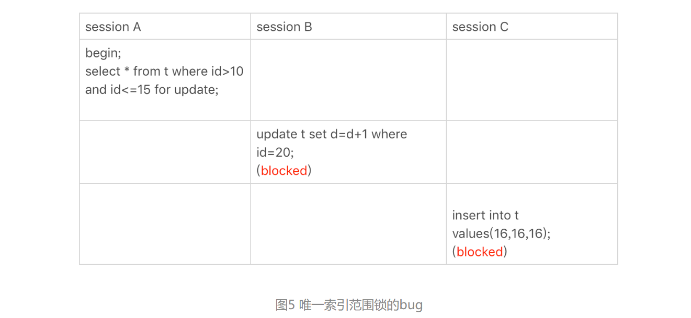
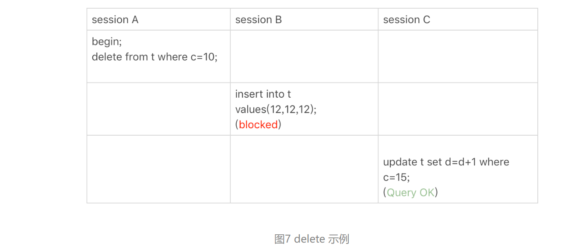
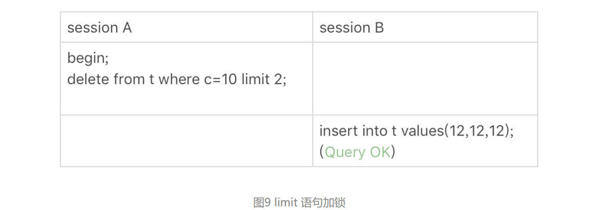
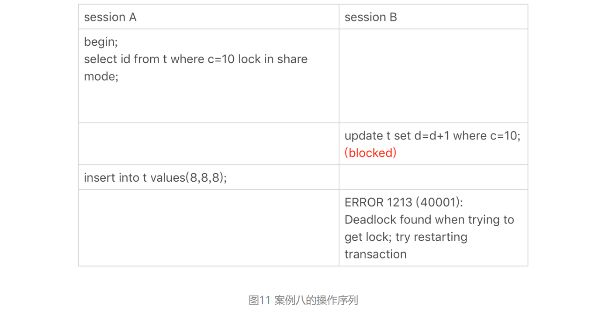

# MySQL 45讲总结

## 18.为什么这些SQL语句逻辑相同，性能却差异巨大？

源表如下：

```sql
CREATE TABLE `tradelog` (
  `id` int(11) NOT NULL,
  `tradeid` varchar(32) DEFAULT NULL,
  `operator` int(11) DEFAULT NULL,
  `t_modified` datetime DEFAULT NULL,
  PRIMARY KEY (`id`),
  KEY `tradeid` (`tradeid`),
  KEY `t_modified` (`t_modified`)
) ENGINE=InnoDB DEFAULT CHARSET=utf8mb4;

mysql> CREATE TABLE `trade_detail` (
  `id` int(11) NOT NULL,
  `tradeid` varchar(32) DEFAULT NULL,
  `trade_step` int(11) DEFAULT NULL, /*操作步骤*/
  `step_info` varchar(32) DEFAULT NULL, /*步骤信息*/
  PRIMARY KEY (`id`),
  KEY `tradeid` (`tradeid`)
) ENGINE=InnoDB DEFAULT CHARSET=utf8;
```

### 条件字段索引

```sql
# 由于对索引字段做函数操作，可能会破坏索引值的有序性，导致不会走索引
select count(*) from tradelog where month(t_modified)=7;

# 优化方案如下：
select count(*) from tradelog 
where (t_modified >= '2016-7-1' and t_modified<'2016-8-1') or
(t_modified >= '2017-7-1' and t_modified<'2017-8-1') or 
(t_modified >= '2018-7-1' and t_modified<'2018-8-1');
```

### 隐式类型转换

```sql
# 由于tradeid字段是varchar类型，将varchar类型与数值进行比较的话，Mysql会先将字符串转换为数值然后进行比较。下面这句SQL等价于
# select * from tradelog where  CAST(tradid AS signed int) = 110717; 
# 所以不会走索引。
select * from tradelog where tradeid=110717;

# 怎么判断字符串和数值进行比较的时候，MySQL是怎么进行转换的？
select “10” > 9; 返回是1说明MySQL是将字符串转换为数值后进行比较的。

# 优化方案如下：
select * from tradelog where tradeid='110717';
```

```sql
# 下面这句会导致全表扫描吗？
# 不会，下面这句SQL等价于 select * from tradelog where id=CAST("83126" AS varchar);
select * from tradelog where id="83126";
```

### 隐式字符编码转换

```sql
# 下面这个语句会走全表扫描，因为utf8mb4是utf8的超集，在进行 d.tradeid=l.tradeid 比较的时候，会将 d.tradeid 从utf8转换为utf8mb4，下面的语句等价于：
# select d.* from tradelog l, trade_detail d where CONVERT(d.tradeid USING utf8mb4)=l.tradeid and l.id=2;
select d.* from tradelog l, trade_detail d where d.tradeid=l.tradeid and l.id=2;

# 优化方案如下：
# 方案一：改表，将trade_detail的tradeid字段改为utf8mb4类型
alter table trade_detail modify tradeid varchar(32) CHARACTER SET utf8mb4 default null;
# 方案二：强制类型转换（可能会有数据丢失）
select d.* from tradelog l, trade_detail d where d.tradeid=CONVERT(l.tradeid USING utf8) and l.id=2; 
```

## 19.为什么我只查一行的语句，也执行这么慢？

```sql
mysql> CREATE TABLE `t` (
  `id` int(11) NOT NULL,
  `c` int(11) DEFAULT NULL,
  PRIMARY KEY (`id`)
) ENGINE=InnoDB;

# 下面这个查询语句长时间都不返回，可能是那些原因？
select * from t where id=1;
# 原因1：等待MDL写锁，常见的加锁语句：lock table t write


```

### 查询长时间不返回

**问题：**

```SQL
# 下面这个查询语句长时间都不返回，可能是那些原因？
select * from t where id=1;
```

**原因：**

- 等待MDL写锁（表级锁），常见的加锁语句：lock table t write。

  

  - `MDL锁`:全称为meta data lock， 中文叫元数据锁，是从MySQL5.5开始引入的锁，是为了解决DDL操作和DML操作之间操作一致性。从锁的作用范围上来说，MDL算是一种表级锁，是一个server层的锁。
    - 其实MDL加锁过程是系统自动控制，无法直接干预，也不需要直接干预，当我们对一个表做增删改查操作的时候，会自动加MDL读锁；当我们要更新表结构的时候，加MDL写锁。加读锁则所有线程可正常读表的元数据，并且读锁不影响表的增删改查操作，只是不能修改表结构；而加写锁只有拥有锁的线程可以读写元数据，即只拥有锁的线程才能更新表结构，其他线程不能修改结构也不能执行相应的增删改查。

- 等待flush（表级锁）

  

- 等行锁

  

**解决办法：**找到是谁占着这个写锁，然后kill掉。

```SQL
select * from t sys.innodb_lock_waits where locked_table=`'test'.'t'
kill ${blocking_pid}
```

### 查询慢

问题：下面session A中，`select * from t where id=1;`查询很慢，而`select * from t where id=1 lock in share mode;`查询很快，这是为什么?


原因：session A先用start transaction with consistent snapshot命令启动了一个事务，之后session B才开始执行update 语句。session B执行完100万次update语句后，id=1这一行处于什么状态呢？session B更新完100万次，生成了100万个回滚日志(undo log)。带lock in share mode的SQL语句，是当前读，因此会直接读到1000001这个结果，所以速度很快；而select * from t where id=1这个语句，是一致性读，因此需要从1000001开始，依次执行undo log，执行了100万次以后，才将1这个结果返回。


> 参考文档：
>
> [MDL锁介绍](https://blog.csdn.net/weixin_43189971/article/details/126436023)


## 20.幻读是什么，幻读有什么问题？

源表：

```sql
CREATE TABLE `t` (
  `id` int(11) NOT NULL,
  `c` int(11) DEFAULT NULL,
  `d` int(11) DEFAULT NULL,
  PRIMARY KEY (`id`),
  KEY `c` (`c`)
) ENGINE=InnoDB;

insert into t values(0,0,0),(5,5,5),
(10,10,10),(15,15,15),(20,20,20),(25,25,25);
```

```sql
# 下面的语句序列，是怎么加锁的，加的锁又是什么时候释放的呢?
begin;
select * from t where d=5 for update;
commit;

# 比较好理解的是，这个语句会命中d=5的这一行，对应的主键id=5，因此在select 语句执行完成后，id=5这一行会加一个写锁，而且由于两阶段锁协议，这个写锁会在执行commit语句的时候释放。
# 由于字段d上没有索引，因此这条查询语句会做全表扫描。那么，其他被扫描到的，但是不满足条件的5行记录上，会不会被加锁呢？RR隔离级别下，不仅会给数据库中已有的6个记录加上了行锁，还同时加了7个间隙锁。
```


- 在可重复读隔离级别下，普通的查询是快照读，是不会看到别的事务插入的数据的。因此，幻读在“当前读”下才会出现。
- 幻读仅专指“新插入的行”。

- 间隙锁（左开右闭）会降低并发度，可能会造成死锁。（下面的死锁例子是RR隔离级别）

  

- 间隙锁是在可重复读隔离级别下才会生效。
- 如果把隔离级别设置为读提交的话，就没有间隙锁了；但同时，你要解决可能出现的数据和日志不一致问题，需要把binlog格式设置为row。这也是现在不少公司使用的配置组合。

## 21.为什么我只改一行的语句，锁这么多？

源表：

```SQL
CREATE TABLE `t` (
  `id` int(11) NOT NULL,
  `c` int(11) DEFAULT NULL,
  `d` int(11) DEFAULT NULL,
  PRIMARY KEY (`id`),
  KEY `c` (`c`)
) ENGINE=InnoDB;

insert into t values(0,0,0),(5,5,5),
(10,10,10),(15,15,15),(20,20,20),(25,25,25);
```


RR隔离级别下的加锁规则：

- 原则1：加锁的基本单位是next-key lock。希望你还记得，next-key lock是前开后闭区间。
- 原则2：查找过程中访问到的对象才会加锁。
- 优化1：索引上的等值查询，给唯一索引加锁的时候，next-key lock退化为行锁。
- 优化2：索引上的等值查询，向右遍历时且最后一个值不满足等值条件的时候，next-key lock退化为间隙锁。
- 一个bug：唯一索引上的范围查询会访问到不满足条件的第一个值为止。

### 案例1 等值查询加缩

关于等值条件操作间隙（RR隔离级别）：


- 根据原则1，加锁单位是next-key lock，session A加锁范围就是(5,10]；
- 同时根据优化2，这是一个等值查询(id=7)，而id=10不满足查询条件，next-key lock退化成间隙锁，因此最终加锁的范围是(5,10)。

- session B要往这个间隙里面插入id=8的记录会被锁住，但是session C修改id=10这行是可以的。

### 案例2 非唯一索引等值锁

关于覆盖索引上的锁（RR隔离级别）：


- 根据原则1，加锁单位是next-key lock，因此会给(0,5]加上next-key lock。
- 要注意c是普通索引，因此仅访问c=5这一条记录是不能马上停下来的，需要向右遍历，查到c=10才放弃。根据原则2，访问到的都要加锁，因此要给(5,10]加next-key lock。

- 但是同时这个符合优化2：等值判断，向右遍历，最后一个值不满足c=5这个等值条件，因此退化成间隙锁(5,10)。
- 根据原则2 ，**只有访问到的对象才会加锁**，这个查询使用覆盖索引，并不需要访问主键索引，所以主键索引上没有加任何锁，这就是为什么session B的update语句可以执行完成。但session C要插入一个(7,7,7)的记录，就会被session A的间隙锁(5,10)锁住。
- 需要注意，在这个例子中，lock in share mode只锁覆盖索引，但是如果是for update就不一样了。 执行 for update时，系统会认为你接下来要更新数据，因此会顺便给主键索引上满足条件的行加上行锁。

### 案例3 主键索引范围锁

关于范围查询（RR隔离级别）：


- 开始执行的时候，要找到第一个id=10的行，因此本该是next-key lock(5,10]。 根据优化1， 主键id上的等值条件，退化成行锁，只加了id=10这一行的行锁。
- 范围查找就往后继续找，找到id=15这一行停下来，因此需要加next-key lock(10,15]。所以session A这时候锁的范围就是主键索引上，行锁id=10和next-key lock(10,15]。这样，session B和session C的结果你就能理解了。
- 需要注意一点，首次session A定位查找id=10的行的时候，是当做等值查询来判断的，而向右扫描到id=15的时候，用的是范围查询判断。

### 案例4 非唯一索引范围锁

关于非唯一索引范围锁（RR隔离级别）：


- 这次session A用字段c来判断，加锁规则跟案例三唯一的不同是：在第一次用c=10定位记录的时候，索引c上加了(5,10]这个next-key lock后，由于索引c是非唯一索引，没有优化规则，也就是说不会蜕变为行锁，因此最终sesion A加的锁是，索引c上的(5,10] 和(10,15] 这两个next-key lock。所以从结果上来看，sesson B要插入（8,8,8)的这个insert语句时就被堵住了。这里需要扫描到c=15才停止扫描，是合理的，因为InnoDB要扫到c=15，才知道不需要继续往后找了。

### 案例5 唯一索引范围锁bug

关于唯一索引范围锁bug（RR隔离级别）：



- session A是一个范围查询，按照原则1的话，应该是索引id上只加(10,15]这个next-key lock，并且因为id是唯一键，所以循环判断到id=15这一行就应该停止了。但是实现上，InnoDB会往前扫描到第一个不满足条件的行为止，也就是id=20。而且由于这是个范围扫描，因此索引id上的(15,20]这个next-key lock也会被锁上。

### 案例6 非唯一索引上存在"等值"的例子

关于非唯一索引上存在"等值"的例子（RR隔离级别）：



- session A在遍历的时候，先访问第一个c=10的记录。同样地，根据原则1，这里加的是(c=5,id=5)到(c=10,id=10)这个next-key lock。
- session A向右查找，直到碰到(c=15,id=15)这一行，循环才结束。根据优化2，这是一个等值查询，向右查找到了不满足条件的行，所以会退化成(c=10,id=10) 到 (c=15,id=15)的间隙锁。

### 案例7 limit 语句加锁

关于limit语句（RR隔离级别）：



- session A的delete语句加了 limit 2。你知道表t里c=10的记录其实只有两条，因此加不加limit 2，删除的效果都是一样的，但是加锁的效果却不同。可以看到，session B的insert语句执行通过了，跟案例六的结果不同。这是因为，案例七里的delete语句明确加了limit 2的限制，因此在遍历到(c=10, id=30)这一行之后，满足条件的语句已经有两条，循环就结束了。索引c上的加锁范围就变成了从（c=5,id=5)到（c=10,id=30)这个前开后闭区间。（索引c上加锁的效果如下图所示）

  

### 案例8 一个死锁的例子

关于死锁（RR隔离级别）：



- session A 启动事务后执行查询语句加lock in share mode，在索引c上加了next-key lock(5,10] 和间隙锁(10,15)；
- session B 的update语句也要在索引c上加next-key lock(5,10] ，进入锁等待；
- 然后session A要再插入(8,8,8)这一行，被session B的间隙锁锁住。由于出现了死锁，InnoDB让session B回滚。

### 思考题

我们在文章开头初始化的表t，里面有6条记录，下图的语句序列中，为什么session B的insert操作，会被锁住呢？


- 由于是order by c desc，第一个要定位的是索引c上“最右边的”c=20的行，所以会加上间隙锁(20,25)和next-key lock (15,20]。
- 在索引c上向左遍历，要扫描到c=10才停下来，所以next-key lock会加到(5,10]，这正是阻塞session B的insert语句的原因。

- 在扫描过程中，c=20、c=15、c=10这三行都存在值，由于是select *，所以会在主键id上加三个行锁。
- 因此，session A 的select语句锁的范围就是：
  - 索引c上 (5, 25)。
  - 主键索引上id=15、20两个行锁。

## 22.MySQL有哪些“饮鸩止渴”提高性能的方法？

**短链接模式**：连接到数据库后，执行很少的SQL语句就断开，下次需要的时候再重连。如果使用的是短连接，在业务高峰期的时候，就可能出现连接数突然暴涨的情况。

- MySQL建立连接的过程，成本是很高的。除了正常的网络连接三次握手外，还需要做登录权限判断和获得这个连接的数据读写权限。
- 一旦数据库处理得慢一些，连接数就会暴涨。
- max_connections参数，用来控制一个MySQL实例同时存在的连接数的上限，超过这个值，系统就会拒绝接下来的连接请求，并报错提示“Too many connections”。

- 解决办法：

  - 设置wait_timeout，先处理掉那些占着连接但是不工作的线程。
    - wait_timeout：一个线程空闲wait_timeout这么多秒之后，就会被MySQL直接断开连接。
  - 减少连接过程的消耗。如可以使用–skip-grant-tables参数跳过所有的权限验证阶段。

  - 慢查询问题

    - 索引没设计好，创建索引。

    - SQL语句没写好，修改SQL。
    - MySQL选错了索引，在SQL语句加上force index。

## 23.MySQL是怎么保证数据不丢的？

binlog的写入机制：

- sync_binlog=0：表示 MySQL 将仅当binlog日志的缓冲区满时，或者在某些特定的操作（例如关闭服务器）时，才会写入二进制日志。
- **sync_binlog=1（默认值）**：在每次执行事务的提交操作（`COMMIT`）时，都会将二进制日志写入到磁盘中。
- sync_binlog=N：在N次事务的提交操作（`COMMIT`）时，才会将二进制日志写入到磁盘中。
  - 如果主机发生异常重启，会丢失最近N个事务的binlog日志。

redo log的写入机制：

- innodb_flush_log_at_trx_commit=0：表示每次事务提交时都只是把redo log留在redo log buffer中。
  - 不建议，这样会丢数据。

- **innodb_flush_log_at_trx_commit=1（默认值）**：表示每次事务提交时都将redo log直接持久化到磁盘。
- innodb_flush_log_at_trx_commit=2：表示每次事务提交时都只是把redo log写到page cache，后台线程每隔1s将page cache调用fsync持久化到磁盘。

WAL机制是减少磁盘写，可是每次提交事务都要写redo log和binlog，这磁盘读写次数也没变少呀？

- redo log 和 binlog都是顺序写，磁盘的顺序写比随机写速度要快；
- 组提交机制，可以大幅度降低磁盘的IOPS消耗。


常见问题：

**问题1**：执行一个update语句以后，我再去执行hexdump命令直接查看ibd文件内容，为什么没有看到数据有改变呢？

**回答**：这可能是因为WAL机制的原因。update语句执行完成后，InnoDB只保证写完了redo log、内存，可能还没来得及将数据写到磁盘。


**问题2**：为什么binlog cache是每个线程自己维护的，而redo log buffer是全局共用的？

**回答**：MySQL这么设计的主要原因是，binlog是不能“被打断的”。一个事务的binlog必须连续写，因此要整个事务完成后，再一起写到文件里。而redo log并没有这个要求，中间有生成的日志可以写到redo log buffer中。redo log buffer中的内容还能“搭便车”，其他事务提交的时候可以被一起写到磁盘中。


**问题3**：事务执行期间，还没到提交阶段，如果发生crash的话，redo log肯定丢了，这会不会导致主备不一致呢？

**回答**：不会。因为这时候binlog 也还在binlog cache里，没发给备库。crash以后redo log和binlog都没有了，从业务角度看这个事务也没有提交，所以数据是一致的。


**问题4**：如果binlog写完盘以后发生crash，这时候还没给客户端答复就重启了。等客户端再重连进来，发现事务已经提交成功了，这是不是bug？

**回答**：不是。你可以设想一下更极端的情况，整个事务都提交成功了，redo log commit完成了，备库也收到binlog并执行了。但是主库和客户端网络断开了，导致事务成功的包返回不回去，这时候客户端也会收到“网络断开”的异常。这种也只能算是事务成功的，不能认为是bug。实际上数据库的crash-safe保证的是：

- 如果客户端收到事务成功的消息，事务就一定持久化了。
- 如果客户端收到事务失败（比如主键冲突、回滚等）的消息，事务就一定失败了。
- 如果客户端收到“执行异常”的消息，应用需要重连后通过查询当前状态来继续后续的逻辑。此时数据库只需要保证内部（数据和日志之间，主库和备库之间）一致就可以了。

## 24.MySQL是怎么保证主备一致的？

binlog三种格式对比：

- statement：可能造成主备数据不一致。
- **row**：占用更大的空间。
  - 好处：可以用来恢复数据。

- mixed：MySQL自己会判断这条SQL语句是否可能引起主备不一致，如果有可能，就用row格式，否则就用statement格式。

如何使用binlog恢复数据？

- 用 mysqlbinlog工具解析出来，然后把解析结果整个发给MySQL执行。

  ```sql
  mysqlbinlog master.000001  --start-position=2738 --stop-position=2973 | mysql -h127.0.0.1 -P13000 -u$user -p$pwd;
  ```

双主结构怎么解决循环复制？

- 规定两个库的server id必须不同，如果相同，则它们之间不能设定为主备关系。
- 一个备库接到binlog并在重放的过程中，生成与原binlog的server id相同的新的binlog。
- 每个库在收到从自己的主库发过来的日志后，先判断server id，如果跟自己的相同，表示这个日志是自己生成的，就直接丢弃这个日志。

## 25.MySQL是怎么保证高可用的？

主备延迟：是同一个事务，在备库执行完成的时间和主库执行完成的时间之间的差值。

主备延迟的来源：

- 有些部署条件下，备库所在机器的性能要比主库所在的机器性能差。
- 运营后台在备库上执行分析语句。怎么解决这种情况？
  - 一主多从。除了备库外，可以多接几个从库，让这些从库来分担读的压力。
  - 通过binlog输出到外部系统，比如Hadoop这类系统，让外部系统提供统计类查询的能力。

- 大事务。解决办法如下：

  - 不要一次性地用delete语句删除太多数据。

  - 计划内的大表DDL，建议使用gh-ost方案。

- 备库的并行复制能力。

主备切换的策略：

- 可靠性优先策略：会出现不可用时间。
- 可用性优先策略：可能会出现数据不一致情况。

## 26.备库为什么会延迟好几个小时？

