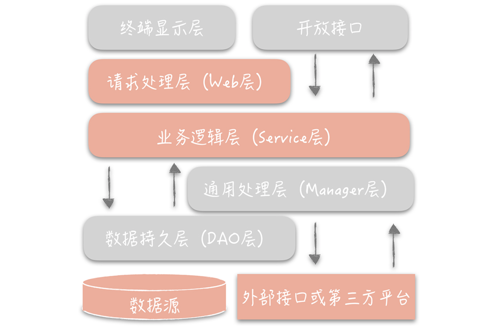
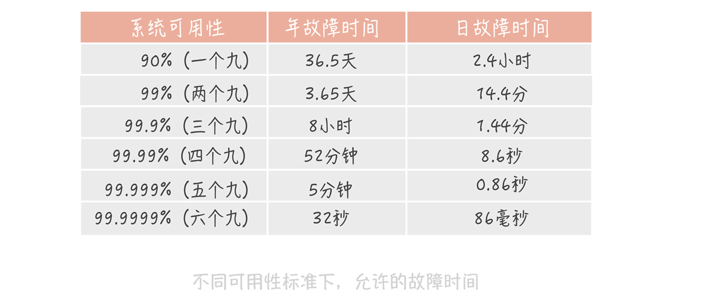
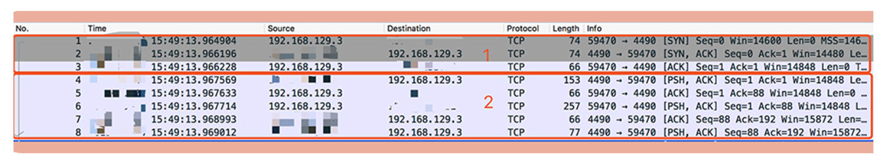
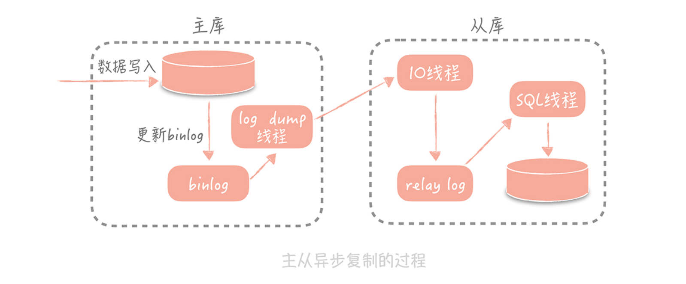
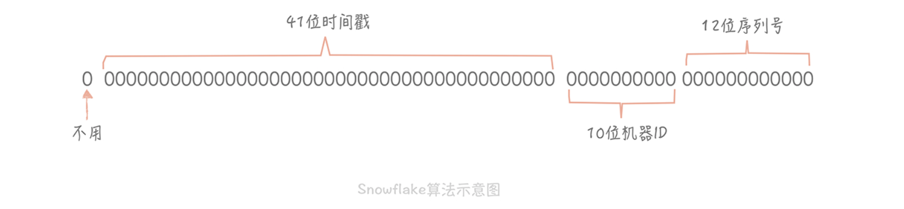
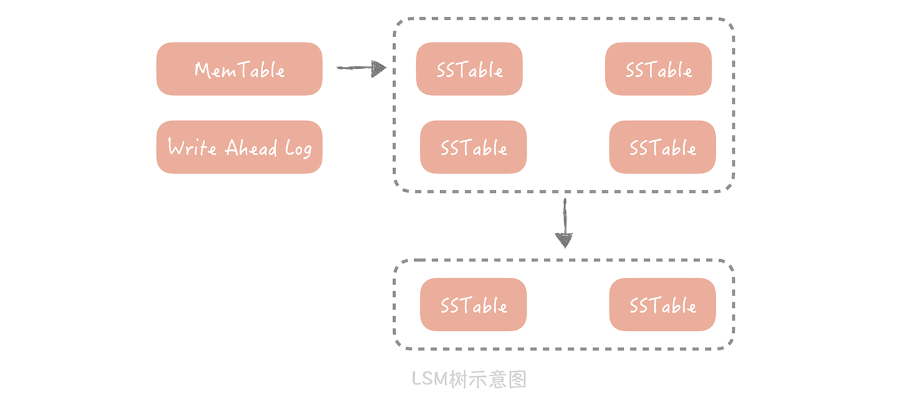
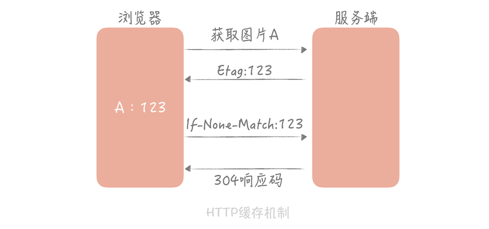

[toc]

# 高并发系统设计40问

## 开篇词

### 0 为什么你要学习高并发系统设计

收获：

- 掌握高并发系统设计的"套路"。
- 理解基本的系统设计思想，对新的知识触类旁通，举一反三。
- 突破技术的瓶颈，突破所处平台的限制，具备一个优秀架构师的资质。

## 基础篇

### 1 高并发系统：它的通用设计方法是什么？

#### 1.1 高并发系统的设计方法

- Scale-up（纵向扩展）：提升机器性能。
  - 适用于系统设计初期
- Scale-out（水平扩展）：分而治之。例如：分布式部署（扩展机器节点）、数据库一主多从、分库分表、存储分片。
  - 适用于系统并发超过了单机极限的时候，但要思考解决以下问题：
    - 单个节点故障，如何保证整体可用性？
    - 当多个节点状态需要同步时，怎么保证状态信息在不同节点的一致性？
    - 如何做到无感知的增加和删除节点？
    - ...

- 缓存：磁盘寻道（10ms级别）、千兆网卡（微秒级别）、CPU（纳秒级别）。缓存的思想遍布许多设计领域：
  - 操作系统中CPU有多级缓存
  - 文件有Pace Cache缓存
- 异步：解耦、消峰平谷
  - 为什么要使用异步？同步调用在高并发下可能会造成系统发生雪崩。

### 2 架构分层：我们为什么一定要这么做？

#### 2.1 典型的分层架构

- **MVC**：Model（数据访问层）-View（表现层）-Controller（业务逻辑层），模型-视图-控制器。
- **TCP-IP协议**：
  - 七层架构：应用层-表示层-会话层-传输层-网络层-数据链路层-物理层
  - 五层架构：应用层-传输层-网络层-数据链路层-物理层
- **Linux文件系统**：
  - 用户空间：Application
  - 内核空间：System Call Interface（SCI）、Vitual File System （VFS）、Ext3/Ext4/Btrfs、General Block Device layer、Device Driver
  - 硬件：Physical Disk

#### 2.2 分层的好处

- **简化系统设计**：让不同的人专注做某一层次的事情。
- **利于复用**：比如，我们在设计系统 A 的时候，发现某一层具有一定的通用性，那么我们可以把它抽取独立出来，在设计系统 B 的时候使用起来，这样可以减少研发周期，提升研发的效率。
- **利于横向扩展**：如果系统没有分层，当流量增加时我们需要针对整体系统来做扩展。但是，如果我们按照上面提到的三层架构将系统分层后，那么我们就可以针对具体的问题来做细致的扩展。
  - 比如说，业务逻辑里面包含有比较复杂的计算，导致 CPU 成为性能的瓶颈，那这样就可以把逻辑层单独抽取出来独立部署，然后只对逻辑层来做扩展，这相比于针对整体系统扩展所付出的代价就要小的多了。

#### 2.3 如何做系统分层

如何做系统分层：参照[阿里巴巴 Java 开发手册 v1.4.0（详尽版)](https://developer.aliyun.com/article/69327)

- Manager层（中台/通用SDK）：通用业务处理层。这一层主要有两个作用，其一，你可以将原先 Service 层的一些通用能力下沉到这一层，比如与缓存和存储交互策略，中间件的接入；其二，你也可以在这一层封装对第三方接口的调用，比如调用支付服务，调用审核服务等。



#### 2.4 分层的不足

- 增加了代码/系统复杂度
- 带来性能损耗

#### 2.5 软件设计分层思想

- **单一职责原则**：规定每个类只有单一的功能，在这里可以引申为每一层拥有单一职责，且层与层之间边界清晰。
- **迪米特法则**：原意是一个对象应当对其它对象有尽可能少的了解，在分层架构的体现是数据的交互不能跨层，只能在相邻层之间进行。
- **开闭原则**：要求软件对扩展开放，对修改关闭。它的含义其实就是将抽象层和实现层分离，抽象层是对实现层共有特征的归纳总结，不可以修改，但是具体的实现是可以无限扩展，随意替换的。

### 3 系统设计目标（一）：如何提升系统性能？

#### 3.1 高并发设计三高

- 高并发
- 高性能
- 高可用

#### 3.2 高并发系统设计目标

- **高并发**：提供系统的并发处理能力。脱离了高并发去谈高可用和高性能是没有意义的。
  - 通常使用**吞吐量**或者**同时在线用户数**来度量并发和流量
- **高性能**：提供系统的响应时间。
  - 性能优化原则
    - **不可提早优化**：要做到问题导向。
    - **遵循二八法则**：抓住主要矛盾，用 20% 的精力解决 80% 的性能问题。
    - **需要有数据支撑**：优化让响应时间减少了多少，提升了多少的吞吐量。
    - **持续不断的进行优化**
  - 性能的度量指标
    - 响应时间平均值：所有请求的响应时间数据相加，再除以总请求数。平均值对于度量性能来说只能作为一个参考。
    - 响应时间最大值：一段时间内所有请求响应时间最长的值。过于敏感。
    - **响应时间分位值**：分位值排除了偶发极慢请求对于数据的影响，能够很好地反应这段时间的性能情况，分位值越大，对于慢请求的影响就越敏感。
      - 健康系统的 99 分位值的响应时间通常需要控制在 200ms 之内，而不超过 1s 的请求占比要在 99.99% 以上
  - 高并发系统的性能优化方法：
    - 提高系统的处理核心数
    - 减少单次任务响应时间
      - CPU 密集型：选用高效的算法、线程池
        - 排查方式：Profile 工具，如Linux 的 perf、eBPF。
      - IO 密集型：包括磁盘IO和网络IO
        - 排查方式：
          - Linux工具：如网络协议栈、网卡、磁盘、文件系统、内存。
          - 监控
- **可扩展**：易于扩展的系统能在短时间内迅速完成扩容，更加平稳地承担峰值流量。

### 4 系统设计目标（二）：系统怎样做到高可用？

#### 4.1 可用性的度量

- **MTBF（Mean Time Between Failure）**：平均故障间隔。代表两次故障的间隔时间，也就是系统正常运转的平均时间。这个时间越长，系统稳定性越高。

- **MTTR（Mean Time To Repair）**：故障的平均恢复时间。也可以理解为平均故障时间。这个值越小，故障对于用户的影响越小。

- **Availability**：系统可用性。Availability = MTBF/(MTBF+MTTR)。

  - 一般我们会使用几个九来描述系统的可用性。**一般来说，我们的核心业务系统的可用性，需要达到四个九，非核心系统的可用性最多容忍到三个九。**

    


#### 4.2 高可用系统的设计思路

- 系统设计
  - **故障转移**：主备切换、路由摘除
    - 故障检测机制：通过心调
    - 涉及到分布式一致性算法：Paxos/Raft
  - **超时控制**：牺牲了少量的请求却保证了整体系统的可用性。不然会造成系统雪崩。
    - 如何设置超市时间呢：建议通过收集系统之间的调用日志，统计比如说 99% 的响应时间是怎样的，然后依据这个时间来指定超时时间。
  - **降级**：为了保证核心服务的稳定而牺牲非核心服务的做法。
    - 可以通过事先预留的开关暂时关闭一些非核心功能。
  - **限流**：通过对并发的请求进行限速来保护系统。
- 系统运维
  - **灰度发布**
  - **故障演练**
  - **混沌工程**

### 5 系统设计目标（三）：如何让系统易于扩展？

#### 5.1 为什么提升扩展性会很复杂

- 对于单机来说：当并行的任务数较多时，系统会因为争抢资源而达到性能上的拐点，系统处理能力不升反降。
- 对于集群来说：
  - 不同的系统分层上可能存在一些"瓶颈点"：比如数据库，网络带宽。
  - 有状态的服务和组件难以扩展：涉及到数据迁移。
  - 系统扩展时需要考虑的因素：数据库、缓存、依赖的第三方、负载均衡、交换机带宽等等。

#### 5.2 高可扩展性的设计思路

- 拆分：将复杂的问题简单化，将大模块拆成小模块。
  - 存储层的扩展性：分库分表
  - 业务层的扩展性：
    - 业务纬度：不同业务分开部署（不同地域/机房），防止业务同时瘫痪。
    - 重要性纬度：核心业务/非核心业务，当出现问题时，可以对非核心业务进行降级。
    - 请求来源纬度：APP/H5/小程序/WEB/客户端...。

### 6 面试现场第一期

- 关于Redis：

  - 你为什么会在项目里使用Redis呢？又是如何使用的呢？

  - 使用Redis时，你用了哪些数据结构呢？

  - 请简单介绍一下SortedSet使用的数据结构？

  - 那SortedSet是一种排序列表，如果由你来实现的话，你会怎么实现呢？

  - 红黑树的原理是怎么样的呢？

  - 你听说过跳表吗？
  - 那你觉得Redis的SortedSet结构是使用红黑树好，还是使用跳表好呢？

- 关于HashMap：

  - HashMap的底层数据结构是怎样的？
  - 如果发生Hash冲突，要怎么解决？常见的解决方式是怎么样的？
  - JDK8中对HashMap做了什么样的优化呢？
  - 红黑树的实现原理是怎样的？相比于链表它的优势和劣势都是什么？
  - HashMap是线程安全的吗？
  - ConcurrentHashMap是如何做到线程安全的呢？

## 演进篇·数据库篇

### 7 池化技术：如何减少频繁创建数据库连接的性能损耗？

为什么频繁创建连接会造成响应时间慢？

- 使用如下命令抓取线上MySQL建立连接的网络包来做分析：

  ```bash
  tcpdump -i bond0 -nn -tttt port 4490
  ```

  

  从抓包结果来看，整个 MySQL 的连接过程可以分为两部分：

  - 第一部分是前三个数据包：这是一个TCP的三次握手过程。
  - 第二部分是 MySQL 服务端校验客户端密码的过程：

如何减少频繁创建数据库连接的性能损耗？软件设计思想是**池化技术**。

- 用连接池预先建立数据库连接：涉及到**最小连接数**和**最大连接数**的配置
  - 如果当前连接数小于最小连接数，则创建新的连接处理数据库请求
  - 如果连接池中有空闲连接则复用空闲连接
  - 如果空闲池中没有连接并且当前连接数小于最大连接数，则创建新的连接处理请求
  - 如果当前连接数已经大于等于最大连接数，则按照配置中设定的时间（C3P0 的连接池配置是 checkoutTimeout）等待旧的连接可用。
  - 如果等待超过了这个设定时间则向用户抛出错误。
  - MySQL 有个参数是"wait_timeout"，控制着当数据库连接闲置多长时间后，数据库会主动的关闭这条连接。这个机制对于数据库使用方是无感知的，所以当我们使用这个被关闭的连接时就会发生错误。
- 用线程池预先创建线程：例如ThreadPoolExecutor，它有两个重要的参数：coreThreadCount 和 maxThreadCount，这两个参数控制着线程池的执行过程。
  - 如果线程池中的线程数少于 coreThreadCount 时，处理新的任务时会创建新的线程。
  - 如果线程数大于 coreThreadCount 则把任务丢到一个队列里面，由当前空闲的线程执行。
  - 当队列中的任务堆积满了的时候，则继续创建线程，直到达到 maxThreadCount。
  - 当线程数达到 maxTheadCount 时还有新的任务提交，那么我们就不得不将它们丢弃了。
  - 注意事项：
    -  JDK 线程池优先把任务放入队列暂存起来，而不是创建更多的线程，它比较适用于执行 CPU 密集型的任务，也就是需要执行大量 CPU 运算的任务。这是为什么呢？因为执行 CPU 密集型的任务时只需要创建和 CPU 核数相当的线程就好了，多了反而会造成线程上下文切换，降低任务执行效率。 Tomcat 使用的线程池就不是 JDK 原生的线程池，而是做了一些改造，当线程数超过 coreThreadCount 之后会优先创建线程，直到线程数到达 maxThreadCount，这样就比较适合于 Web 系统大量 IO 操作的场景了，你在实际运用过程中也可以参考借鉴。
    - 线程池中使用的队列的堆积量也是我们需要监控的重要指标，对于实时性要求比较高的任务来说，这个指标尤为关键。
    - 一定记住不要使用无界队列（即没有设置固定大小的队列）。因为大量的任务堆积会占用大量的内存空间，一旦内存空间被占满就会频繁地触发 Full GC，造成服务不可用。

线上经验：

- 对于数据库连接池，根据我的经验，一般在线上我建议最小连接数控制在 10 左右，最大连接数控制在 20～30 左右即可。

### 8 数据库优化方案（一）：查询请求增加时，如何做主从分离？

如何做主从分离？

- 读写分离：系统一般都是读多写少，做读写分离，更容易对读进行扩展。读写分离有两个关键技术点：

  - 主从复制：通过binlog来实现数据的拷贝。主要有一主多从、主备切换。例如MySQL/Redis/Elasticsearch都使用了这个技术。

    - 主从复制的过程：首先从库在连接到主节点时会创建一个 IO 线程，用以请求主库更新的 binlog，并且把接收到的 binlog 信息写入一个叫做 relay log 的日志文件中，而主库也会创建一个 log dump 线程来发送 binlog 给从库；同时，从库还会创建一个 SQL 线程读取 relay log 中的内容，并且在从库中做回放，最终实现主从的一致性。这是一种比较常见的主从复制方式。**在这个方案中，使用独立的 log dump 线程是一种异步的方式，可以避免对主库的主体更新流程产生影响，而从库在接收到信息后并不是写入从库的存储中，是写入一个 relay log，是避免写入从库实际存储会比较耗时，最终造成从库和主库延迟变长。**

      

      - 是否可以无限制地增加从库的数量就可以抵抗大量的并发？不是的。因为随着从库数量增加，从库连接上来的 IO 线程比较多，主库也需要创建同样多的 log dump 线程来处理复制的请求，对于主库资源消耗比较高，同时受限于主库的网络带宽，**所以在实际使用中，一般一个主库最多挂 3～5 个从库**。
      - 一般我们会**把从库落后的时间作为一个重点的数据库指标做监控和报警**，正常的时间是在毫秒级别，一旦落后的时间达到了秒级别就需要告警了。
      - 缺点：主从同步延迟。解决方案如下。
        - 数据冗余：优先采用这种方案
        - 使用缓存：缓存的方案比较适合新增数据的场景，在更新数据的场景下，先更新缓存可能会造成数据的不一致。
        - 查询主库：若非万不得已，不要选用这种方式。

  - 如何访问数据库：在主从分离况下，我们如何屏蔽主从分离带来的访问数据库方式的变化，让开发同学像是在使用单一数据库一样。

    - 使用数据库中间件。
      - 专用SDK：以代码形式内嵌运行在应用程序内部。比如淘宝的 TDDL（ Taobao Distributed Data Layer），适用于运维能力较弱的团队使用。
      - 单独部署的中间件：如阿里基于 Cobar 开发出来的 Mycat、360 开源的 Atlas、美团开源的基于 Atlas 开发的 DBProxy。适用于有一定运维能力的大中型团队使用。缺点是所以的SQL语句都需要跨两次网络调用，从应用到代理层和从代理层到数据源，在性能上有一定的损耗。

### 9 数据库优化方案（二）：写入数据量增加时，如何实现分库分表？

单库单表在数据量过大时带来的影响？

- 查询耗时增加。
- 备份和恢复的时间变长。

- 不能做到故障隔离：所有模块数据放到一个库中，一旦库发生故障，所有模块都会受到影响。
  - 可以使用垂直拆分解决

分库分表的本质：对数据进行分片，分而治之的思想。

如何实现数据库分库分表？

- 垂直拆分：顾名思义就是对数据库竖着拆分，也就是将数据库的表拆分到多个不同的数据库中。
  - 垂直拆分的原则一般是按照业务类型来拆分，核心思想是专库专用，将业务耦合度比较高的表拆分到单独的库中。
- 水平拆分
  - 拆分规则：主要有以下两种
    - **按照某一个字段的哈希值做拆分**：这种拆分规则比较适用于实体表，比如说用户表，内容表，我们一般按照这些实体表的 ID 字段来拆分。比如说我们想把用户表拆分成 16 个库，64 张表，那么可以先对用户 ID 做哈希，哈希的目的是将 ID 尽量打散，然后再对 16 取余，这样就得到了分库后的索引值；对 64 取余，就得到了分表后的索引值。
    - **按照某一个字段的区间来拆分**：比较常用的是时间字段，例如"创建时间"。
      - 考虑问题点：会出现热点问题。比如人们会更关注最近我买了什么，发了什么。这种情况下就要做好数据冷热隔离，可以降低成本。

分库分表引入的问题？

- **引入了分库分表键（也叫分区键）**：如按照字段的哈希值或区间段拆分，那么在之后所有的查询都需要带上这个字段。解决方案有如下两种：
  - 按待查询字段作为分区健再进行一次拆分：不推荐。
  - 建立待查询字段与分区健的映射表：
- **多表的join无法实现**：把两个表的数据取出后在业务代码里面做筛选。

### 10 发号器：如何保证分库分表后ID的全局唯一性？

解决数据库扩展的问题：

- 分库分表
- 主从读写分离
- 数据分片

带来的限制：

- 查询必须带分区健
- 聚合类的查询（如count性能较差）
- 主键的全局唯一性

主键如何选择？

- 选择一：使用业务字段作为主键，比如说对于用户表来说，可以使用手机号，email 或者身份证号作为主键。
  - 对于大部分场景来说，很难找到一个业务字段作为主键。手机号，email 可能出现变更；身份证号属于隐私，很难获取到。
- 选择二：使用生成的唯一 ID 作为主键。

如何生成全局唯一ID？

- 基于 Snowflake 算法搭建发号器。

  - 特点：单调递增，是有序的。主键为什么需要有序？一是在系统设计时，ID 有可能成为排序的字段；二是可提升数据的写入性能。

  - 原理：将 64bit 的二进制数字分成若干部分，每一部分都存储有特定含义的数据，比如说时间戳、机器 ID（又可以拆为IDC标识+机器ID标识）、序列号等等，最终生成全局唯一的有序 ID。（**41 位的时间戳大概可以支撑69年**）

    

  - 如何工程化？
    - 方式一：嵌入到业务代码里，也就是分布在业务服务器中。但是需要保证机器ID的唯一性。
    - 方式二：作为独立的服务部署（也就是常说的发号器服务）。
  - 缺点：
    - 依赖于系统的时间戳，一旦系统时间不准，就有可能生成重复的 ID。
      - 解决办法：如果发现系统时钟不准，可以让发号器暂时拒绝发号，直到准确为止。
    - 请求发号器的 QPS 不高，比如说发号器每毫秒只发一个 ID，就会造成生成 ID 的末位永远是 1，那么在分库分表时如果使用 ID 作为分区键就会造成库表分配的不均匀。
      - 解决办法：
        - 时间戳不记录毫秒而是记录秒，这样在一个时间区间里可以多发出几个号，避免出现分库分表时数据分配不均。
        - 生成的序列号的起始号可以做一下随机，这一秒是 21，下一秒是 30，这样就会尽量的均衡了。

- 使用UUID作为主键的缺点：
  - 无序，会造成页分裂，影响性能。
  - 不具备业务含义。
    - 比较耗费存储空间。

> 拓展：[万亿级调用系统：微信序列号生成器架构设计及演变](https://mp.weixin.qq.com/s?__biz=MzI4NDMyNTU2Mw==&mid=2247483679&idx=1&sn=584dbd80aa08fa1188627ad725680928&mpshare=1&scene=1&srcid=1208L9z4yXKLW60rPph2ZmMn#rd)

### 11 NoSQL：在高并发场景下，数据库和NoSQL如何做到互补？

场景的NoSQL数据库类型：

- KV型存储：如Redis、LevelDB。优势是极高的读写性能。
- 列式存储数据库：如Hbase、Cassandra。不像传统数据库以行为单位来存储，而是以列来存储，适用于一些离线数据统计的场景。
- 文档型数据库： 如MongoDB、CouchDB。特点是 Schema Free（模式自由），数据表中的字段可以任意扩展，比如说电商系统中的商品有非常多的字段，并且不同品类的商品的字段也都不尽相同，使用关系型数据库就需要不断增加字段支持，而用文档型数据库就简单很多了。

NoSQL 数据库是如何做到与关系数据库互补的？

- **使用 NoSQL 提升写入性能**：NoSQL 数据库使用一些算法将对磁盘的随机写转换成顺序写，提升了写的性能。

  - 关系型数据库：如MySQl InnoDB 引擎中索引是使用B+树，在数据插入的时候，会产生随机IO和页分裂。

  - NoSQL数据库：如ClickHouse/Hbase/Cassandra/LevelDB使用基于 LSM（Log-Structured Merge Tree）树的存储引擎。特点牺牲了一定的读性能来换取写入数据的高性能。

    - LSM树的原理：

      - 数据首先会写入到一个叫做 MemTable 的内存结构中，在 MemTable 中数据是按照写入的 Key 来排序的。为了防止 MemTable 里面的数据因为机器掉电或者重启而丢失，一般会通过写 Write Ahead Log 的方式将数据备份在磁盘上。
      - MemTable 在累积到一定规模时，它会被刷新生成一个新的文件，我们把这个文件叫做 SSTable（Sorted String Table）。当 SSTable 达到一定数量时，我们会将这些 SSTable 合并，减少文件的数量，因为 SSTable 都是有序的，所以合并的速度也很快。
      - 当从 LSM 树里面读数据时，我们首先从 MemTable 中查找数据，如果数据没有找到，再从 SSTable 中查找数据。因为存储的数据都是有序的，所以查找的效率是很高的，只是因为数据被拆分成多个 SSTable，所以读取的效率会低于 B+ 树索引。

      

- **使用 NoSQL 提升查询性能**：在某些场景下，比如全文搜索功能，关系型数据库并不能高效地支持，需要 NoSQL 数据库的支持。
  - 典型的例子：Elasticsearch基于倒排索引实现。倒排索引是指将记录中的某些列做分词，然后形成的分词与记录 ID 之间的映射关系。

- **使用 NoSQL 提升扩展型**：NoSQL 数据库天生支持分布式，支持数据冗余和数据分片的特性。
  - 典型的例子：MongoDB。 MongoDB 有三个扩展性方面的特性。
    - 其一是Replica，也叫做副本集。可以理解为主从分离，也就是通过将数据拷贝成多份来保证当主挂掉后数据不会丢失。同时，Replica 还可以分担读请求。
    - 其二是 Shard，也叫做分片，你可以理解为分库分表，即将数据按照某种规则拆分成多份，存储在不同的机器上。类似于ElasticSearch。
    - 其三是负载均衡，就是当 MongoDB 发现 Shard 之间数据分布不均匀，会启动 Balancer 进程对数据做重新的分配，最终让不同 Shard Server 的数据可以尽量的均衡。

## 演进篇·缓存篇

### 12 缓存：数据库成为瓶颈后，动态数据的查询要如何加速？

#### 12.1 缓存的定义

缓存的定义：缓存，是一种存储数据的组件，它的作用是让对数据的请求更快地返回。

- **常见的误解**：我们常将内存作为缓存，但是缓存不仅仅是内存，比如在某些场景下我们可能还会使用 SSD 作为冷数据的缓存，360 开源的 Pika 就是使用 SSD 存储数据解决 Redis 的容量瓶颈的。
- **缓存到底有多快**：做一次内存寻址大概需要 100ns，而做一次磁盘的查找则需要 10ms。使用内存作为缓存的存储介质相比于以磁盘作为主要存储介质的数据库来说，性能上会提高多个数量级，同时也能够支撑更高的并发量。

- **案例**：

  - **TLB（Translation Lookaside Buffer）**：Linux 内存管理是通过一个叫做 MMU（Memory Management Unit）的硬件，来实现从虚拟地址到物理地址的转换的，但是如果每次转换都要做这么复杂计算的话，无疑会造成性能的损耗，所以我们会借助一个叫做 TLB（Translation Lookaside Buffer）的组件来缓存最近转换过的虚拟地址，和物理地址的映射。

  - 视频播放缓存

  - **HTTP协议也有缓存机制**：当我们第一次请求静态的资源时，比如一张图片，服务端除了返回图片信息，在响应头里面还有一个“Etag”的字段。浏览器会缓存图片信息以及这个字段的值。当下一次再请求这个图片的时候，浏览器发起的请求头里面会有一个“If-None-Match”的字段，并且把缓存的“Etag”的值写进去发给服务端。服务端比对图片信息是否有变化，如果没有，则返回浏览器一个 304 的状态码，浏览器会继续使用缓存的图片信息。通过这种缓存协商的方式，可以减少网络传输的数据大小，从而提升页面展示的性能。

    

#### 12.2 缓存与缓冲区

缓存与缓冲区：

- 缓存：**可以提高低速设备的访问速度**，或者减少复杂耗时的计算带来的性能问题。
- 缓冲区：是一块临时存储数据的区域，这些数据后面会被传输到其他设备上。缓冲区更像“消息队列篇”中即将提到的消息队列，**用以弥补高速设备和低速设备通信时的速度差**。
  - 比如，我们将数据写入磁盘时并不是直接刷盘，而是写到一块缓冲区里面，内核会标识这个缓冲区为脏。当经过一定时间或者脏缓冲区比例到达一定阈值时，由单独的线程把脏块刷新到硬盘上。这样避免了每次写数据都要刷盘带来的性能问题。

#### 12.3 缓存分类

缓存的分类：

- **静态缓存**：针对静态的资源的缓存。例如在 Nginx 上部署静态缓存。
- **分布式缓存**：针对动态请求而言。例如Memcached、Redis。
- **热点本地缓存**：针对极端热点数据查询，热点本地缓存主要部署在应用服务器的代码中，用于阻挡热点查询对于分布式缓存节点或者数据库的压力。 例如：HashMap，Guava Cache，Ehcache。
  - 本地缓存一般会设置缓存过期时间，通常为分钟或者秒级别，以避免返回前端脏数据。

#### 12.4 缓存的不足

缓存的不足：

- 缓存比较适合于读多写少的业务场景，并且数据最好带有一定的热点属性。
- 缓存会给整体系统带来复杂度，并且会有数据不一致的风险。
  - 解决方案：缓存可以使用较短的过期时间。
- 缓存通常使用内存作为存储介质，但是内存并不是无限的。
- 缓存会给运维也带来一定的成本。
