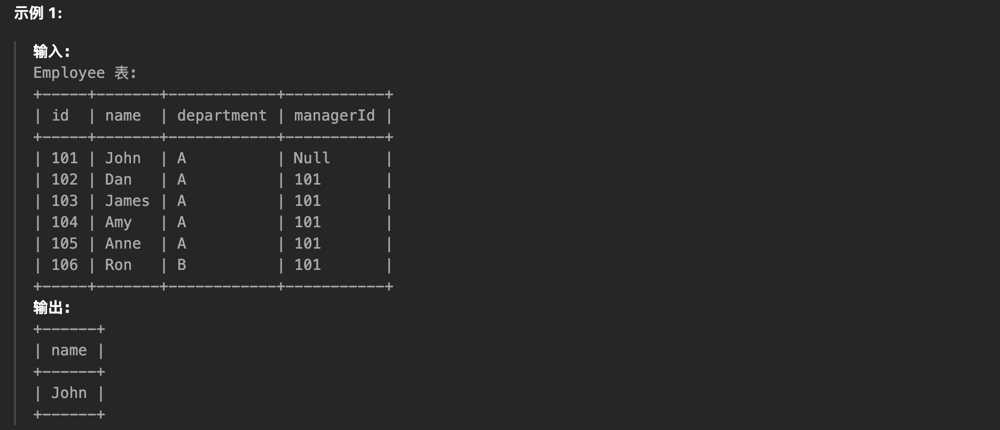
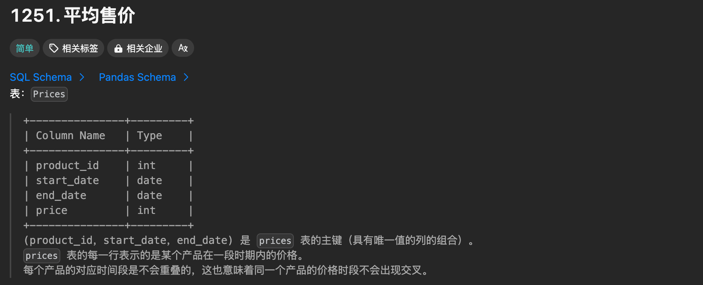
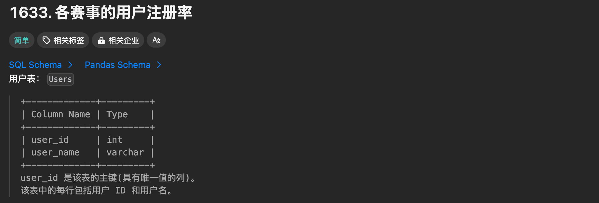

[TOC]

# LeetCode高频 SQL 50 题（基础版）

## 查询

### [1757. 可回收且低脂的产品](https://leetcode.cn/problems/recyclable-and-low-fat-products/)


```sql
# Schema
Create table If Not Exists Products (product_id int, low_fats ENUM('Y', 'N'), recyclable ENUM('Y','N'))
Truncate table Products
insert into Products (product_id, low_fats, recyclable) values ('0', 'Y', 'N')
insert into Products (product_id, low_fats, recyclable) values ('1', 'Y', 'Y')
insert into Products (product_id, low_fats, recyclable) values ('2', 'N', 'Y')
insert into Products (product_id, low_fats, recyclable) values ('3', 'Y', 'Y')
insert into Products (product_id, low_fats, recyclable) values ('4', 'N', 'N')

# Result
SELECT product_id FROM Products WHERE low_fats = 'Y' AND recyclable = 'Y';
```

### [584. 寻找用户推荐人](https://leetcode.cn/problems/find-customer-referee/)


```sql
# Schema
Create table If Not Exists Customer (id int, name varchar(25), referee_id int)
Truncate table Customer
insert into Customer (id, name, referee_id) values ('1', 'Will', NULL)
insert into Customer (id, name, referee_id) values ('2', 'Jane', NULL)
insert into Customer (id, name, referee_id) values ('3', 'Alex', '2')
insert into Customer (id, name, referee_id) values ('4', 'Bill', NULL)
insert into Customer (id, name, referee_id) values ('5', 'Zack', '1')
insert into Customer (id, name, referee_id) values ('6', 'Mark', '2')

# Result
SELECT name FROM Customer WHERE referee_id IS NULL OR referee_id <> 2;
```

### [595. 大的国家](https://leetcode.cn/problems/big-countries/)


```sql
# Schema
Create table If Not Exists World (name varchar(255), continent varchar(255), area int, population int, gdp bigint)
Truncate table World
insert into World (name, continent, area, population, gdp) values ('Afghanistan', 'Asia', '652230', '25500100', '20343000000')
insert into World (name, continent, area, population, gdp) values ('Albania', 'Europe', '28748', '2831741', '12960000000')
insert into World (name, continent, area, population, gdp) values ('Algeria', 'Africa', '2381741', '37100000', '188681000000')
insert into World (name, continent, area, population, gdp) values ('Andorra', 'Europe', '468', '78115', '3712000000')
insert into World (name, continent, area, population, gdp) values ('Angola', 'Africa', '1246700', '20609294', '100990000000')

# Result
SELECT name,population,area FROM World WHERE area >= 3000000 OR population >= 25000000;
```

### [1148. 文章浏览 I](https://leetcode.cn/problems/article-views-i/)


```sql
# Schema
Create table If Not Exists Views (article_id int, author_id int, viewer_id int, view_date date)
Truncate table Views
insert into Views (article_id, author_id, viewer_id, view_date) values ('1', '3', '5', '2019-08-01')
insert into Views (article_id, author_id, viewer_id, view_date) values ('1', '3', '6', '2019-08-02')
insert into Views (article_id, author_id, viewer_id, view_date) values ('2', '7', '7', '2019-08-01')
insert into Views (article_id, author_id, viewer_id, view_date) values ('2', '7', '6', '2019-08-02')
insert into Views (article_id, author_id, viewer_id, view_date) values ('4', '7', '1', '2019-07-22')
insert into Views (article_id, author_id, viewer_id, view_date) values ('3', '4', '4', '2019-07-21')
insert into Views (article_id, author_id, viewer_id, view_date) values ('3', '4', '4', '2019-07-21')

# Result
SELECT DISTINCT(author_id) as id FROM Views WHERE viewer_id = author_id ORDER BY id asc;
```

### [1683. 无效的推文](https://leetcode.cn/problems/invalid-tweets/)


```sql
# Schema
Create table If Not Exists Tweets(tweet_id int, content varchar(50))
Truncate table Tweets
insert into Tweets (tweet_id, content) values ('1', 'Let us Code')
insert into Tweets (tweet_id, content) values ('2', 'More than fifteen chars are here!')

# Result
SELECT tweet_id FROM Tweets WHERE CHAR_LENGTH(content) > 15;
```

**注意**：

- 对于SQL表，用于计算字符串中字符数的最佳函数是 CHAR_LENGTH(str)，它返回字符串 str 的长度。

- 另一个常用的函数 LENGTH(str) 在这个问题中也适用，因为列 content 只包含英文字符，没有特殊字符。否则，LENGTH() 可能会返回不同的结果，因为该函数返回字符串 str 的字节数，某些字符包含多于 1 个字节。以字符 '¥' 为例：CHAR_LENGTH() 返回结果为 1，而 LENGTH() 返回结果为 2，因为该字符串包含 2 个字节。

## 连接

### [1378. 使用唯一标识码替换员工ID](https://leetcode.cn/problems/replace-employee-id-with-the-unique-identifier/)


```sql
# Schema
Create table If Not Exists Employees (id int, name varchar(20))
Create table If Not Exists EmployeeUNI (id int, unique_id int)
Truncate table Employees
insert into Employees (id, name) values ('1', 'Alice')
insert into Employees (id, name) values ('7', 'Bob')
insert into Employees (id, name) values ('11', 'Meir')
insert into Employees (id, name) values ('90', 'Winston')
insert into Employees (id, name) values ('3', 'Jonathan')
Truncate table EmployeeUNI
insert into EmployeeUNI (id, unique_id) values ('3', '1')
insert into EmployeeUNI (id, unique_id) values ('11', '2')
insert into EmployeeUNI (id, unique_id) values ('90', '3')

# Result
SELECT u.unique_id,e.name FROM Employees e LEFT JOIN EmployeeUNI u ON e.id = u.id;
```

### [1068. 产品销售分析 I](https://leetcode.cn/problems/product-sales-analysis-i/)


```sql
# Schema
Create table If Not Exists Sales (sale_id int, product_id int, year int, quantity int, price int)
Create table If Not Exists Product (product_id int, product_name varchar(10))
Truncate table Sales
insert into Sales (sale_id, product_id, year, quantity, price) values ('1', '100', '2008', '10', '5000')
insert into Sales (sale_id, product_id, year, quantity, price) values ('2', '100', '2009', '12', '5000')
insert into Sales (sale_id, product_id, year, quantity, price) values ('7', '200', '2011', '15', '9000')
Truncate table Product
insert into Product (product_id, product_name) values ('100', 'Nokia')
insert into Product (product_id, product_name) values ('200', 'Apple')
insert into Product (product_id, product_name) values ('300', 'Samsung')

# Result
SELECT p.product_name,s.year,s.price FROM Sales s LEFT JOIN Product p ON s.product_id = p.product_id;
```

### [1581. 进店却未进行过交易的顾客](https://leetcode.cn/problems/customer-who-visited-but-did-not-make-any-transactions/)


```sql
# Schema
Create table If Not Exists Visits(visit_id int, customer_id int)
Create table If Not Exists Transactions(transaction_id int, visit_id int, amount int)
Truncate table Visits
insert into Visits (visit_id, customer_id) values ('1', '23')
insert into Visits (visit_id, customer_id) values ('2', '9')
insert into Visits (visit_id, customer_id) values ('4', '30')
insert into Visits (visit_id, customer_id) values ('5', '54')
insert into Visits (visit_id, customer_id) values ('6', '96')
insert into Visits (visit_id, customer_id) values ('7', '54')
insert into Visits (visit_id, customer_id) values ('8', '54')
Truncate table Transactions
insert into Transactions (transaction_id, visit_id, amount) values ('2', '5', '310')
insert into Transactions (transaction_id, visit_id, amount) values ('3', '5', '300')
insert into Transactions (transaction_id, visit_id, amount) values ('9', '5', '200')
insert into Transactions (transaction_id, visit_id, amount) values ('12', '1', '910')
insert into Transactions (transaction_id, visit_id, amount) values ('13', '2', '970')

# Result
SELECT customer_id, count(visit_id) as count_no_trans 
FROM Visits 
WHERE visit_id not in (
    SELECT distinct visit_id FROM Transactions
) GROUP BY customer_id;

# Result2
SELECT customer_id, count(v.visit_id) as count_no_trans 
FROM Visits v
LEFT JOIN Transactions t
ON v.visit_id = t.visit_id
WHERE t.transaction_id IS NULL 
GROUP BY customer_id;
```

### [197. 上升的温度](https://leetcode.cn/problems/rising-temperature/)


```sql
# Schema
Create table If Not Exists Weather (id int, recordDate date, temperature int)
Truncate table Weather
insert into Weather (id, recordDate, temperature) values ('1', '2015-01-01', '10')
insert into Weather (id, recordDate, temperature) values ('2', '2015-01-02', '25')
insert into Weather (id, recordDate, temperature) values ('3', '2015-01-03', '20')
insert into Weather (id, recordDate, temperature) values ('4', '2015-01-04', '30')

# Result
SELECT w1.id FROM Weather w1 
LEFT JOIN Weather w2 ON datediff(w1.recordDate,w2.recordDate) = 1
WHERE w1.temperature > w2.temperature;

# Result2
SELECT w1.id FROM Weather w1 
LEFT JOIN Weather w2 ON timestampdiff(day,w1.recordDate,w2.recordDate) = -1
WHERE w1.temperature > w2.temperature;
```

#### a.时间计算函数

两个关于时间计算的函数：

- datediff(日期1, 日期2)：得到的结果是日期1与日期2相差的天数。如果日期1比日期2大，结果为正；如果日期1比日期2小，结果为负。
- timestampdiff(时间类型, 日期1, 日期2)：这个函数和上面diffdate的正、负号规则刚好相反。日期1大于日期2，结果为负，日期1小于日期2，结果为正。

### [1661. 每台机器的进程平均运行时间](https://leetcode.cn/problems/average-time-of-process-per-machine/)


```sql
# Schema
Create table If Not Exists Activity (machine_id int, process_id int, activity_type ENUM('start', 'end'), timestamp float)
Truncate table Activity
insert into Activity (machine_id, process_id, activity_type, timestamp) values ('0', '0', 'start', '0.712')
insert into Activity (machine_id, process_id, activity_type, timestamp) values ('0', '0', 'end', '1.52')
insert into Activity (machine_id, process_id, activity_type, timestamp) values ('0', '1', 'start', '3.14')
insert into Activity (machine_id, process_id, activity_type, timestamp) values ('0', '1', 'end', '4.12')
insert into Activity (machine_id, process_id, activity_type, timestamp) values ('1', '0', 'start', '0.55')
insert into Activity (machine_id, process_id, activity_type, timestamp) values ('1', '0', 'end', '1.55')
insert into Activity (machine_id, process_id, activity_type, timestamp) values ('1', '1', 'start', '0.43')
insert into Activity (machine_id, process_id, activity_type, timestamp) values ('1', '1', 'end', '1.42')
insert into Activity (machine_id, process_id, activity_type, timestamp) values ('2', '0', 'start', '4.1')
insert into Activity (machine_id, process_id, activity_type, timestamp) values ('2', '0', 'end', '4.512')
insert into Activity (machine_id, process_id, activity_type, timestamp) values ('2', '1', 'start', '2.5')
insert into Activity (machine_id, process_id, activity_type, timestamp) values ('2', '1', 'end', '5')

# Result：推荐这种做法 JOIN/INNER JOIN/CROSS JOIN都不会影响结果
SELECT a.machine_id, ROUND(AVG(a.timestamp - b.timestamp),3) as processing_time 
FROM Activity a JOIN Activity b 
ON a.machine_id = b.machine_id AND a.process_id = b.process_id AND a.activity_type = 'end' AND b.activity_type = 'start' 
GROUP BY a.machine_id;

# Result2: 虽然使用左连接也是对的（因为AVG计算平均值时会去掉null的项），但是这里使用交叉连接更容易理解
SELECT a.machine_id, ROUND(AVG(a.timestamp - b.timestamp),3) as processing_time 
FROM Activity a LEFT JOIN Activity b 
ON a.machine_id = b.machine_id AND a.process_id = b.process_id AND a.activity_type = 'end' AND b.activity_type = 'start' 
GROUP BY a.machine_id;
```

#### a. JOIN/INNER JOIN/CROSS JOIN/LEFT JOIN的区别

> 参考文档：
>
> 1. [一分钟让你搞明白 left join、right join和join的区别](https://blog.csdn.net/Li_Jian_Hui_/article/details/105801454)
> 2. [数据库 | 辨析 cross join、inner join和outer join](https://blog.csdn.net/a26013/article/details/123615320)
>    - CROSS JOIN、INNER JOIN、JOIN 和逗号分隔的连接是等价的。

### [577. 员工奖金](https://leetcode.cn/problems/employee-bonus/)


```sql
# Schema
Create table If Not Exists Employee (empId int, name varchar(255), supervisor int, salary int)
Create table If Not Exists Bonus (empId int, bonus int)
Truncate table Employee
insert into Employee (empId, name, supervisor, salary) values ('3', 'Brad', NULL, '4000')
insert into Employee (empId, name, supervisor, salary) values ('1', 'John', '3', '1000')
insert into Employee (empId, name, supervisor, salary) values ('2', 'Dan', '3', '2000')
insert into Employee (empId, name, supervisor, salary) values ('4', 'Thomas', '3', '4000')
Truncate table Bonus
insert into Bonus (empId, bonus) values ('2', '500')
insert into Bonus (empId, bonus) values ('4', '2000')

# Result
SELECT e.name,b.bonus FROM Employee e LEFT JOIN Bonus b 
ON e.empId = b.empId
WHERE b.bonus < 1000 OR b.bonus is null;
```

### [1280. 学生们参加各科测试的次数](https://leetcode.cn/problems/students-and-examinations/)🌟


```sql
# Schema
Create table If Not Exists Students (student_id int, student_name varchar(20))
Create table If Not Exists Subjects (subject_name varchar(20))
Create table If Not Exists Examinations (student_id int, subject_name varchar(20))
Truncate table Students
insert into Students (student_id, student_name) values ('1', 'Alice')
insert into Students (student_id, student_name) values ('2', 'Bob')
insert into Students (student_id, student_name) values ('13', 'John')
insert into Students (student_id, student_name) values ('6', 'Alex')
Truncate table Subjects
insert into Subjects (subject_name) values ('Math')
insert into Subjects (subject_name) values ('Physics')
insert into Subjects (subject_name) values ('Programming')
Truncate table Examinations
insert into Examinations (student_id, subject_name) values ('1', 'Math')
insert into Examinations (student_id, subject_name) values ('1', 'Physics')
insert into Examinations (student_id, subject_name) values ('1', 'Programming')
insert into Examinations (student_id, subject_name) values ('2', 'Programming')
insert into Examinations (student_id, subject_name) values ('1', 'Physics')
insert into Examinations (student_id, subject_name) values ('1', 'Math')
insert into Examinations (student_id, subject_name) values ('13', 'Math')
insert into Examinations (student_id, subject_name) values ('13', 'Programming')
insert into Examinations (student_id, subject_name) values ('13', 'Physics')
insert into Examinations (student_id, subject_name) values ('2', 'Math')
insert into Examinations (student_id, subject_name) values ('1', 'Math')

# Result
SELECT s1.student_id,s1.student_name,s2.subject_name,IFNULL(e.attended_exams,0) attended_exams
FROM Students s1 JOIN Subjects s2 LEFT JOIN (
    SELECT student_id,subject_name,count(*) as attended_exams 
    FROM Examinations 
    GROUP BY student_id, subject_name
) e ON s1.student_id = e.student_id AND s2.subject_name = e.subject_name 
ORDER BY s1.student_id, s2.subject_name;
```

#### a.IFNULL函数的使用

### [570. 至少有5名直接下属的经理](https://leetcode.cn/problems/managers-with-at-least-5-direct-reports/)🌟




```sql
# Schema
Create table If Not Exists Employee (id int, name varchar(255), department varchar(255), managerId int)
Truncate table Employee
insert into Employee (id, name, department, managerId) values ('101', 'John', 'A', NULL)
insert into Employee (id, name, department, managerId) values ('102', 'Dan', 'A', '101')
insert into Employee (id, name, department, managerId) values ('103', 'James', 'A', '101')
insert into Employee (id, name, department, managerId) values ('104', 'Amy', 'A', '101')
insert into Employee (id, name, department, managerId) values ('105', 'Anne', 'A', '101')
insert into Employee (id, name, department, managerId) values ('106', 'Ron', 'B', '101')

# Result1
SELECT name FROM Employee WHERE id in (
    SELECT managerId FROM (
        SELECT managerId, count(*) cnt FROM Employee e 
        WHERE e.managerId is not null
        GROUP BY managerId
    ) g WHERE g.cnt >= 5
);

# Result2: 推荐
SELECT Employee.name 
FROM (
    SELECT managerId
    FROM Employee 
    WHERE managerId is not NULL
    GROUP BY managerId 
    HAVING count(id) >= 5
) as Manager JOIN Employee on Manager.managerId = Employee.id;
```

### [1934. 确认率](https://leetcode.cn/problems/confirmation-rate/)🌟


```sql
# Schema
Create table If Not Exists Signups (user_id int, time_stamp datetime)
Create table If Not Exists Confirmations (user_id int, time_stamp datetime, action ENUM('confirmed','timeout'))
Truncate table Signups
insert into Signups (user_id, time_stamp) values ('3', '2020-03-21 10:16:13')
insert into Signups (user_id, time_stamp) values ('7', '2020-01-04 13:57:59')
insert into Signups (user_id, time_stamp) values ('2', '2020-07-29 23:09:44')
insert into Signups (user_id, time_stamp) values ('6', '2020-12-09 10:39:37')
Truncate table Confirmations
insert into Confirmations (user_id, time_stamp, action) values ('3', '2021-01-06 03:30:46', 'timeout')
insert into Confirmations (user_id, time_stamp, action) values ('3', '2021-07-14 14:00:00', 'timeout')
insert into Confirmations (user_id, time_stamp, action) values ('7', '2021-06-12 11:57:29', 'confirmed')
insert into Confirmations (user_id, time_stamp, action) values ('7', '2021-06-13 12:58:28', 'confirmed')
insert into Confirmations (user_id, time_stamp, action) values ('7', '2021-06-14 13:59:27', 'confirmed')
insert into Confirmations (user_id, time_stamp, action) values ('2', '2021-01-22 00:00:00', 'confirmed')
insert into Confirmations (user_id, time_stamp, action) values ('2', '2021-02-28 23:59:59', 'timeout')

# Result
SELECT s.user_id, ROUND(AVG(IFNULL(c.action='confirmed',0)),2) AS confirmation_rate
FROM Signups s LEFT JOIN Confirmations c ON s.user_id = c.user_id 
GROUP BY s.user_id;

# Result
SELECT s.user_id, ROUND(IFNULL(AVG(c.action='confirmed'), 0), 2) AS confirmation_rate
FROM Signups s LEFT JOIN Confirmations c ON s.user_id = c.user_id 
GROUP BY s.user_id;
```

#### a.AVG函数的使用

> 参考文献：
>
> 1. [mySQL中AVG()函数如何去除null值或0值求平均值](https://blog.csdn.net/m0_51088798/article/details/123906790)

## 聚合函数

### [620. 有趣的电影](https://leetcode.cn/problems/not-boring-movies/)


```sql
# Schema
Create table If Not Exists cinema (id int, movie varchar(255), description varchar(255), rating float(2, 1))
Truncate table cinema
insert into cinema (id, movie, description, rating) values ('1', 'War', 'great 3D', '8.9')
insert into cinema (id, movie, description, rating) values ('2', 'Science', 'fiction', '8.5')
insert into cinema (id, movie, description, rating) values ('3', 'irish', 'boring', '6.2')
insert into cinema (id, movie, description, rating) values ('4', 'Ice song', 'Fantacy', '8.6')
insert into cinema (id, movie, description, rating) values ('5', 'House card', 'Interesting', '9.1')

# Result
SELECT * FROM cinema 
WHERE id % 2 = 1 AND description != 'boring'
ORDER BY rating DESC;

# Result2: 推荐
SELECT * FROM cinema 
WHERE mod(id, 2) = 1 AND description != 'boring'
ORDER BY rating DESC;
```

### [1251. 平均售价](https://leetcode.cn/problems/average-selling-price/)




```sql
# Schema
Create table If Not Exists Prices (product_id int, start_date date, end_date date, price int)
Create table If Not Exists UnitsSold (product_id int, purchase_date date, units int)
Truncate table Prices
insert into Prices (product_id, start_date, end_date, price) values ('1', '2019-02-17', '2019-02-28', '5')
insert into Prices (product_id, start_date, end_date, price) values ('1', '2019-03-01', '2019-03-22', '20')
insert into Prices (product_id, start_date, end_date, price) values ('2', '2019-02-01', '2019-02-20', '15')
insert into Prices (product_id, start_date, end_date, price) values ('2', '2019-02-21', '2019-03-31', '30')
Truncate table UnitsSold
insert into UnitsSold (product_id, purchase_date, units) values ('1', '2019-02-25', '100')
insert into UnitsSold (product_id, purchase_date, units) values ('1', '2019-03-01', '15')
insert into UnitsSold (product_id, purchase_date, units) values ('2', '2019-02-10', '200')
insert into UnitsSold (product_id, purchase_date, units) values ('2', '2019-03-22', '30')

# Result
SELECT p.product_id, IFNULL(ROUND(SUM(p.price*u.units)/SUM(u.units),2),0) as average_price 
FROM Prices p LEFT JOIN (
    SELECT product_id,purchase_date,SUM(units) as units 
    FROM UnitsSold 
    GROUP BY product_id,purchase_date
) as u ON p.product_id = u.product_id AND u.purchase_date BETWEEN p.start_date AND p.end_date
GROUP BY product_id;
```

### [1075. 项目员工 I](https://leetcode.cn/problems/project-employees-i/)


```sql
# Schema
Create table If Not Exists Project (project_id int, employee_id int)
Create table If Not Exists Employee (employee_id int, name varchar(10), experience_years int)
Truncate table Project
insert into Project (project_id, employee_id) values ('1', '1')
insert into Project (project_id, employee_id) values ('1', '2')
insert into Project (project_id, employee_id) values ('1', '3')
insert into Project (project_id, employee_id) values ('2', '1')
insert into Project (project_id, employee_id) values ('2', '4')
Truncate table Employee
insert into Employee (employee_id, name, experience_years) values ('1', 'Khaled', '3')
insert into Employee (employee_id, name, experience_years) values ('2', 'Ali', '2')
insert into Employee (employee_id, name, experience_years) values ('3', 'John', '1')
insert into Employee (employee_id, name, experience_years) values ('4', 'Doe', '2')

# Result
SELECT p.project_id, IFNULL(ROUND(AVG(e.experience_years),2),0) as average_years
FROM Project p LEFT JOIN Employee e ON p.employee_id = e.employee_id
GROUP BY p.project_id;
```

### [1633. 各赛事的用户注册率](https://leetcode.cn/problems/percentage-of-users-attended-a-contest/)




```sql
# Schema
Create table If Not Exists Users (user_id int, user_name varchar(20))
Create table If Not Exists Register (contest_id int, user_id int)
Truncate table Users
insert into Users (user_id, user_name) values ('6', 'Alice')
insert into Users (user_id, user_name) values ('2', 'Bob')
insert into Users (user_id, user_name) values ('7', 'Alex')
Truncate table Register
insert into Register (contest_id, user_id) values ('215', '6')
insert into Register (contest_id, user_id) values ('209', '2')
insert into Register (contest_id, user_id) values ('208', '2')
insert into Register (contest_id, user_id) values ('210', '6')
insert into Register (contest_id, user_id) values ('208', '6')
insert into Register (contest_id, user_id) values ('209', '7')
insert into Register (contest_id, user_id) values ('209', '6')
insert into Register (contest_id, user_id) values ('215', '7')
insert into Register (contest_id, user_id) values ('208', '7')
insert into Register (contest_id, user_id) values ('210', '2')
insert into Register (contest_id, user_id) values ('207', '2')
insert into Register (contest_id, user_id) values ('210', '7')

# Result
SELECT r.contest_id as contest_id, ROUND(COUNT(r.user_id)/t.total_cnt*100,2) as percentage
FROM Register r JOIN (
    SELECT COUNT(user_id) as total_cnt
    FROM Users
) t GROUP BY r.contest_id ORDER BY percentage DESC, contest_id ASC;

# Result2: 推荐
SELECT contest_id as contest_id, ROUND(COUNT(user_id)/(SELECT COUNT(user_id) FROM Users)*100,2) as percentage
FROM Register 
GROUP BY contest_id ORDER BY percentage DESC, contest_id ASC;
```

### [1211. 查询结果的质量和占比](https://leetcode.cn/problems/queries-quality-and-percentage/)🌟


```sql
# Schema
Create table If Not Exists Queries (query_name varchar(30), result varchar(50), position int, rating int)
Truncate table Queries
insert into Queries (query_name, result, position, rating) values ('Dog', 'Golden Retriever', '1', '5')
insert into Queries (query_name, result, position, rating) values ('Dog', 'German Shepherd', '2', '5')
insert into Queries (query_name, result, position, rating) values ('Dog', 'Mule', '200', '1')
insert into Queries (query_name, result, position, rating) values ('Cat', 'Shirazi', '5', '2')
insert into Queries (query_name, result, position, rating) values ('Cat', 'Siamese', '3', '3')
insert into Queries (query_name, result, position, rating) values ('Cat', 'Sphynx', '7', '4')

# Result
SELECT 
    query_name, 
    ROUND(AVG(rating/position),2) as quality, 
    ROUND(SUM(IF(rating<3,1,0))*100/COUNT(*),2) as poor_query_percentage
FROM Queries
WHERE query_name IS NOT NULL
GROUP BY query_name;
```

### [1193. 每月交易 I](https://leetcode.cn/problems/monthly-transactions-i/)🌟


```sql
# Schema
Create table If Not Exists Transactions (id int, country varchar(4), state enum('approved', 'declined'), amount int, trans_date date)
Truncate table Transactions
insert into Transactions (id, country, state, amount, trans_date) values ('121', 'US', 'approved', '1000', '2018-12-18')
insert into Transactions (id, country, state, amount, trans_date) values ('122', 'US', 'declined', '2000', '2018-12-19')
insert into Transactions (id, country, state, amount, trans_date) values ('123', 'US', 'approved', '2000', '2019-01-01')
insert into Transactions (id, country, state, amount, trans_date) values ('124', 'DE', 'approved', '2000', '2019-01-07')

# Result
SELECT DATE_FORMAT(trans_date, '%Y-%m') AS month,
    country,
    COUNT(*) AS trans_count,
    COUNT(IF(state = 'approved', 1, NULL)) AS approved_count,
    SUM(amount) AS trans_total_amount,
    SUM(IF(state = 'approved', amount, 0)) AS approved_total_amount
FROM Transactions
GROUP BY month, country;
```

### [1174. 即时食物配送 II](https://leetcode.cn/problems/immediate-food-delivery-ii/)🌟


```sql
# Schema
Create table If Not Exists Delivery (delivery_id int, customer_id int, order_date date, customer_pref_delivery_date date)
Truncate table Delivery
insert into Delivery (delivery_id, customer_id, order_date, customer_pref_delivery_date) values ('1', '1', '2019-08-01', '2019-08-02')
insert into Delivery (delivery_id, customer_id, order_date, customer_pref_delivery_date) values ('2', '2', '2019-08-02', '2019-08-02')
insert into Delivery (delivery_id, customer_id, order_date, customer_pref_delivery_date) values ('3', '1', '2019-08-11', '2019-08-12')
insert into Delivery (delivery_id, customer_id, order_date, customer_pref_delivery_date) values ('4', '3', '2019-08-24', '2019-08-24')
insert into Delivery (delivery_id, customer_id, order_date, customer_pref_delivery_date) values ('5', '3', '2019-08-21', '2019-08-22')
insert into Delivery (delivery_id, customer_id, order_date, customer_pref_delivery_date) values ('6', '2', '2019-08-11', '2019-08-13')
insert into Delivery (delivery_id, customer_id, order_date, customer_pref_delivery_date) values ('7', '4', '2019-08-09', '2019-08-09')

# Result
SELECT ROUND(SUM(IF(t.order_date=t.customer_pref_delivery_date,1,0))/(SELECT COUNT(DISTINCT customer_id) FROM Delivery)*100,2) as immediate_percentage FROM (
    SELECT d.customer_id,d.order_date,d.customer_pref_delivery_date FROM (
        SELECT 
            customer_id,
            order_date,
            customer_pref_delivery_date,
            RANK() OVER(PARTITION BY customer_id ORDER BY order_date asc) as rank_num
        FROM Delivery
    ) d WHERE d.rank_num <=1
) t

# Result2: 推荐
SELECT 
    ROUND(SUM(IF(order_date=customer_pref_delivery_date,1,0))/COUNT(*)*100,2) as immediate_percentage 
FROM Delivery 
WHERE (customer_id, order_date) IN (
    SELECT customer_id, MIN(order_date) as order_date
    FROM Delivery
    GROUP BY customer_id
)
```

#### a.Rank排名函数

> 参考文献：
>
> 1. [RANK/DENSE_RANK/ROW_NUMBER函数的使用](https://www.cnblogs.com/yanghr/p/17815477.html)
> 2. [Mysql常用函数之Rank 排名函数](https://blog.csdn.net/weixin_42272869/article/details/116372776)


### [550. 游戏玩法分析 IV](https://leetcode.cn/problems/game-play-analysis-iv/)🌟


```sql
# Schema
Create table If Not Exists Activity (player_id int, device_id int, event_date date, games_played int)
Truncate table Activity
insert into Activity (player_id, device_id, event_date, games_played) values ('1', '2', '2016-03-01', '5')
insert into Activity (player_id, device_id, event_date, games_played) values ('1', '2', '2016-03-02', '6')
insert into Activity (player_id, device_id, event_date, games_played) values ('2', '3', '2017-06-25', '1')
insert into Activity (player_id, device_id, event_date, games_played) values ('3', '1', '2016-03-02', '0')
insert into Activity (player_id, device_id, event_date, games_played) values ('3', '4', '2018-07-03', '5')

# Result
SELECT IFNULL(ROUND(COUNT(DISTINCT e.player_id)/COUNT(DISTINCT a.player_id),2),0) as fraction
FROM Activity a LEFT JOIN (
    SELECT player_id,DATE_ADD(MIN(event_date),INTERVAL 1 DAY) as second_date 
    FROM Activity
    GROUP BY player_id
) e ON a.player_id = e.player_id AND a.event_date = e.second_date;
```

#### a.DATE_ADD函数的使用

> 参考文档：
>
> 1. [MySQL加减间隔时间函数DATE_ADD和DATE_SUB的详解](https://blog.csdn.net/liqinglonguo/article/details/138226160)

## 排序和分组

### [2356. 每位教师所教授的科目种类的数量](https://leetcode.cn/problems/number-of-unique-subjects-taught-by-each-teacher/)


```sql
# Schema
Create table If Not Exists Teacher (teacher_id int, subject_id int, dept_id int)
Truncate table Teacher
insert into Teacher (teacher_id, subject_id, dept_id) values ('1', '2', '3')
insert into Teacher (teacher_id, subject_id, dept_id) values ('1', '2', '4')
insert into Teacher (teacher_id, subject_id, dept_id) values ('1', '3', '3')
insert into Teacher (teacher_id, subject_id, dept_id) values ('2', '1', '1')
insert into Teacher (teacher_id, subject_id, dept_id) values ('2', '2', '1')
insert into Teacher (teacher_id, subject_id, dept_id) values ('2', '3', '1')
insert into Teacher (teacher_id, subject_id, dept_id) values ('2', '4', '1')

# Result
SELECT teacher_id,COUNT(DISTINCT subject_id) cnt 
FROM Teacher
GROUP BY teacher_id;
```

### [1141. 查询近30天活跃用户数](https://leetcode.cn/problems/user-activity-for-the-past-30-days-i/)


```sql
# Schema
Create table If Not Exists Activity (user_id int, session_id int, activity_date date, activity_type ENUM('open_session', 'end_session', 'scroll_down', 'send_message'))
Truncate table Activity
insert into Activity (user_id, session_id, activity_date, activity_type) values ('1', '1', '2019-07-20', 'open_session')
insert into Activity (user_id, session_id, activity_date, activity_type) values ('1', '1', '2019-07-20', 'scroll_down')
insert into Activity (user_id, session_id, activity_date, activity_type) values ('1', '1', '2019-07-20', 'end_session')
insert into Activity (user_id, session_id, activity_date, activity_type) values ('2', '4', '2019-07-20', 'open_session')
insert into Activity (user_id, session_id, activity_date, activity_type) values ('2', '4', '2019-07-21', 'send_message')
insert into Activity (user_id, session_id, activity_date, activity_type) values ('2', '4', '2019-07-21', 'end_session')
insert into Activity (user_id, session_id, activity_date, activity_type) values ('3', '2', '2019-07-21', 'open_session')
insert into Activity (user_id, session_id, activity_date, activity_type) values ('3', '2', '2019-07-21', 'send_message')
insert into Activity (user_id, session_id, activity_date, activity_type) values ('3', '2', '2019-07-21', 'end_session')
insert into Activity (user_id, session_id, activity_date, activity_type) values ('4', '3', '2019-06-25', 'open_session')
insert into Activity (user_id, session_id, activity_date, activity_type) values ('4', '3', '2019-06-25', 'end_session')

# Result
SELECT activity_date as day, COUNT(DISTINCT user_id) as active_users 
FROM Activity 
WHERE activity_date BETWEEN DATE_SUB('2019-07-27',INTERVAL 29 DAY) AND '2019-07-27'
GROUP BY activity_date;

# Result2
SELECT activity_date as day, COUNT(DISTINCT user_id) as active_users 
FROM Activity 
WHERE DATEDIFF('2019-07-27',activity_date) BETWEEN 0 AND 29
GROUP BY activity_date;
```

### [1084. 销售分析III](https://leetcode.cn/problems/sales-analysis-iii/)🌟


```sql
# Schema
Create table If Not Exists Product (product_id int, product_name varchar(10), unit_price int)
Create table If Not Exists Sales (seller_id int, product_id int, buyer_id int, sale_date date, quantity int, price int)
Truncate table Product
insert into Product (product_id, product_name, unit_price) values ('1', 'S8', '1000')
insert into Product (product_id, product_name, unit_price) values ('2', 'G4', '800')
insert into Product (product_id, product_name, unit_price) values ('3', 'iPhone', '1400')
Truncate table Sales
insert into Sales (seller_id, product_id, buyer_id, sale_date, quantity, price) values ('1', '1', '1', '2019-01-21', '2', '2000')
insert into Sales (seller_id, product_id, buyer_id, sale_date, quantity, price) values ('1', '2', '2', '2019-02-17', '1', '800')
insert into Sales (seller_id, product_id, buyer_id, sale_date, quantity, price) values ('2', '2', '3', '2019-06-02', '1', '800')
insert into Sales (seller_id, product_id, buyer_id, sale_date, quantity, price) values ('3', '3', '4', '2019-05-13', '2', '2800')

# Result
SELECT s.product_id, p.product_name FROM (
    SELECT 
        product_id,
        SUM(IF(sale_date BETWEEN '2019-01-01' AND '2019-03-31',1,0)) as sale_in,
        SUM(IF(sale_date NOT BETWEEN '2019-01-01' AND '2019-03-31',1,0)) as sale_out
    FROM Sales
    GROUP BY product_id
    HAVING sale_in>0 AND sale_out = 0
) as s LEFT JOIN Product p ON s.product_id = p.product_id;

# Result2: 推荐
SELECT s.product_id, p.product_name 
FROM Sales s LEFT JOIN Product p ON s.product_id = p.product_id
GROUP BY s.product_id
HAVING max(s.sale_date)<='2019-03-31' AND min(s.sale_date)>='2019-01-01';
```

### [596. 超过 5 名学生的课](https://leetcode.cn/problems/classes-more-than-5-students/)


```sql
# Schema
Create table If Not Exists Courses (student varchar(255), class varchar(255))
Truncate table Courses
insert into Courses (student, class) values ('A', 'Math')
insert into Courses (student, class) values ('B', 'English')
insert into Courses (student, class) values ('C', 'Math')
insert into Courses (student, class) values ('D', 'Biology')
insert into Courses (student, class) values ('E', 'Math')
insert into Courses (student, class) values ('F', 'Computer')
insert into Courses (student, class) values ('G', 'Math')
insert into Courses (student, class) values ('H', 'Math')
insert into Courses (student, class) values ('I', 'Math')

# Result
SELECT class FROM Courses
GROUP BY class
HAVING COUNT(DISTINCT student)>=5;
```

### [1729. 求关注者的数量](https://leetcode.cn/problems/find-followers-count/)


```sql
# Schema
Create table If Not Exists Followers(user_id int, follower_id int)
Truncate table Followers
insert into Followers (user_id, follower_id) values ('0', '1')
insert into Followers (user_id, follower_id) values ('1', '0')
insert into Followers (user_id, follower_id) values ('2', '0')
insert into Followers (user_id, follower_id) values ('2', '1')

# Result
SELECT user_id, COUNT(follower_id) as followers_count 
FROM Followers
GROUP BY user_id
ORDER BY user_id ASC;
```

### [619. 只出现一次的最大数字](https://leetcode.cn/problems/biggest-single-number/)🌟


```sql
# Schema
Create table If Not Exists MyNumbers (num int)
Truncate table MyNumbers
insert into MyNumbers (num) values ('8')
insert into MyNumbers (num) values ('8')
insert into MyNumbers (num) values ('3')
insert into MyNumbers (num) values ('3')
insert into MyNumbers (num) values ('1')
insert into MyNumbers (num) values ('4')
insert into MyNumbers (num) values ('5')
insert into MyNumbers (num) values ('6')

# Result
SELECT max(t.num) as num
FROM (
    SELECT num
    FROM MyNumbers
    GROUP BY num
    HAVING COUNT(num) = 1
) t;
```

### [1045. 买下所有产品的客户](https://leetcode.cn/problems/customers-who-bought-all-products/)


```sql
# Schema
Create table If Not Exists Customer (customer_id int, product_key int)
Create table Product (product_key int)
Truncate table Customer
insert into Customer (customer_id, product_key) values ('1', '5')
insert into Customer (customer_id, product_key) values ('2', '6')
insert into Customer (customer_id, product_key) values ('3', '5')
insert into Customer (customer_id, product_key) values ('3', '6')
insert into Customer (customer_id, product_key) values ('1', '6')
Truncate table Product
insert into Product (product_key) values ('5')
insert into Product (product_key) values ('6')

# Result
SELECT customer_id FROM Customer 
GROUP BY customer_id 
HAVING COUNT(DISTINCT product_key) = (SELECT COUNT(product_key) FROM Product);
```

## 高级查询和连接

### [1731. 每位经理的下属员工数量](https://leetcode.cn/problems/the-number-of-employees-which-report-to-each-employee/)


```sql
# Schema
Create table If Not Exists Employees(employee_id int, name varchar(20), reports_to int, age int)
Truncate table Employees
insert into Employees (employee_id, name, reports_to, age) values ('9', 'Hercy', NULL, '43')
insert into Employees (employee_id, name, reports_to, age) values ('6', 'Alice', '9', '41')
insert into Employees (employee_id, name, reports_to, age) values ('4', 'Bob', '9', '36')
insert into Employees (employee_id, name, reports_to, age) values ('2', 'Winston', NULL, '37')

# Result
SELECT t.employee_id,e.name,t.reports_count,t.average_age
FROM (
    SELECT 
        reports_to as employee_id, 
        COUNT(employee_id) as reports_count, 
        ROUND(AVG(age),0) as average_age 
    FROM Employees
    WHERE reports_to is not NULL
    GROUP BY reports_to
) t LEFT JOIN Employees e ON t.employee_id = e.employee_id
ORDER BY t.employee_id ASC;
```

### [1789. 员工的直属部门](https://leetcode.cn/problems/primary-department-for-each-employee/)🌟


```sql
# Schema
Create table If Not Exists Employee (employee_id int, department_id int, primary_flag ENUM('Y','N'))
Truncate table Employee
insert into Employee (employee_id, department_id, primary_flag) values ('1', '1', 'N')
insert into Employee (employee_id, department_id, primary_flag) values ('2', '1', 'Y')
insert into Employee (employee_id, department_id, primary_flag) values ('2', '2', 'N')
insert into Employee (employee_id, department_id, primary_flag) values ('3', '3', 'N')
insert into Employee (employee_id, department_id, primary_flag) values ('4', '2', 'N')
insert into Employee (employee_id, department_id, primary_flag) values ('4', '3', 'Y')
insert into Employee (employee_id, department_id, primary_flag) values ('4', '4', 'N')

# Result
SELECT employee_id, department_id 
FROM Employee
WHERE primary_flag = 'Y'
UNION
SELECT employee_id, max(department_id) 
FROM Employee
GROUP BY employee_id
HAVING COUNT(primary_flag) = 1;

# Result2
SELECT 
    employee_id,
    IF(count(department_id) = 1, department_id, max(CASE primary_flag WHEN 'Y' THEN department_id END)) as department_id
FROM Employee
GROUP BY employee_id;
```

#### a.CASE WHEN

> 参考文献：
>
> 1. [SQL之CASE WHEN用法详解](https://blog.csdn.net/qq_43718048/article/details/127277369)

### [610. 判断三角形](https://leetcode.cn/problems/triangle-judgement/)🌟


```sql
# Schema
Create table If Not Exists Triangle (x int, y int, z int)
Truncate table Triangle
insert into Triangle (x, y, z) values ('13', '15', '30')
insert into Triangle (x, y, z) values ('10', '20', '15')

# Result
SELECT 
    t.x,
    t.y,
    t.z,
    CASE WHEN r.x is null THEN 'No' ELSE 'Yes' END as triangle  
FROM Triangle t LEFT JOIN (
    SELECT x,y,z
    FROM Triangle
    WHERE x+y>z AND x+z>y AND y+z>x
) r ON t.x = r.x AND t.y = r.y AND t.z = r.z;

# Result2
SELECT 
    x,
    y,
    z,
    CASE 
        WHEN x+y>z AND x+z>y AND y+z>x THEN 'Yes' 
        ELSE 'No' 
    END as triangle  
FROM Triangle;

# Result3
SELECT 
    x,
    y,
    z,
    IF(x+y>z AND x+z>y AND y+z>x,'Yes','No') as triangle  
FROM Triangle;
```

#### a.CASE WHEN

> 参考文献：
>
> 1. [SQL之CASE WHEN用法详解](https://blog.csdn.net/qq_43718048/article/details/127277369)
> 2. [case when null then 'xx' else 'yy' end 无效](https://blog.csdn.net/weixin_34270606/article/details/94049736)

### [180. 连续出现的数字](https://leetcode.cn/problems/consecutive-numbers/)


```sql
# Schema
Create table If Not Exists Logs (id int, num int)
Truncate table Logs
insert into Logs (id, num) values ('1', '1')
insert into Logs (id, num) values ('2', '1')
insert into Logs (id, num) values ('3', '1')
insert into Logs (id, num) values ('4', '2')
insert into Logs (id, num) values ('5', '1')
insert into Logs (id, num) values ('6', '2')
insert into Logs (id, num) values ('7', '2')

# Result
SELECT DISTINCT l1.num as ConsecutiveNums
FROM Logs l1, Logs l2, Logs l3
WHERE l1.id = l2.id-1 AND l2.id = l3.id-1 AND l1.num = l2.num AND l2.num = l3.num;

# Result2: 推荐
SELECT DISTINCT num as ConsecutiveNums
FROM (
    SELECT 
        id,
        num,
        ROW_NUMBER() over(order by id) - ROW_NUMBER() over(partition by num order by id) as serial_number
    FROM Logs
) sub GROUP BY num, serial_number HAVING COUNT(*) >= 3;
```


## 子查询


## 高级字符串函数/正则表达式/子句

