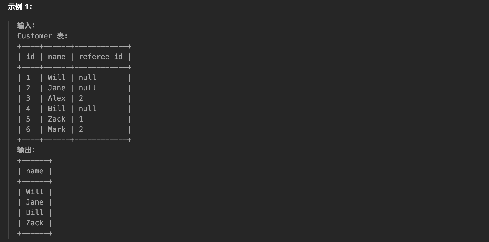
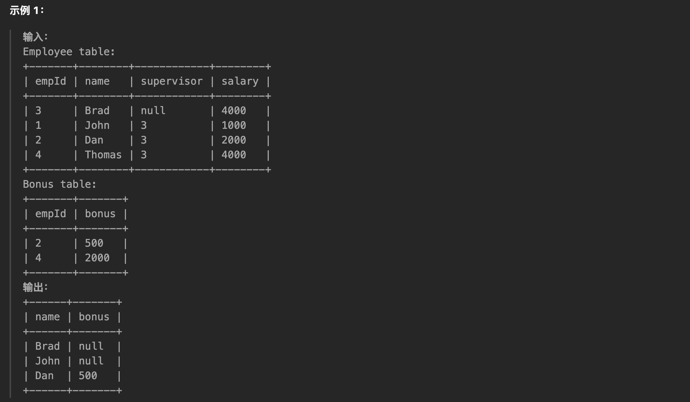
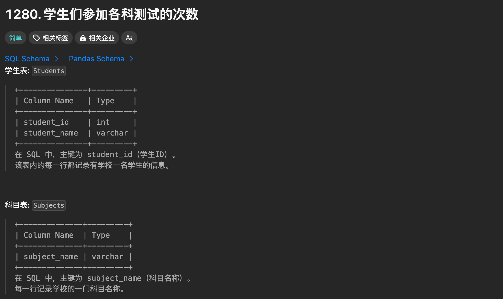
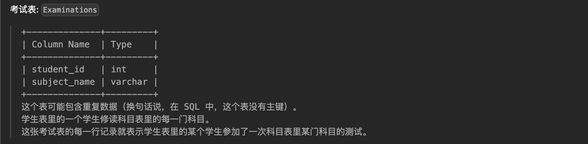

[TOC]

# 高频 SQL 50 题（基础版）

## 查询

### [1757. 可回收且低脂的产品](https://leetcode.cn/problems/recyclable-and-low-fat-products/)


```sql
# Schema
Create table If Not Exists Products (product_id int, low_fats ENUM('Y', 'N'), recyclable ENUM('Y','N'))
Truncate table Products
insert into Products (product_id, low_fats, recyclable) values ('0', 'Y', 'N')
insert into Products (product_id, low_fats, recyclable) values ('1', 'Y', 'Y')
insert into Products (product_id, low_fats, recyclable) values ('2', 'N', 'Y')
insert into Products (product_id, low_fats, recyclable) values ('3', 'Y', 'Y')
insert into Products (product_id, low_fats, recyclable) values ('4', 'N', 'N')

# Result
SELECT product_id FROM Products WHERE low_fats = 'Y' AND recyclable = 'Y';
```

### [584. 寻找用户推荐人](https://leetcode.cn/problems/find-customer-referee/)




```sql
# Schema
Create table If Not Exists Customer (id int, name varchar(25), referee_id int)
Truncate table Customer
insert into Customer (id, name, referee_id) values ('1', 'Will', NULL)
insert into Customer (id, name, referee_id) values ('2', 'Jane', NULL)
insert into Customer (id, name, referee_id) values ('3', 'Alex', '2')
insert into Customer (id, name, referee_id) values ('4', 'Bill', NULL)
insert into Customer (id, name, referee_id) values ('5', 'Zack', '1')
insert into Customer (id, name, referee_id) values ('6', 'Mark', '2')

# Result
SELECT name FROM Customer WHERE referee_id IS NULL OR referee_id <> 2;
```

### [595. 大的国家](https://leetcode.cn/problems/big-countries/)


```sql
# Schema
Create table If Not Exists World (name varchar(255), continent varchar(255), area int, population int, gdp bigint)
Truncate table World
insert into World (name, continent, area, population, gdp) values ('Afghanistan', 'Asia', '652230', '25500100', '20343000000')
insert into World (name, continent, area, population, gdp) values ('Albania', 'Europe', '28748', '2831741', '12960000000')
insert into World (name, continent, area, population, gdp) values ('Algeria', 'Africa', '2381741', '37100000', '188681000000')
insert into World (name, continent, area, population, gdp) values ('Andorra', 'Europe', '468', '78115', '3712000000')
insert into World (name, continent, area, population, gdp) values ('Angola', 'Africa', '1246700', '20609294', '100990000000')

# Result
SELECT name,population,area FROM World WHERE area >= 3000000 OR population >= 25000000;
```

### [1148. 文章浏览 I](https://leetcode.cn/problems/article-views-i/)


```sql
# Schema
Create table If Not Exists Views (article_id int, author_id int, viewer_id int, view_date date)
Truncate table Views
insert into Views (article_id, author_id, viewer_id, view_date) values ('1', '3', '5', '2019-08-01')
insert into Views (article_id, author_id, viewer_id, view_date) values ('1', '3', '6', '2019-08-02')
insert into Views (article_id, author_id, viewer_id, view_date) values ('2', '7', '7', '2019-08-01')
insert into Views (article_id, author_id, viewer_id, view_date) values ('2', '7', '6', '2019-08-02')
insert into Views (article_id, author_id, viewer_id, view_date) values ('4', '7', '1', '2019-07-22')
insert into Views (article_id, author_id, viewer_id, view_date) values ('3', '4', '4', '2019-07-21')
insert into Views (article_id, author_id, viewer_id, view_date) values ('3', '4', '4', '2019-07-21')

# Result
SELECT DISTINCT(author_id) as id FROM Views WHERE viewer_id = author_id ORDER BY id asc;
```

### [1683. 无效的推文](https://leetcode.cn/problems/invalid-tweets/)


```sql
# Schema
Create table If Not Exists Tweets(tweet_id int, content varchar(50))
Truncate table Tweets
insert into Tweets (tweet_id, content) values ('1', 'Let us Code')
insert into Tweets (tweet_id, content) values ('2', 'More than fifteen chars are here!')

# Result
SELECT tweet_id FROM Tweets WHERE CHAR_LENGTH(content) > 15;
```

**注意**：

- 对于SQL表，用于计算字符串中字符数的最佳函数是 CHAR_LENGTH(str)，它返回字符串 str 的长度。

- 另一个常用的函数 LENGTH(str) 在这个问题中也适用，因为列 content 只包含英文字符，没有特殊字符。否则，LENGTH() 可能会返回不同的结果，因为该函数返回字符串 str 的字节数，某些字符包含多于 1 个字节。以字符 '¥' 为例：CHAR_LENGTH() 返回结果为 1，而 LENGTH() 返回结果为 2，因为该字符串包含 2 个字节。

## 连接

### [1378. 使用唯一标识码替换员工ID](https://leetcode.cn/problems/replace-employee-id-with-the-unique-identifier/)


```sql
# Schema
Create table If Not Exists Employees (id int, name varchar(20))
Create table If Not Exists EmployeeUNI (id int, unique_id int)
Truncate table Employees
insert into Employees (id, name) values ('1', 'Alice')
insert into Employees (id, name) values ('7', 'Bob')
insert into Employees (id, name) values ('11', 'Meir')
insert into Employees (id, name) values ('90', 'Winston')
insert into Employees (id, name) values ('3', 'Jonathan')
Truncate table EmployeeUNI
insert into EmployeeUNI (id, unique_id) values ('3', '1')
insert into EmployeeUNI (id, unique_id) values ('11', '2')
insert into EmployeeUNI (id, unique_id) values ('90', '3')

# Result
SELECT u.unique_id,e.name FROM Employees e LEFT JOIN EmployeeUNI u ON e.id = u.id;
```

### [1068. 产品销售分析 I](https://leetcode.cn/problems/product-sales-analysis-i/)


```sql
# Schema
Create table If Not Exists Sales (sale_id int, product_id int, year int, quantity int, price int)
Create table If Not Exists Product (product_id int, product_name varchar(10))
Truncate table Sales
insert into Sales (sale_id, product_id, year, quantity, price) values ('1', '100', '2008', '10', '5000')
insert into Sales (sale_id, product_id, year, quantity, price) values ('2', '100', '2009', '12', '5000')
insert into Sales (sale_id, product_id, year, quantity, price) values ('7', '200', '2011', '15', '9000')
Truncate table Product
insert into Product (product_id, product_name) values ('100', 'Nokia')
insert into Product (product_id, product_name) values ('200', 'Apple')
insert into Product (product_id, product_name) values ('300', 'Samsung')

# Result
SELECT p.product_name,s.year,s.price FROM Sales s LEFT JOIN Product p ON s.product_id = p.product_id;
```

### [1581. 进店却未进行过交易的顾客](https://leetcode.cn/problems/customer-who-visited-but-did-not-make-any-transactions/)


```sql
# Schema
Create table If Not Exists Visits(visit_id int, customer_id int)
Create table If Not Exists Transactions(transaction_id int, visit_id int, amount int)
Truncate table Visits
insert into Visits (visit_id, customer_id) values ('1', '23')
insert into Visits (visit_id, customer_id) values ('2', '9')
insert into Visits (visit_id, customer_id) values ('4', '30')
insert into Visits (visit_id, customer_id) values ('5', '54')
insert into Visits (visit_id, customer_id) values ('6', '96')
insert into Visits (visit_id, customer_id) values ('7', '54')
insert into Visits (visit_id, customer_id) values ('8', '54')
Truncate table Transactions
insert into Transactions (transaction_id, visit_id, amount) values ('2', '5', '310')
insert into Transactions (transaction_id, visit_id, amount) values ('3', '5', '300')
insert into Transactions (transaction_id, visit_id, amount) values ('9', '5', '200')
insert into Transactions (transaction_id, visit_id, amount) values ('12', '1', '910')
insert into Transactions (transaction_id, visit_id, amount) values ('13', '2', '970')

# Result
SELECT customer_id, count(visit_id) as count_no_trans 
FROM Visits 
WHERE visit_id not in (
    SELECT distinct visit_id FROM Transactions
) GROUP BY customer_id;

# Result2
SELECT customer_id, count(v.visit_id) as count_no_trans 
FROM Visits v
LEFT JOIN Transactions t
ON v.visit_id = t.visit_id
WHERE t.transaction_id IS NULL 
GROUP BY customer_id;
```

### [197. 上升的温度](https://leetcode.cn/problems/rising-temperature/)


```sql
# Schema
Create table If Not Exists Weather (id int, recordDate date, temperature int)
Truncate table Weather
insert into Weather (id, recordDate, temperature) values ('1', '2015-01-01', '10')
insert into Weather (id, recordDate, temperature) values ('2', '2015-01-02', '25')
insert into Weather (id, recordDate, temperature) values ('3', '2015-01-03', '20')
insert into Weather (id, recordDate, temperature) values ('4', '2015-01-04', '30')

# Result
SELECT w1.id FROM Weather w1 
LEFT JOIN Weather w2 ON datediff(w1.recordDate,w2.recordDate) = 1
WHERE w1.temperature > w2.temperature;

# Result2
SELECT w1.id FROM Weather w1 
LEFT JOIN Weather w2 ON timestampdiff(day,w1.recordDate,w2.recordDate) = -1
WHERE w1.temperature > w2.temperature;
```

两个关于时间计算的函数：

- datediff(日期1, 日期2)：得到的结果是日期1与日期2相差的天数。如果日期1比日期2大，结果为正；如果日期1比日期2小，结果为负。
- timestampdiff(时间类型, 日期1, 日期2)：这个函数和上面diffdate的正、负号规则刚好相反。日期1大于日期2，结果为负，日期1小于日期2，结果为正。

### [1661. 每台机器的进程平均运行时间](https://leetcode.cn/problems/average-time-of-process-per-machine/)


```sql
# Schema
Create table If Not Exists Activity (machine_id int, process_id int, activity_type ENUM('start', 'end'), timestamp float)
Truncate table Activity
insert into Activity (machine_id, process_id, activity_type, timestamp) values ('0', '0', 'start', '0.712')
insert into Activity (machine_id, process_id, activity_type, timestamp) values ('0', '0', 'end', '1.52')
insert into Activity (machine_id, process_id, activity_type, timestamp) values ('0', '1', 'start', '3.14')
insert into Activity (machine_id, process_id, activity_type, timestamp) values ('0', '1', 'end', '4.12')
insert into Activity (machine_id, process_id, activity_type, timestamp) values ('1', '0', 'start', '0.55')
insert into Activity (machine_id, process_id, activity_type, timestamp) values ('1', '0', 'end', '1.55')
insert into Activity (machine_id, process_id, activity_type, timestamp) values ('1', '1', 'start', '0.43')
insert into Activity (machine_id, process_id, activity_type, timestamp) values ('1', '1', 'end', '1.42')
insert into Activity (machine_id, process_id, activity_type, timestamp) values ('2', '0', 'start', '4.1')
insert into Activity (machine_id, process_id, activity_type, timestamp) values ('2', '0', 'end', '4.512')
insert into Activity (machine_id, process_id, activity_type, timestamp) values ('2', '1', 'start', '2.5')
insert into Activity (machine_id, process_id, activity_type, timestamp) values ('2', '1', 'end', '5')

# Result：推荐这种做法 JOIN/INNER JOIN/CROSS JOIN都不会影响结果
SELECT a.machine_id, ROUND(AVG(a.timestamp - b.timestamp),3) as processing_time 
FROM Activity a JOIN Activity b 
ON a.machine_id = b.machine_id AND a.process_id = b.process_id AND a.activity_type = 'end' AND b.activity_type = 'start' 
GROUP BY a.machine_id;

# Result2: 虽然使用左连接也是对的（因为AVG计算平均值时会去掉null的项），但是这里使用交叉连接更容易理解
SELECT a.machine_id, ROUND(AVG(a.timestamp - b.timestamp),3) as processing_time 
FROM Activity a LEFT JOIN Activity b 
ON a.machine_id = b.machine_id AND a.process_id = b.process_id AND a.activity_type = 'end' AND b.activity_type = 'start' 
GROUP BY a.machine_id;
```

> 参考文档：
>
> 1. [一分钟让你搞明白 left join、right join和join的区别](https://blog.csdn.net/Li_Jian_Hui_/article/details/105801454)
> 2. [数据库 | 辨析 cross join、inner join和outer join](https://blog.csdn.net/a26013/article/details/123615320)
>    - CROSS JOIN、INNER JOIN、JOIN 和逗号分隔的连接是等价的。
> 3. [mySQL中AVG()函数如何去除null值或0值求平均值](https://blog.csdn.net/m0_51088798/article/details/123906790)

### [577. 员工奖金](https://leetcode.cn/problems/employee-bonus/)




```sql
# Schema
Create table If Not Exists Employee (empId int, name varchar(255), supervisor int, salary int)
Create table If Not Exists Bonus (empId int, bonus int)
Truncate table Employee
insert into Employee (empId, name, supervisor, salary) values ('3', 'Brad', NULL, '4000')
insert into Employee (empId, name, supervisor, salary) values ('1', 'John', '3', '1000')
insert into Employee (empId, name, supervisor, salary) values ('2', 'Dan', '3', '2000')
insert into Employee (empId, name, supervisor, salary) values ('4', 'Thomas', '3', '4000')
Truncate table Bonus
insert into Bonus (empId, bonus) values ('2', '500')
insert into Bonus (empId, bonus) values ('4', '2000')

# Result
SELECT e.name,b.bonus FROM Employee e LEFT JOIN Bonus b 
ON e.empId = b.empId
WHERE b.bonus < 1000 OR b.bonus is null;
```

### [1280. 学生们参加各科测试的次数](https://leetcode.cn/problems/students-and-examinations/)🌟






```sql
# Schema
Create table If Not Exists Students (student_id int, student_name varchar(20))
Create table If Not Exists Subjects (subject_name varchar(20))
Create table If Not Exists Examinations (student_id int, subject_name varchar(20))
Truncate table Students
insert into Students (student_id, student_name) values ('1', 'Alice')
insert into Students (student_id, student_name) values ('2', 'Bob')
insert into Students (student_id, student_name) values ('13', 'John')
insert into Students (student_id, student_name) values ('6', 'Alex')
Truncate table Subjects
insert into Subjects (subject_name) values ('Math')
insert into Subjects (subject_name) values ('Physics')
insert into Subjects (subject_name) values ('Programming')
Truncate table Examinations
insert into Examinations (student_id, subject_name) values ('1', 'Math')
insert into Examinations (student_id, subject_name) values ('1', 'Physics')
insert into Examinations (student_id, subject_name) values ('1', 'Programming')
insert into Examinations (student_id, subject_name) values ('2', 'Programming')
insert into Examinations (student_id, subject_name) values ('1', 'Physics')
insert into Examinations (student_id, subject_name) values ('1', 'Math')
insert into Examinations (student_id, subject_name) values ('13', 'Math')
insert into Examinations (student_id, subject_name) values ('13', 'Programming')
insert into Examinations (student_id, subject_name) values ('13', 'Physics')
insert into Examinations (student_id, subject_name) values ('2', 'Math')
insert into Examinations (student_id, subject_name) values ('1', 'Math')

# Result
SELECT s1.student_id,s1.student_name,s2.subject_name,IFNULL(e.attended_exams,0) attended_exams
FROM Students s1 JOIN Subjects s2 LEFT JOIN (
    SELECT student_id,subject_name,count(*) as attended_exams 
    FROM Examinations 
    GROUP BY student_id, subject_name
) e ON s1.student_id = e.student_id AND s2.subject_name = e.subject_name 
ORDER BY s1.student_id, s2.subject_name;
```

